# Algraf

Algraf is a block-scoped, algebraic grammar-of-graphics DSL. You describe a
chart declaratively in a `.ag` file, point it at a CSV, and the `algraf`
binary parses the source, validates it against the data, trains scales, and
emits deterministic SVG.

The normative reference is [`docs/ALGRAF_SPEC.md`](docs/ALGRAF_SPEC.md).
Active planning starts at [`docs/V0_15_PLAN.md`](docs/V0_15_PLAN.md), with the
staged roadmap recorded in [`docs/`](docs/).

```bash
cargo run -p algraf-cli -- render examples/scatter.ag --output /tmp/scatter.svg
```

This tutorial walks through every example in [`examples/`](examples/) from
the simplest scatter plot up through statistical layers, derived tables,
faceting, and theme overrides. Each section shows the `.ag` source followed
by its rendered SVG.

---

## A first chart: scatter with a categorical fill

A `Chart` block holds a `Space`, and a `Space` holds geometries. The
algebra operator `*` is *cross*: it pairs two columns into Cartesian x/y.
Mapping `fill: species` colors each point by the categorical column and
produces a legend automatically.

```algraf
Chart(data: "penguins.csv", width: 760, height: 500) {
    Theme(name: "minimal")

    Space(flipper_length * body_mass) {
        Point(fill: species, alpha: 0.82, size: 4)
    }
}
```

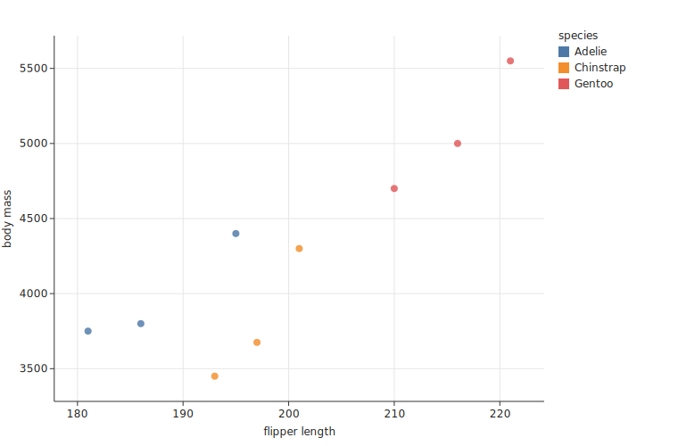

## Line series over time

Temporal columns are detected from the CSV schema and get a time-aware
axis. Mapping `stroke: series` splits one line per group.

```algraf
Chart(data: "series.csv", width: 760, height: 460) {
    Space(day * value) {
        Line(stroke: series, strokeWidth: 2)
    }
}
```


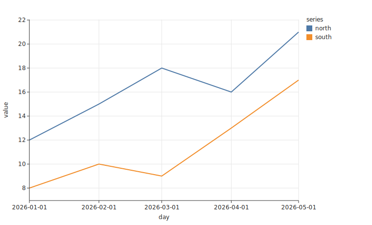

## Layering multiple space blocks: weather forecast

You can overlay different geometries mapped to different y-axis columns by defining multiple `Space` blocks inside the same `Chart`. They will share the same trained coordinate system. Here, we layer a forecast range (`Ribbon`), a mean forecast line (`Line`), and actual observed temperatures (`Point`).

```algraf
Chart(data: "weather_forecast.csv", width: 760, height: 420, title: "7-Day Weather Forecast & Observations") {
    Theme(name: "minimal")
    Scale(axis: y, domain: [8, 28])
    Guide(axis: x, label: "Date")
    Guide(axis: y, label: "Temperature (°C)")

    Space(date * temp_forecast) {
        Ribbon(ymin: temp_min, ymax: temp_max, fill: "#add8e6", alpha: 0.4)
        Line(stroke: "#4a90e2", strokeWidth: 3)
    }

    Space(date * temp_actual) {
        Point(fill: "#ff6b6b", size: 6)
    }
}
```

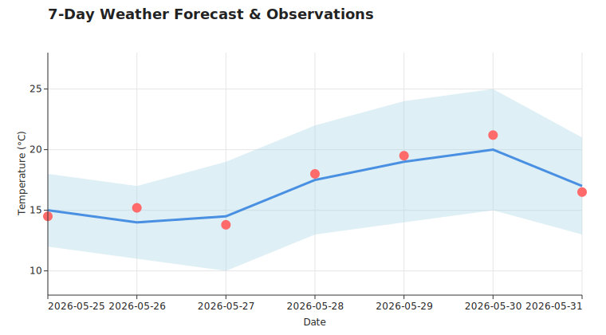

## Grouping lines without changing color

`group:` separates series independently from `stroke`, so several series can
share a constant visual style while still drawing as separate paths.

```algraf
Chart(data: "series.csv", width: 760, height: 460, title: "Grouped constant-color lines") {
    Space(day * value) {
        Line(group: series, stroke: "#777777", strokeWidth: 2)
        Point(fill: series, size: 4)
    }
}
```

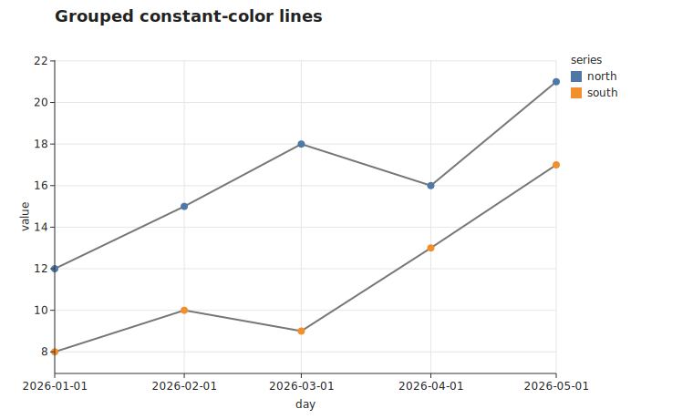

## Layered marks: connected scatter

Geometries inside a `Space` render in source order, so listing `Line`
before `Point` draws the points on top of the connecting lines.

```algraf
Chart(data: "timeseries.csv") {
    Space(time * value) {
        Line(stroke: series, strokeWidth: 2)
        Point(fill: series, size: 4)
    }
}
```

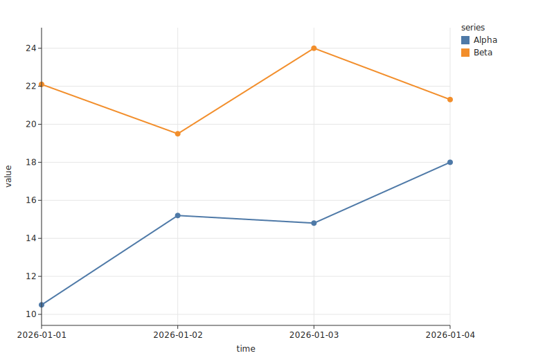

## Point shapes as a non-color channel

`shape:` can be a literal shape or a categorical mapping. Category order
assigns shapes deterministically.

```algraf
Chart(data: "series.csv", width: 760, height: 460, title: "Series shapes") {
    Space(day * value) {
        Line(group: series, stroke: "#888888")
        Point(shape: series, fill: series, size: 4)
    }
}
```


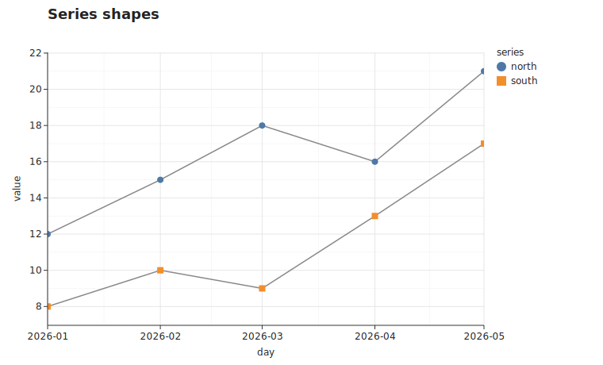

## Bubble chart with size mapping and labels

Continuous point sizes are mapped using the `size` property. We can customize the output range with a `Scale(size: ...)` and add label overlays to each point using the `Text` geometry.

```algraf
Chart(data: "co2_gdp.csv", width: 800, height: 500, title: "CO2 Emissions vs. GDP per Capita (2024)") {
    Theme(name: "minimal")
    Scale(fill: continent, palette: "default")
    Scale(size: population, range: [4, 25], label: "Population (M)")
    Guide(axis: x, label: "GDP per Capita ($)")
    Guide(axis: y, label: "CO2 Emissions per Capita (Tons)")

    Space(gdp_per_capita * co2_per_capita) {
        Point(fill: continent, size: population, alpha: 0.6)
        Text(label: country, dy: -14, size: 8, fill: "#444444", anchor: "middle")
    }
}
```

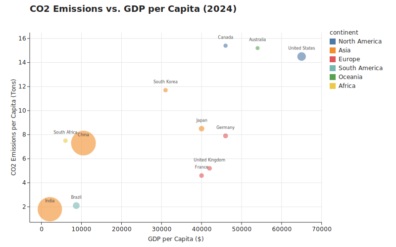

## Statistical overlay: linear smooth

`Smooth(method: "lm")` fits a linear model and draws the resulting line
on top of the data, sharing the same x/y space as the points.

```algraf
Chart(data: "penguins.csv", width: 760, height: 500) {
    Space(flipper_length * body_mass) {
        Point(fill: species, alpha: 0.55, size: 3)
        Smooth(method: "lm", stroke: "#333333", strokeWidth: 2)
    }
}
```

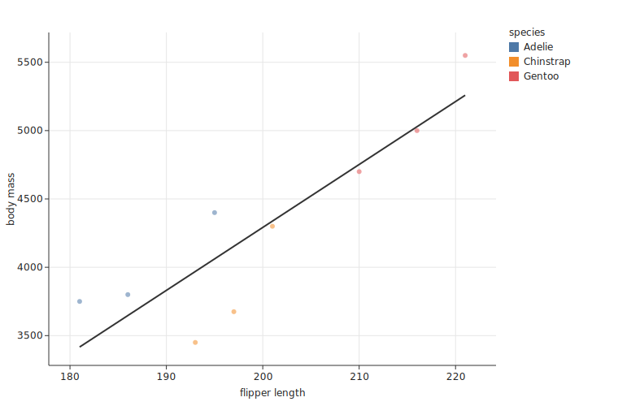

## Grouped bars via the `/` (nest) operator

`/` is *nest*: `quarter / type` makes `type` a sub-band inside each
`quarter` band. The result is a dodged/grouped bar chart with no extra
configuration.

```algraf
Chart(data: "financials.csv", width: 760, height: 460) {
    Theme(name: "classic")

    Space((quarter / type) * amount) {
        Bar(fill: type)
    }
}
```

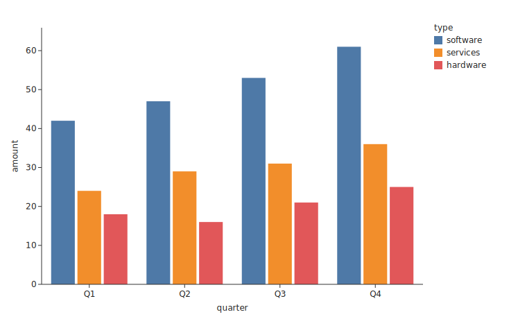

## Stacked bars

Switching the bar `layout` from the default `"identity"` to `"stack"`
keeps the single `quarter` band and stacks the type contributions.

```algraf
Chart(data: "financials.csv", width: 760, height: 460) {
    Space(quarter * amount) {
        Bar(fill: type, layout: "stack")
    }
}
```

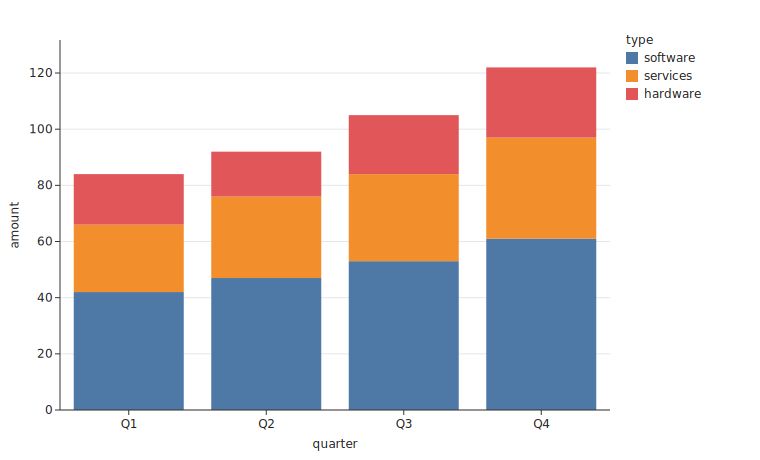

## Proportional fill bars

`layout: "fill"` normalizes each stack to 1.0 so the bars compare shares
instead of totals.

```algraf
Chart(data: "financials.csv", width: 760, height: 460) {
    Space(quarter * amount) {
        Bar(fill: type, layout: "fill")
    }
}
```

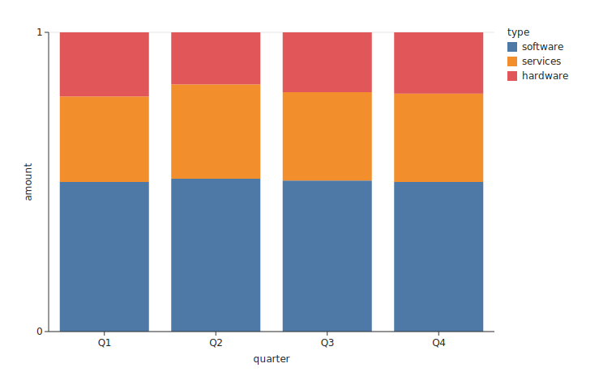

## Counting categories: `Bar(stat: "count")`

When you only have a categorical column, `stat: "count"` aggregates rows
per category and uses the count as the y value — no explicit `Derive`
needed.

```algraf
Chart(
    data: "demographics.csv",
    width: 640,
    height: 420,
    title: "Sample distribution by gender",
) {
    Space(gender) {
        Bar(stat: "count", fill: gender, alpha: 0.85)
    }
}
```


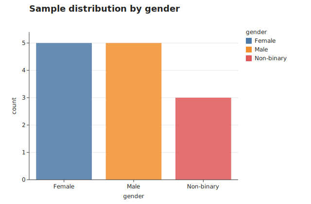

## Diverging bars around a baseline

Bars can extend in both positive and negative directions. Custom color scales let you highlight positive vs negative values, and `HLine` provides a reference line at the zero baseline.

```algraf
Chart(data: "monthly_profit.csv", width: 720, height: 420, title: "Monthly Profit / Loss Analysis") {
    Theme(name: "minimal")
    Scale(fill: status, range: ["Profit" => "#2ca02c", "Loss" => "#d62728"])
    Guide(axis: x, label: "Month")
    Guide(axis: y, label: "Profit / Loss ($)")

    Space(month * profit) {
        Bar(fill: status, layout: "identity", alpha: 0.85)
        HLine(y: 0, stroke: "#333333", strokeWidth: 1.2)
    }
}
```

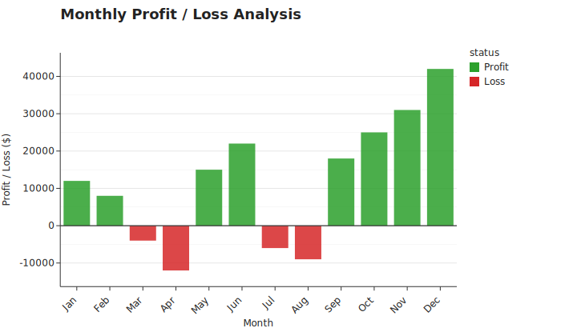

## Layered bar and point chart

You can layer a background `Bar` with a `Point` to build a clean and elegant comparison chart. This keeps the bars light and draws focus to the individual data points.

```algraf
Chart(data: "programming_languages.csv", width: 700, height: 450, title: "Programming Language Popularity") {
    Theme(name: "minimal")
    Scale(fill: paradigm, palette: "accent")
    Scale(stroke: paradigm, palette: "accent")
    Guide(axis: y, label: "Share (%)")
    Guide(axis: x, label: "Programming Language")

    Space(language * popularity) {
        Bar(fill: "#f3f3f3", stroke: "#dddddd", strokeWidth: 1.5)
        Point(fill: paradigm, size: 9)
    }
}
```

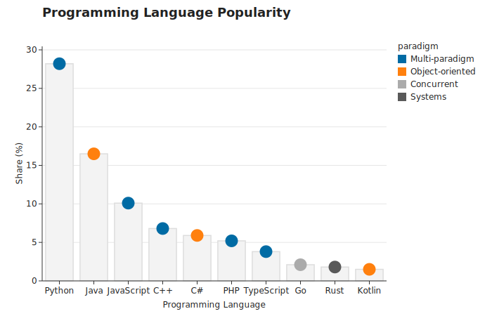

## Histograms the explicit way: `Derive` + `Rect`

`Derive` produces a named derived table from a stat. Here `Bin` returns
`bin_start`, `bin_end`, `count`, and `density`, and `Rect` draws the
bars by reading from `data: bins`.

```algraf
Chart(data: "distribution.csv", width: 760, height: 460) {
    Derive bins = Bin(value, binWidth: 1, boundary: 0)

    Space(bin_start * count, data: bins) {
        Rect(
            xmin: bin_start,
            xmax: bin_end,
            ymin: 0,
            ymax: count,
            fill: "steelblue",
            stroke: "#ffffff",
            strokeWidth: 1,
            alpha: 0.86,
        )
    }
}
```

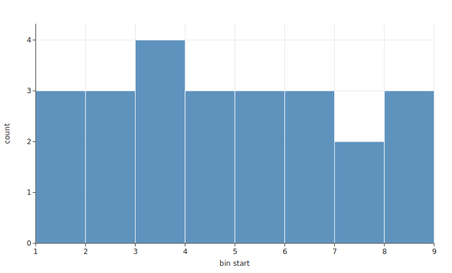

## Histograms the short way: the `Histogram` geometry

`Histogram` desugars to the same `Derive` + `Rect` pair above, so you
get binning, count, density and the rectangles in a single line.

```algraf
Chart(data: "distribution.csv", width: 760, height: 460) {
    Space(value) {
        Histogram(
            binWidth: 1,
            boundary: 0,
            fill: "steelblue",
            stroke: "#ffffff",
            strokeWidth: 1,
            alpha: 0.86,
        )
    }
}
```


## Frequency polygon

`FreqPoly` uses the same binning controls as `Histogram`, but connects bin
centers with a line instead of drawing bars.

```algraf
Chart(data: "distribution.csv", width: 760, height: 460, title: "Frequency polygon") {
    Space(value) {
        FreqPoly(bins: 16, stroke: "steelblue", strokeWidth: 2)
    }
}
```

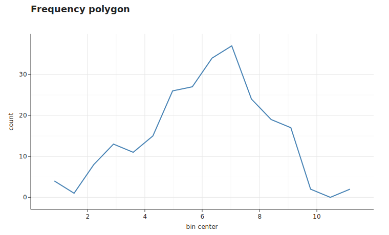

## Chained derived tables

A `Derive` can reference columns produced by an earlier derived table. Here
`Smooth` fits a line over binned counts.

```algraf
Chart(data: "distribution.csv", width: 760, height: 460, title: "Binned trend") {
    Derive bins = Bin(value, bins: 12)
    Derive trend = Smooth(bin_center, count, method: "lm")

    Space(bin_center * count, data: bins) {
        Rect(xmin: bin_start, xmax: bin_end, ymin: 0, ymax: count, fill: "#c7dcef")
    }

    Space(x * y, data: trend) {
        Line(stroke: "#333333", strokeWidth: 2)
    }
}
```

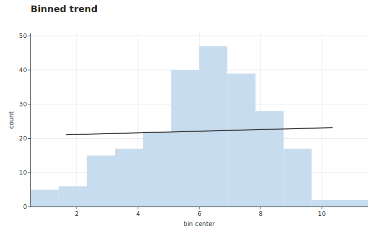

## Binned 2D regression chain

A multi-stage statistical chaining chart that runs 2D density binning (`Bin2D`), chains a linear regression (`Smooth`) over the binned coordinate centers, and overlays the binned rectangles, center points, and regression line.

```algraf
Chart(data: "samples.csv", width: 760, height: 500, title: "Binned 2D Regression Chain") {
    Theme(name: "minimal")
    Derive binned = Bin2D(x, y, bins: 10)
    Derive trend = Smooth(x_center, y_center, method: "lm")

    Space(x_center * y_center, data: binned) {
        Rect(xmin: x_start, xmax: x_end, ymin: y_start, ymax: y_end, fill: count, alpha: 0.6)
        Point(fill: "#333333", size: 4, alpha: 0.8)
    }

    Space(x * y, data: trend) {
        Line(stroke: "red", strokeWidth: 3)
    }
}
```

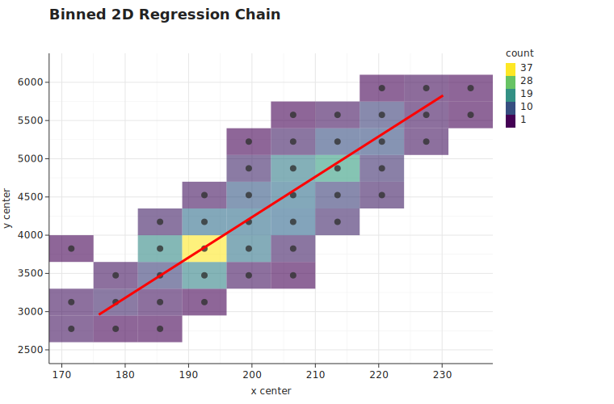

## Binning over time

`Bin` and `Histogram` work on temporal columns too. Mapping a single date
column into the space and adding `Histogram(bins: ...)` buckets the rows by
date and keeps the temporal type on the axis, so you get time-aware tick
labels for free. For calendar bins, use `interval: "month"` (or `day`, `week`,
`quarter`, etc.) and optional temporal labels such as `timeFormat: "iso-minute"`.

```algraf
Chart(data: "signups.csv", width: 760, height: 460, title: "Signups over the launch quarter") {
    Guide(axis: x, label: "Signup date", timeFormat: "iso-date")

    Space(signup_date) {
        Histogram(
            interval: "week",
            fill: "steelblue",
            stroke: "#ffffff",
            strokeWidth: 1,
            alpha: 0.86,
        )
    }
}
```

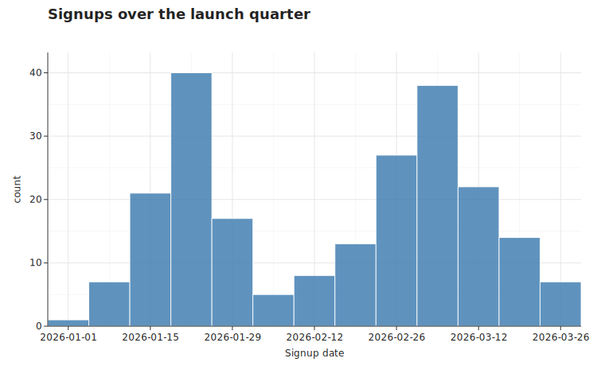

## Heatmap with `Tile`

Two categorical axes plus a continuous fill give you a heatmap.

```algraf
Chart(data: "heatmap.csv", width: 700, height: 460) {
    Space(day * hour) {
        Tile(fill: value, alpha: 0.92)
    }
}
```

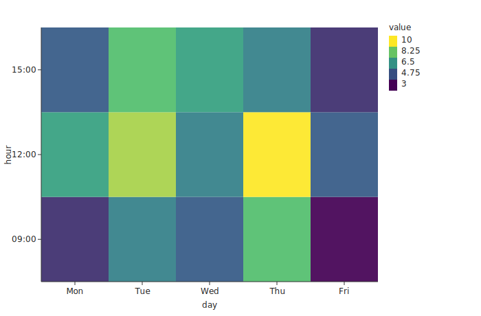

## Custom continuous gradients

`Scale(fill: ..., gradient: [...])` sets evenly spaced color stops for a
continuous fill or stroke mapping. Use `Stop(value: ..., color: ...)` when the
colors should land at explicit domain values.

```algraf
Chart(data: "heatmap.csv", width: 700, height: 460, title: "Custom continuous gradient") {
    Scale(
        fill: value,
        gradient: [
            Stop(value: 3, color: "#3366cc"),
            Stop(value: 10, color: "#cc3333"),
        ],
        label: "Intensity",
    )

    Space(day * hour) {
        Tile(fill: value, alpha: 0.92)
    }
}
```

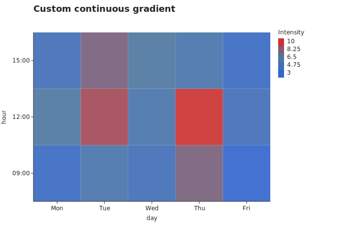

## Rectangular 2D bins

`Bin2D` groups observations over two continuous axes and fills rectangles by
count.

```algraf
Chart(data: "samples.csv", width: 720, height: 500, title: "2D rectangular bins") {
    Space(x * y) {
        Bin2D(bins: 12)
    }
}
```

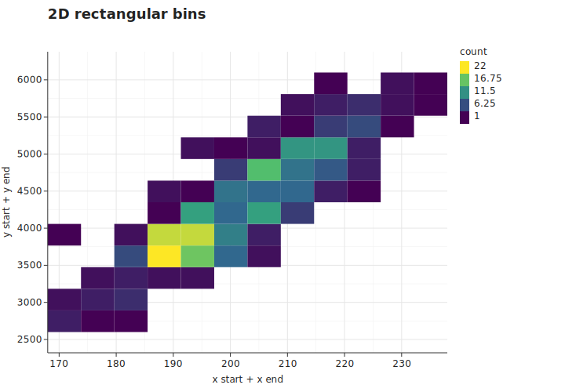

## 2D binning with raw points and thresholds overlay

Continuous 2D density heatmap using `Bin2D` overlaid with raw scatter points and threshold reference lines.

```algraf
Chart(data: "samples.csv", width: 760, height: 500, title: "2D Density Binning with Points Overlay") {
    Theme(name: "minimal")
    Scale(axis: x, domain: [165, 205])
    Scale(axis: y, domain: [2000, 4500])
    Guide(axis: x, label: "Variable X")
    Guide(axis: y, label: "Variable Y")

    Space(x * y) {
        Bin2D(bins: 12, alpha: 0.8)
        Point(fill: "red", stroke: "#ffffff", size: 3, alpha: 0.6)
        HLine(y: 3500, stroke: "#111111", strokeWidth: 1.5, label: "Upper Limit")
        VLine(x: 185, stroke: "#111111", strokeWidth: 1.5, label: "Midpoint")
    }
}
```

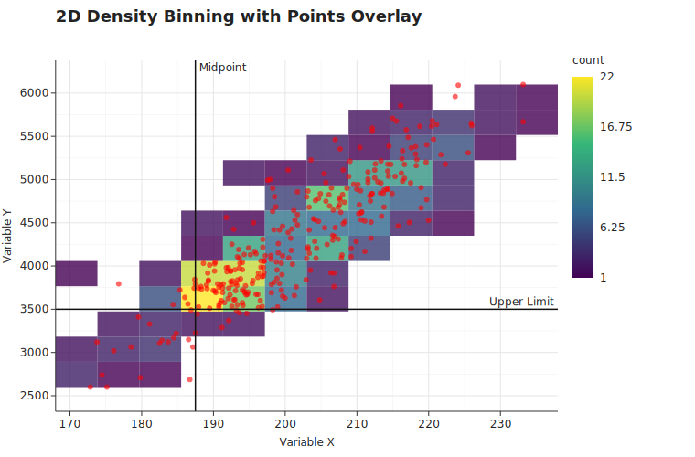

## Hex bins

`HexBin` is the hexagonal counterpart for dense two-dimensional scatter data.
Observations are assigned to the nearest hexagon on a tessellating lattice and
each cell is shaded by count.

```algraf
Chart(data: "samples.csv", width: 720, height: 500, title: "Hex bins") {
    Space(x * y) {
        HexBin(bins: 12, alpha: 0.9)
    }
}
```

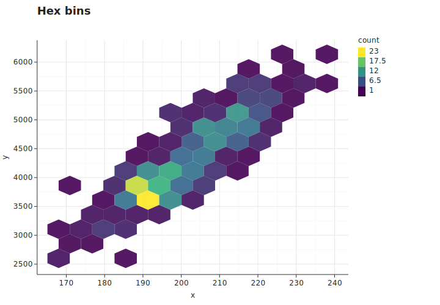

## Boxplot with a rug

`Boxplot` summarizes a continuous distribution per categorical level,
and `Rug` adds tick marks along an axis to show raw values. `sides: "l"`
puts the rug on the left.

```algraf
Chart(data: "demographics.csv", width: 700, height: 460) {
    Space(gender * height) {
        Boxplot(fill: gender, alpha: 0.78)
        Rug(sides: "l", alpha: 0.35)
    }
}
```

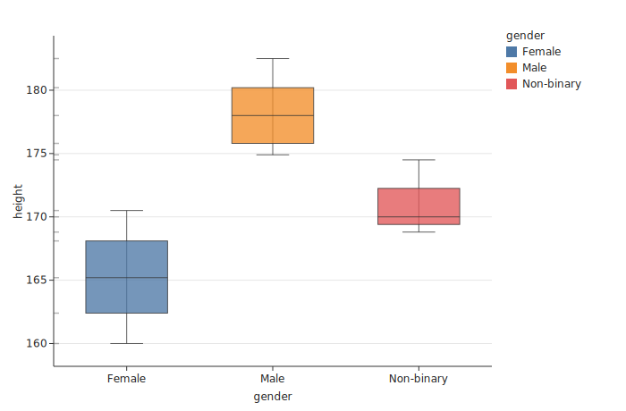

## Violin distributions

`Violin` mirrors a Gaussian KDE within each categorical band. Optional
`quantiles` draw deterministic reference lines inside each violin.

```algraf
Chart(data: "demographics.csv", width: 720, height: 460, title: "Height distribution by group") {
    Space(gender * height) {
        Violin(fill: gender, quantiles: [0.25, 0.5, 0.75], alpha: 0.62)
        Rug(sides: "l", alpha: 0.25)
    }
}
```

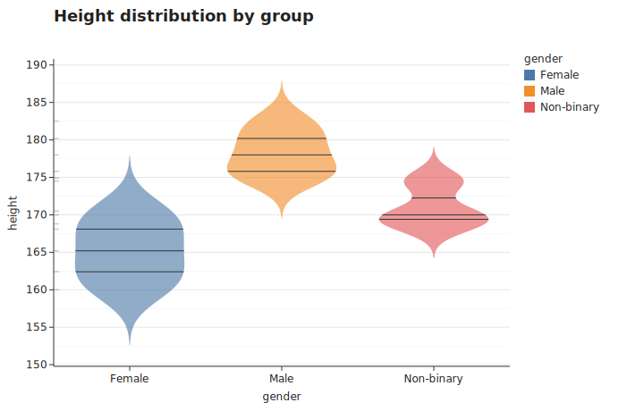

## Layered violin and boxplot distributions

Geometries can be overlaid inside a single `Space` to build compound charts. Here, a transparent `Violin` is paired with a narrow, opaque `Boxplot` to show both the detailed density curve and summary statistics.

```algraf
Chart(data: "demographics.csv", width: 720, height: 460, title: "Height Distribution by Group (Violin + Boxplot)") {
    Theme(name: "minimal")
    Guide(axis: x, label: "Gender Group")
    Guide(axis: y, label: "Height (cm)")

    Space(gender * height) {
        Violin(fill: gender, alpha: 0.45)
        Boxplot(width: 15, fill: "#ffffff", stroke: "#2b2b2b", strokeWidth: 1.5)
    }
}
```

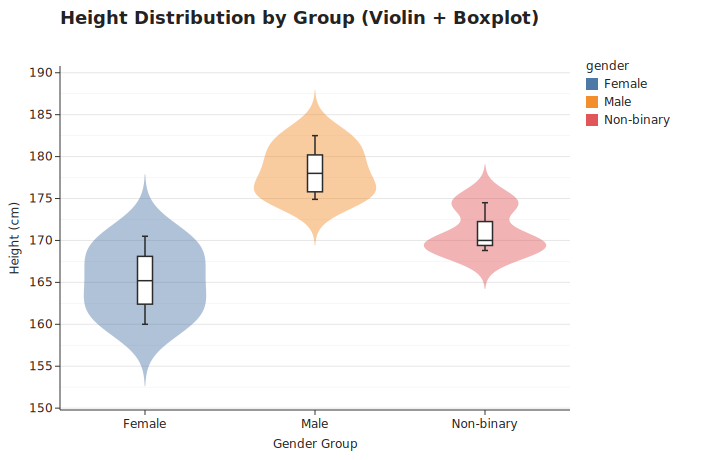

## Faceted violin and boxplot distributions with rug

Overlaying `Violin`, narrow `Boxplot`, and marginal `Rug` plots inside a faceted space layout.

```algraf
Chart(data: "regional_sales.csv", width: 840, height: 500, title: "Sales Distribution by Product and Region") {
    Theme(name: "minimal")
    Scale(fill: product, palette: "accent")
    Scale(stroke: product, palette: "accent")
    Guide(axis: y, label: "Sales Amount")

    Space((product * sales) / region) {
        Violin(fill: product, alpha: 0.5, quantiles: [0.25, 0.5, 0.75])
        Boxplot(width: 0.12, fill: "#ffffff", stroke: "#000000", strokeWidth: 1.2, alpha: 0.9)
        Rug(sides: "l", stroke: product, alpha: 0.35)
    }
}
```

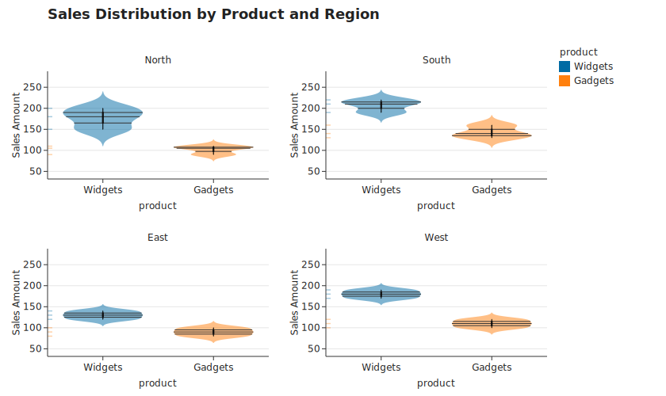

## Density: a smooth distribution

`Density` estimates the distribution of a single numeric column with a
Gaussian kernel and fills the resulting curve down to a zero baseline. The
bandwidth defaults to Silverman's rule of thumb; pass `bandwidth:` or `n:`
(grid points) to control it. This example also shows a `/* ... */` block
comment, which the lexer and formatter treat as trivia.

```algraf
/*
 * A kernel density estimate of a single numeric column.
 * Density() desugars to a filled Area over the estimated curve.
 */
Chart(data: "distribution.csv", width: 760, height: 460, title: "Estimated density") {
    Space(value) {
        Density(fill: "#4c78a8", stroke: "#1f3b57", strokeWidth: 1.5, alpha: 0.6)
    }
}
```

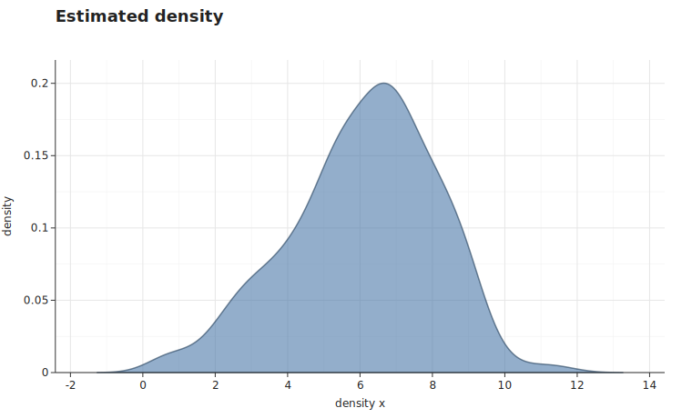

## Ribbon: confidence band

`Ribbon` closes a band between `ymin` and `ymax` per x value. The `+`
operator in the algebra is *blend*: it tells the y scale to consider
both columns when training its domain.

```algraf
Chart(data: "ribbon.csv", width: 760, height: 460) {
    Space(day * (lower + upper)) {
        Ribbon(ymin: lower, ymax: upper, fill: "steelblue", alpha: 0.25)
    }
}
```

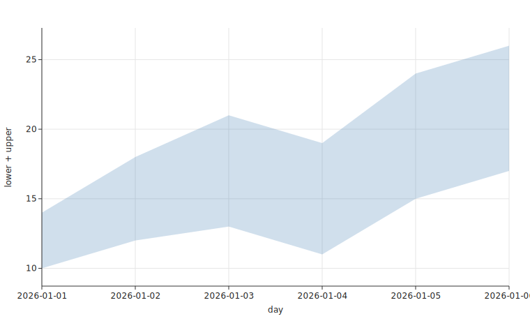

## Filled area under a line

`Area` closes a polygon down to its `baseline` — when the baseline is 0
the bottom edge sits flush against the x axis. Layering a `Line` on top
preserves the original series outline.

```algraf
Chart(data: "timeseries.csv", width: 760, height: 420) {
    Space(time * value) {
        Area(baseline: 0, fill: series, alpha: 0.35)
        Line(stroke: series, strokeWidth: 2)
    }
}
```

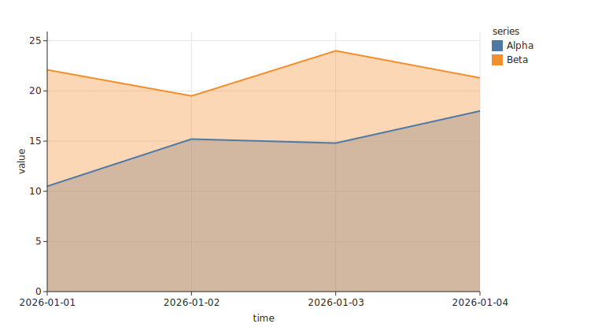

## Categorical strip / barcode

A categorical x paired with a continuous y and a low-alpha `Point` makes
a strip plot — useful for inspecting distributions without binning.

```algraf
Chart(data: "demographics.csv") {
    Space(gender * height) {
        Point(fill: gender, alpha: 0.4, size: 3)
    }
}
```

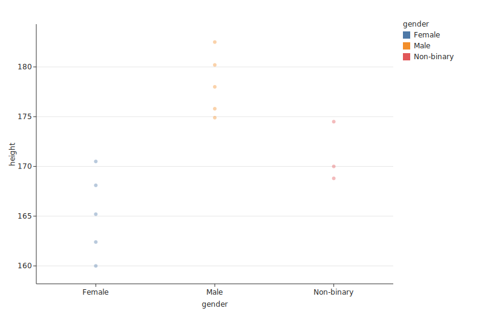

## Floating intervals with `Rect`

`Rect` is the general rectangle primitive: any combination of
`xmin/xmax/ymin/ymax` from columns or literals.

```algraf
Chart(data: "intervals.csv") {
    Space(time * value) {
        Rect(
            xmin: start_time,
            xmax: end_time,
            ymin: 0,
            ymax: peak_value,
            fill: "steelblue",
            alpha: 0.5
        )
    }
}
```

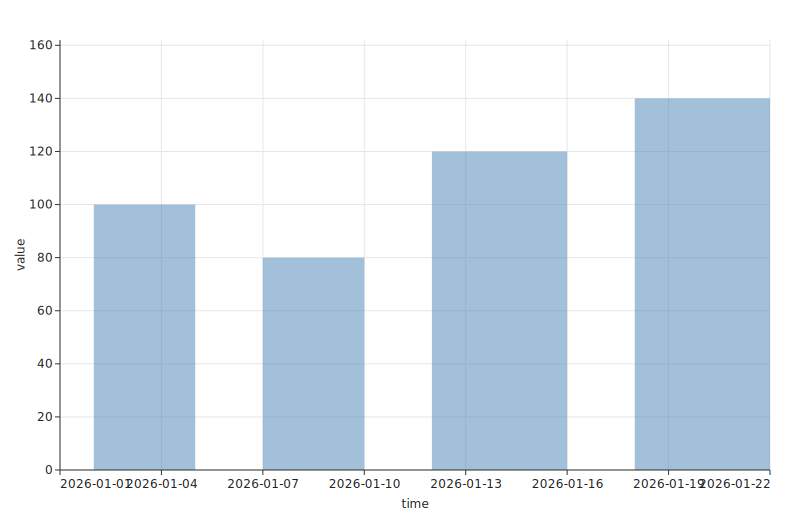

## Time series with shaded peak intervals

Drawing shaded peak intervals (`Rect`) and overlaying a blue line trend series (`Line`, `Point`, `Text`) with shared temporal x and value-constrained y axes.

```algraf
Chart(data: "intervals.csv", width: 760, height: 460, title: "Time Series with Shaded Peak Intervals") {
    Theme(name: "minimal")
    Scale(axis: x, label: "Timeline")
    Scale(axis: y, label: "Value")

    Space(time * peak_value) {
        Rect(xmin: start_time, xmax: end_time, ymin: value, ymax: peak_value, fill: "#e2e2e2", alpha: 0.6)
        Line(stroke: "blue", strokeWidth: 2)
        Point(fill: "blue", size: 6)
        Text(label: peak_value, dy: -8, size: 9, fill: "#333333", anchor: "middle")
    }
}
```

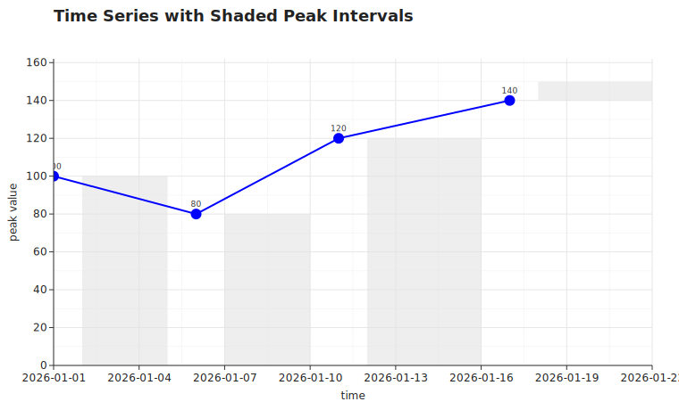

## Gantt chart / timeline with categorical `Rect` bounds

A Gantt chart illustrates a project timeline by plotting intervals for each
phase. `Rect` can use temporal bounds on x and categorical band bounds on y.

```algraf
Chart(data: "gantt.csv", width: 760, height: 420, title: "Project Schedule") {
    Theme(name: "classic")

    Guide(axis: x, label: "Timeline")
    Guide(axis: y, label: "Attorney / phase")

    Space((start_date + end_date) * (attorney / phase)) {
        Rect(
            xmin: start_date,
            xmax: end_date,
            ymin: phase,
            ymax: phase,
            fill: phase,
            alpha: 0.85,
        )
    }
}
```

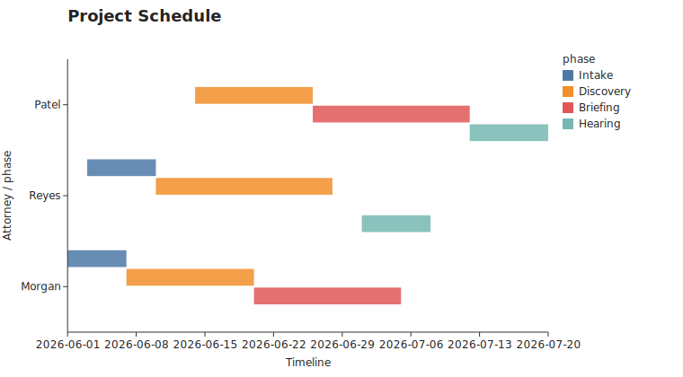

## Stock market candlestick chart via custom rectangles

You can construct complex custom plots like financial candlestick charts using `Rect` primitives. By calculating coordinate offsets for the wicks and bodies in the input data, you can layer a thin rectangle for the high/low wick and a wider rectangle for the open/close body, utilizing conditional color scales for gains and losses.

```algraf
Chart(data: "stock_prices.csv", width: 720, height: 450, title: "Stock Price Candlestick Chart") {
    Theme(name: "minimal")
    Scale(fill: status, range: ["Gain" => "#2ca02c", "Loss" => "#d62728"])
    Scale(stroke: status, range: ["Gain" => "#2ca02c", "Loss" => "#d62728"])
    Scale(axis: x, domain: [0.5, 10.5])
    Scale(axis: y, domain: [90, 115])
    Guide(axis: x, label: "Trading Day")
    Guide(axis: y, label: "Price ($)")

    Space(day * close) {
        // Wick: drawn from low to high
        Rect(xmin: w_left, xmax: w_right, ymin: low, ymax: high, fill: status, alpha: 0.7)
        // Body: drawn from open to close
        Rect(xmin: b_left, xmax: b_right, ymin: open, ymax: close, fill: status)
    }
}
```

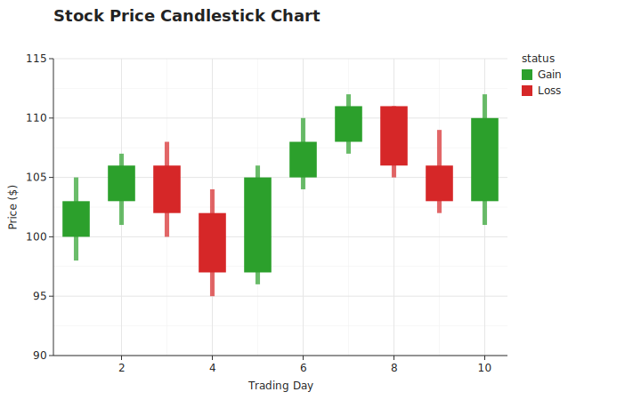

## Flight price dumbbell plot

A dumbbell plot displays range changes or category comparisons using horizontal segments connecting two points per category. In Algraf, you can build this by combining a `Line` (grouped by category with a constant stroke) and a `Point` geometry over a category-continuous space.

```algraf
Chart(data: "flights.csv", width: 760, height: 440, title: "Flight Ticket Prices by Airline and Class") {
    Theme(name: "classic")
    Scale(axis: x, domain: [100, 1000])
    Scale(fill: class, palette: "default")
    Guide(axis: x, label: "Ticket Price ($)")
    Guide(axis: y, label: "Airline")

    Space(price * airline) {
        Line(group: airline, stroke: "#cccccc", strokeWidth: 4)
        Point(fill: class, size: 7)
    }
}
```

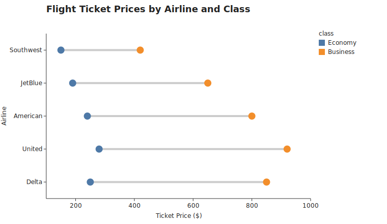

## Faceting via nested algebra

Nesting the space with `/ region` produces one panel per region, all
sharing the same scales and axes.

```algraf
Chart(data: "regional_sales.csv") {
    Space((time * sales) / region) {
        Line(stroke: product)
    }
}
```

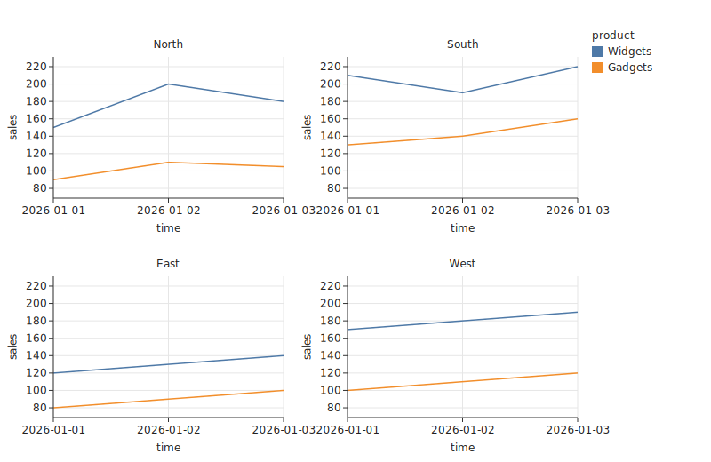

## Faceted sales performance with target line

Combining nested space algebra faceting, line and point series, custom axes/color scales, and reference overlays.

```algraf
Chart(data: "regional_sales.csv", width: 800, height: 480, title: "Regional Sales Performance vs. Target") {
    Theme(name: "minimal")
    Scale(stroke: product, palette: "accent")
    Scale(fill: product, palette: "accent")
    Scale(axis: y, domain: [50, 250])
    Guide(axis: y, grid: true, label: "Sales (k$)")
    Guide(axis: x, label: "Date")

    Space((time * sales) / region) {
        Line(stroke: product, strokeWidth: 2.5)
        Point(fill: product, size: 5)
        HLine(y: 150, stroke: "#ff4444", strokeWidth: 1.5, label: "Daily Target")
    }
}
```

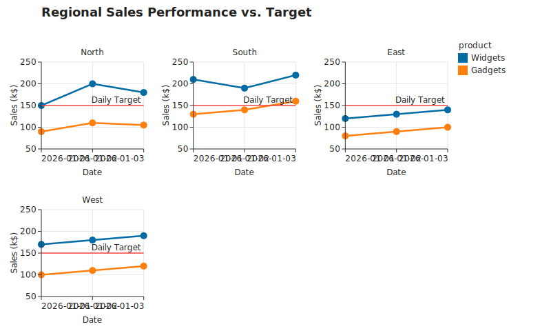

## Reference marks: title, `HLine`, `VLine`, `Rug`

`HLine` and `VLine` accept literal data values and optional labels.
`Guide(legend: false)` suppresses the auto-generated legend when you
don't need it. `Chart(title: ...)` puts a title at the top.

```algraf
Chart(data: "penguins.csv", width: 760, height: 500, title: "Penguin measurements") {
    Guide(legend: false)

    Space(flipper_length * body_mass) {
        Point(fill: species, alpha: 0.62, size: 3)
        HLine(y: 4200, stroke: "#b22222", label: "4.2 kg")
        VLine(x: 45, stroke: "#555555", label: "45 mm")
        Rug(sides: "bl", alpha: 0.3)
    }
}
```

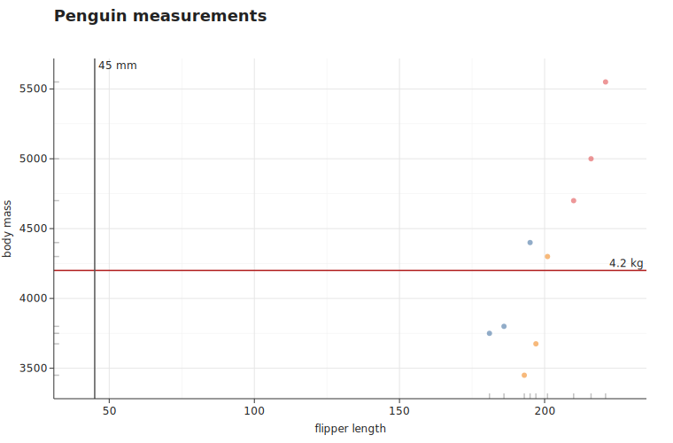

## Line segments between literal points

`Segment` draws a straight line between (`x`, `y`) and (`xend`, `yend`).
The endpoints participate in scale training, so the segment always
stays inside the plot rect.

```algraf
Chart(data: "penguins.csv", width: 720, height: 480) {
    Space(flipper_length * body_mass) {
        Point(fill: species, alpha: 0.7, size: 3)
        Segment(
            x: 175,
            y: 3000,
            xend: 230,
            yend: 6000,
            stroke: "#d62728",
            strokeWidth: 2,
        )
    }
}
```

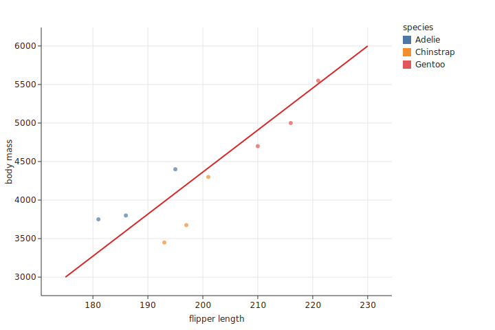

## Text labels per row

`Text` places one label per data row at its (`x`, `y`) position, using
the column you map to `label`.

```algraf
Chart(data: "penguins.csv", width: 720, height: 480) {
    Space(flipper_length * body_mass) {
        Point(fill: species, alpha: 0.4, size: 3)
        Text(label: species, anchor: "middle", dy: -8, size: 10)
    }
}
```

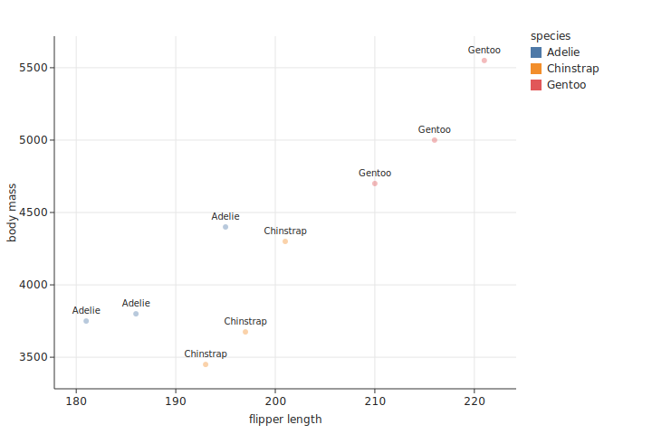

## Multiline text labels from JSON

JSON string values can contain newline characters. `Text` renders those as
separate SVG text lines, so longer annotations can stay attached to their data
position without pre-splitting the source table.

```algraf
Chart(data: "text.json",) {
    Scale(axis: x, domain: [0, 80])
    Scale(axis: y, domain: [0, 100])
    Space(x * y) {
        Text(label: label)
    }
}
```

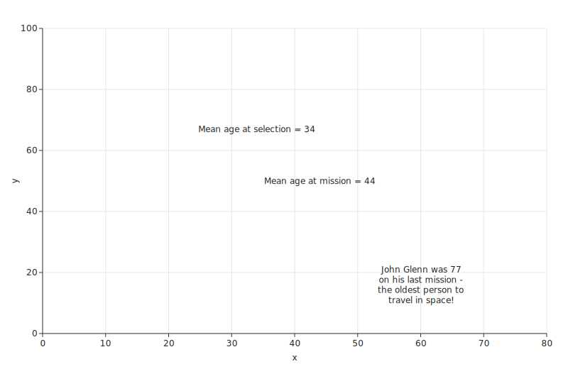

## Slopegraph with text labels

A slopegraph compares values at two points in time/categories (e.g. 2024 vs 2026) for different groups, drawing a line between the two states. In Algraf, you can do this by using a continuous or categorical x-axis, using `Line` grouped and colored by group, `Point` markers, and `Text` labels. By leaving the label column blank for the starting year, text labels are rendered only at the end points to cleanly name the series.

Because the end-labels name the series directly, the `metric` legend is redundant, so it is turned off with `Guide(legend: false)`. With the legend gone there is nothing to reserve space on the right for those labels, so `marginRight: 150` keeps a minimum right margin wide enough for them to fit on the canvas.

Two of the 2026 endpoints (Customer Support and Platform Ease) are nearly tied, so their labels would collide. `declutter: true` on the `Text` layer spreads vertically-overlapping labels apart automatically — it operates on the final label positions, is scoped to labels sharing the same x, and keeps them within the plot.

```algraf
Chart(data: "satisfaction.csv", width: 760, height: 480, marginRight: 150, title: "Customer Satisfaction Shift (2024 vs 2026)") {
    Theme(name: "minimal")
    Scale(axis: x, domain: [2024, 2026], integer: true)
    Scale(axis: y, domain: [50, 100])
    Scale(stroke: metric, palette: "accent")
    Scale(fill: metric, palette: "accent")
    Guide(axis: x, label: "Year")
    Guide(axis: y, label: "Satisfaction Score (%)")
    Guide(legend: false)

    Space(year * value) {
        Line(group: metric, stroke: metric, strokeWidth: 3)
        Point(fill: metric, size: 6)
        Text(label: label, dx: 10, dy: -2, anchor: "start", size: 10, fill: "#444444", declutter: true)
    }
}
```

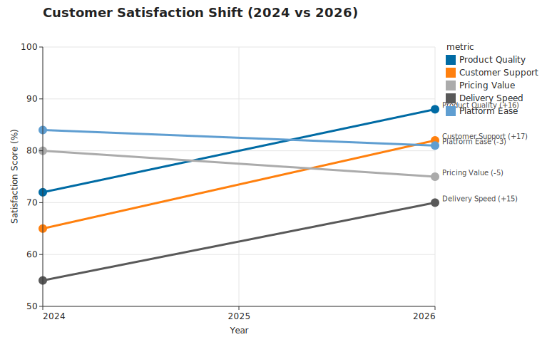

## Per-row label offsets

When you want full control over where each label sits rather than automatic decluttering, `dx` and `dy` can take a **column** instead of a literal number, so every label is offset by its own value from the data. Here a `labeldy` column lifts some labels above their point and drops others below, keeping each clear of its marker.

```algraf
Chart(data: "labeled_points.csv", width: 640, height: 440, title: "Product Positioning") {
    Theme(name: "minimal")
    Scale(axis: y, domain: [3.5, 5.0])
    Guide(axis: x, label: "Price ($)")
    Guide(axis: y, label: "Rating")

    Space(price * rating) {
        Point(size: 6, fill: "#4E79A7")
        Text(label: label, dy: labeldy, anchor: "middle", size: 11, fill: "#333333")
    }
}
```

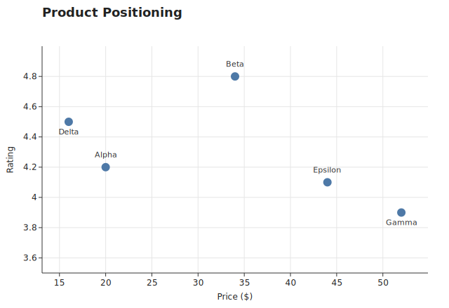

## Overriding labels and palettes

`Guide(axis: x, label: ...)` and `Guide(axis: y, label: ...)` replace
the default column-name axis titles with custom text. `Scale(fill: ...,
palette: "accent")` switches the categorical fill palette for the mapped
column.

```algraf
Chart(data: "penguins.csv", width: 720, height: 480) {
    Guide(axis: x, label: "Flipper length (mm)")
    Guide(axis: y, label: "Body mass (g)")
    Scale(fill: species, palette: "accent")

    Space(flipper_length * body_mass) {
        Point(fill: species, alpha: 0.7, size: 3)
    }
}
```

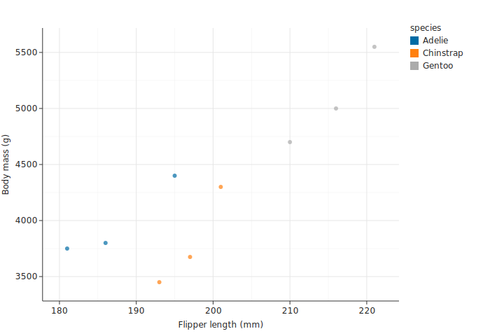

## Renaming a legend with `Scale(label: ...)`

A `fill` or `stroke` scale can carry a `label`, which becomes the legend
title instead of the raw column name. Combine it with `palette:` to control
both the colors and the heading of the legend.

```algraf
Chart(data: "penguins.csv", width: 720, height: 480, title: "Scale-driven legend label") {
    Scale(fill: species, palette: "accent", label: "Penguin Species")

    Space(flipper_length * body_mass) {
        Point(fill: species, size: 4, alpha: 0.85)
    }
}
```

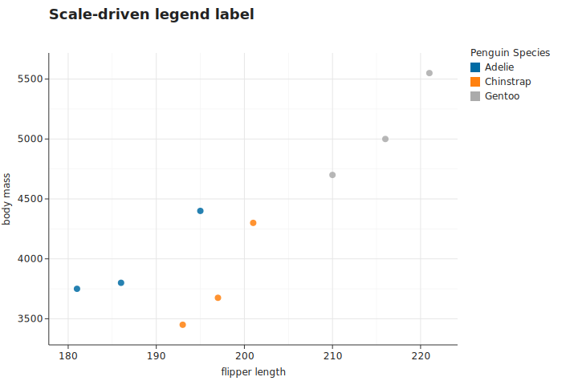

## Merging fill and stroke legends

When `fill` and `stroke` map to the same categorical column, Algraf merges
their legends into one. Each swatch shows the fill color with the stroke
color drawn as an outline, instead of two redundant legends with the same
title.

```algraf
Chart(data: "penguins.csv", width: 720, height: 480, title: "Merged fill and stroke legend") {
    Space(flipper_length * body_mass) {
        Point(fill: species, stroke: species, size: 4, alpha: 0.8)
    }
}
```

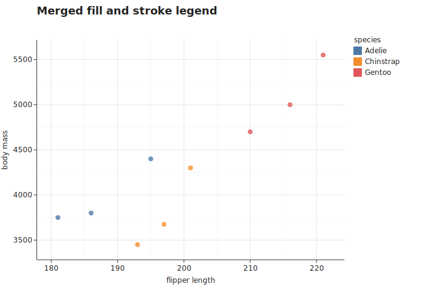

## Log-scaled axes

`Scale(axis: y, type: "log10")` switches a continuous position axis to a
base-10 log scale, which spreads out values that span several orders of
magnitude. A log axis needs a strictly positive domain, so pin it with
`domain: [...]` rather than relying on the data-driven bounds.

```algraf
Chart(data: "cities.csv", width: 720, height: 460, title: "Population across settlement sizes") {
    Scale(axis: y, type: "log10", domain: [100, 10000000])
    Guide(axis: y, label: "Population (log scale)")

    Space(place * population) {
        Point(fill: place, size: 6)
    }
}
```

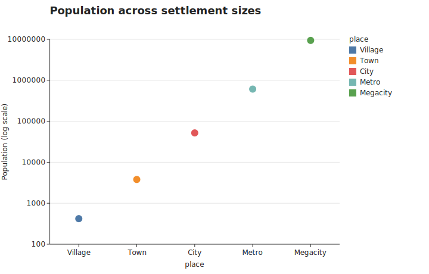

## Pinning a domain

`Scale(axis: y, domain: [min, max])` fixes the axis bounds to an explicit
range instead of fitting them to the data. This is handy for keeping a
consistent y range across charts, or for adding headroom around the points.

```algraf
Chart(data: "penguins.csv", width: 720, height: 480) {
    Scale(axis: y, domain: [2500, 6500])
    Guide(axis: y, label: "Body mass (g), pinned axis")

    Space(flipper_length * body_mass) {
        Point(fill: species, alpha: 0.7, size: 3)
    }
}
```

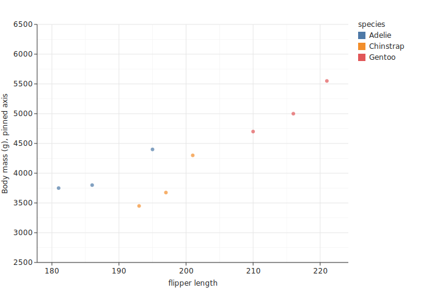

## Reversing an axis

`Scale(axis: y, reverse: true)` flips the axis direction. For rank-style
data — where 1 is best — reversing the y axis puts first place at the top,
turning a line chart into a bump chart. Adding `integer: true` constrains the
ticks to whole numbers, so ranks and weeks read as `1, 2, 3` instead of
half-steps — without having to pin an explicit `domain`.

```algraf
Chart(data: "rankings.csv", width: 720, height: 440, title: "League standings by week") {
    Scale(axis: x, integer: true)
    Scale(axis: y, reverse: true, integer: true)
    Guide(axis: y, label: "Rank")

    Space(week * rank) {
        Line(stroke: team, strokeWidth: 2)
        Point(fill: team, size: 5)
    }
}
```

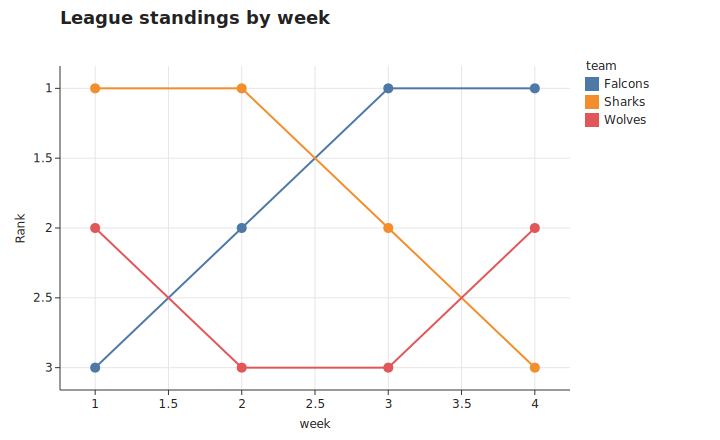

## Hiding grid lines and individual legends

Guide controls compose: `Guide(grid: false)` drops the background grid, and
`Guide(fill: null)` suppresses just the `fill` legend while keeping the
colors mapped. The result is a stripped-down canvas that still encodes the
categorical fill.

```algraf
Chart(data: "penguins.csv", width: 720, height: 480) {
    Guide(grid: false)
    Guide(fill: null)

    Space(flipper_length * body_mass) {
        Point(fill: species, alpha: 0.75, size: 4)
    }
}
```

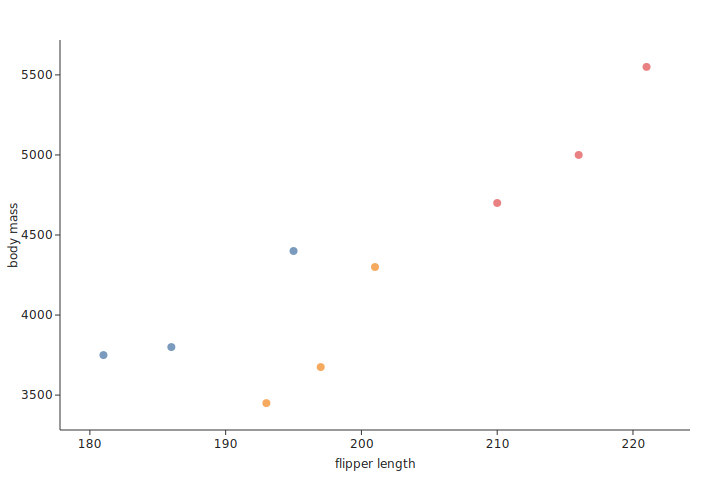

## Space-local themes

`Theme` can appear at the chart level or inside a `Space`. A
space-scoped `Theme` overrides the chart theme just for that panel —
useful when one space wants a stripped-down look.

```algraf
Chart(data: "timeseries.csv", width: 760, height: 420) {
    Theme(name: "minimal")

    Space(time * value) {
        Theme(name: "void")
        Line(stroke: series, strokeWidth: 2)
    }
}
```

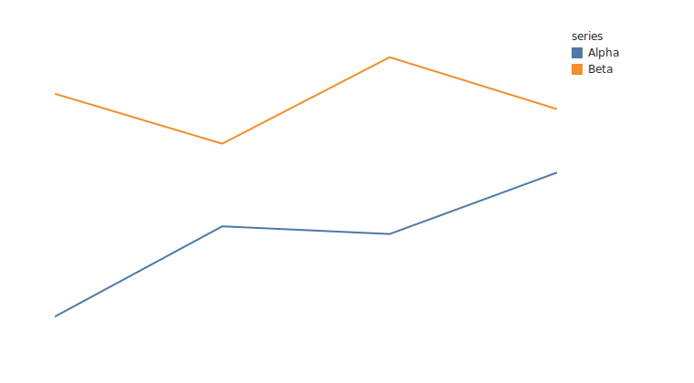

---

## Variables with `let`

A `let` binding names a constant value so it can be reused across a chart
instead of repeating the literal. Bindings are valid at chart scope (visible
everywhere) and space scope (visible in that space, shadowing a chart binding of
the same name). They resolve in property value positions; a bare identifier
matching a binding wins over a column of the same name, while a backtick-quoted
identifier is always a column.

```algraf
Chart(data: "penguins.csv") {
    let primary = "#3366cc"
    let muted = Style(fill: "#6b7280", alpha: 0.55)

    Space(flipper_length * body_mass) {
        Point(style: muted, stroke: primary)
    }
}
```

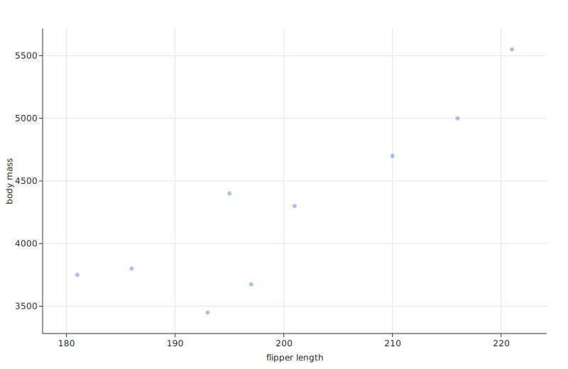

---

## Custom themes

`Theme` accepts override properties layered on top of a named base. Two grouped,
geometry-style overrides — `axisText: Text(...)` and `gridMajor: Line(...)` —
sit alongside direct scalar keys such as `plotBackground`, `axisColor`,
`textColor`, `fontSize`, `lineWidth`, `grid`, and `axes`. Override values reuse
the usual value forms and may reference `let` variables for shared colors.

```algraf
Chart(data: "penguins.csv") {
    let ink = "#333333"
    let faint = "#dddddd"

    Theme(
        name: "minimal",
        axisText: Text(size: 12, fill: ink),
        gridMajor: Line(stroke: faint, strokeWidth: 1),
        plotBackground: "#fafafa"
    )

    Space(flipper_length * body_mass) {
        Point(fill: species, alpha: 0.8)
    }
}
```

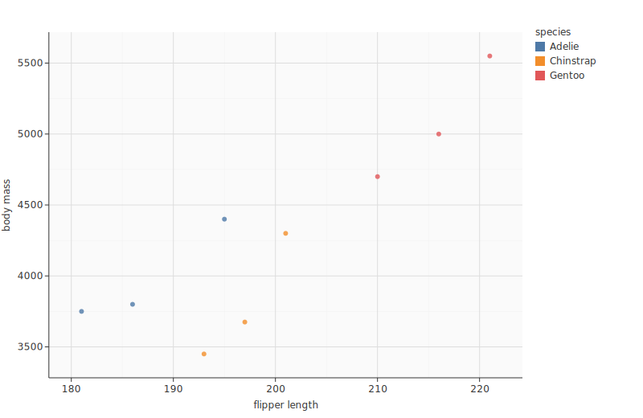

---

## Paths and data-driven line width

`Path` connects rows in source order — unlike `Line`, which sorts by x — so it
can trace a route that doubles back on itself. Mapping `strokeWidth` to a column
turns the line into a variable-width ribbon: a continuous `Scale(strokeWidth:)`
trains the column's domain into a pixel `range`, and each segment is drawn at the
width of its endpoints. A `domain` (or `range`) bound may be `null` to infer it
from the data.

```algraf
Chart(data: "route.csv", title: "Path with variable width") {
    Scale(strokeWidth: load, domain: [0, null], range: [1, 18], label: "Load")

    Space(x * y) {
        Path(stroke: "#4E79A7", strokeWidth: load)
    }
}
```

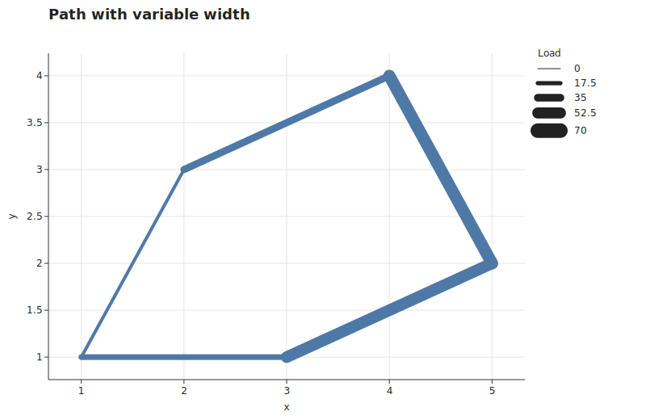

## Manual colors and renamed legend entries

A categorical `fill`/`stroke` scale can take a `=>` map for `range:`, assigning
each category an exact color, and a `labels:` map that renames the legend
entries. The map keys also fix the category order, so no separate `domain` is
needed.

```algraf
Chart(data: "penguins.csv", title: "Manual colors and renamed legend") {
    Scale(fill: species,
          range:  ["Adelie" => "#4E79A7", "Chinstrap" => "#E15759", "Gentoo" => "#59A14F"],
          labels: ["Adelie" => "Adélie", "Chinstrap" => "Chinstrap", "Gentoo" => "Gentoo"],
          label:  "Species")

    Space(flipper_length * body_mass) {
        Point(fill: species, alpha: 0.8)
    }
}
```

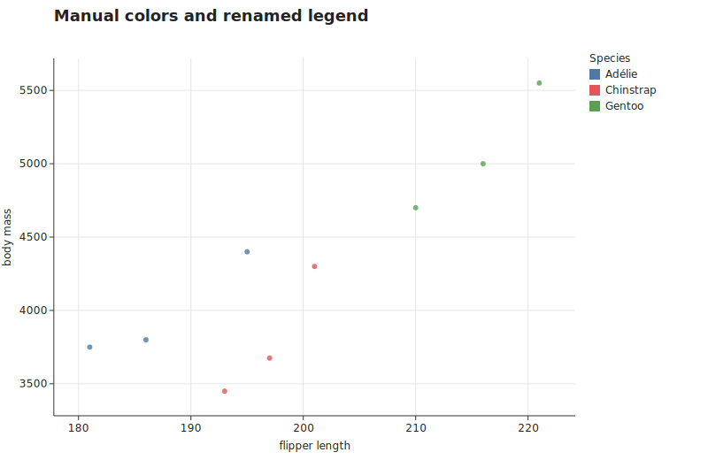

## Minard's march: overlaying a second data source

The capstone pulls the v0.6 primitives together to recreate Minard's map of
Napoleon's 1812 Russian campaign. A chart-scoped `Table` loads a second CSV of
city labels onto the same long/lat space as the troop path. The troop layer is a
`Path` drawn in data order, its width encoding the surviving troop count and its
color split between advance and retreat with two hand-picked colors and renamed
legend entries. The two mapped aesthetics produce two legends: a "Direction"
swatch legend for the stroke colors and a "Troops" size legend whose swatch lines
thicken with the surviving-troop count. Axis titles are suppressed with
`label: null`, since raw longitude and latitude need no heading.

```algraf
Chart(
    data: "minard_troops.csv",
    title: "Napoleon's Russian Campaign",
    subtitle: "Inspired by the graphic of C.J. Minard",
    marginRight: 40
) {
    Table cities = "minard_cities.csv"

    Scale(stroke: direction,
          range: ["A" => "burlywood", "R" => "black"],
          labels: ["A" => "Advance", "R" => "Retreat"],
          label: "Direction")
    Scale(strokeWidth: survivors, domain: [0, null], range: [0, 30], label: "Troops")

    Guide(axis: x, label: null)
    Guide(axis: y, label: null)

    Space(long * lat) {
        Path(stroke: direction, strokeWidth: survivors, group: group)
    }

    Space(long * lat, data: cities) {
        Text(label: city, size: 6)
    }
}
```

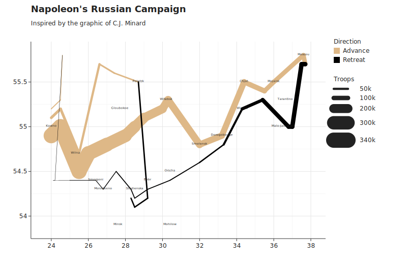

## Data formats: TSV, JSON, and NDJSON

Every example so far reads CSV, but a data source can also be TSV, JSON, or
NDJSON. The format is chosen by the file extension (`.tsv`/`.tab`, `.json`,
`.ndjson`/`.jsonl`); an unrecognized extension is read as CSV. Whatever the
format, the data lands in the same dataframe and runs through the same
type-inference pipeline, so the chart language is identical.

A `.tsv` source is just CSV with tab separators:

```algraf
Chart(
    data: "sales.tsv",
    width: 640,
    height: 420,
    title: "Revenue by region (TSV source)",
) {
    Space(region * revenue) {
        Bar(stat: "identity", fill: region, alpha: 0.85, layout: "stack")
    }
}
```

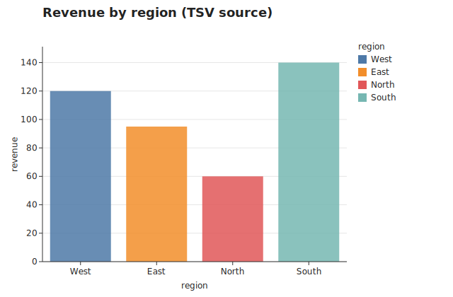

SQLite sources use an explicit constructor with a database path and a read-only
query. The `sql` feature gate is required, and the query includes `ORDER BY` so
row order is deterministic:

```algraf
Algraf(version: "0.21", features: ["sql"])

Chart(
    data: Sqlite("sales.db", "SELECT region, revenue FROM sales ORDER BY region"),
    width: 640,
    height: 420,
    title: "Revenue by region (SQLite source)",
) {
    Space(region * revenue) {
        Bar(stat: "identity", fill: region, alpha: 0.85)
    }
}
```

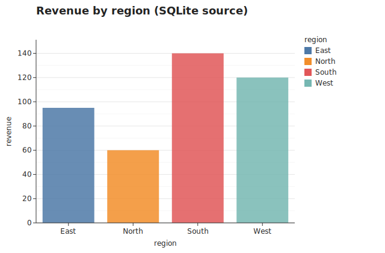

A `.json` source is an array of row objects. Each object is a row; keys become
columns (in first-seen order). JSON values are inferred exactly as their CSV
text would be — `null` is a missing cell, and the number `1` and string `"1"`
both infer as an integer:

```algraf
Chart(
    data: "temperatures.json",
    width: 760,
    height: 460,
    title: "Monthly temperature (JSON source)",
) {
    Space(date * temp) {
        Line(stroke: city, strokeWidth: 2)
        Point(fill: city, size: 5)
    }
}
```

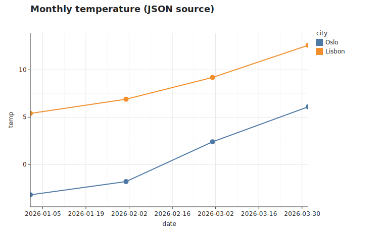

A `.ndjson` source is one JSON row object per line (blank lines are skipped):

```algraf
Chart(
    data: "events.ndjson",
    width: 640,
    height: 420,
    title: "Events by category (NDJSON source)",
) {
    Space(category * count) {
        Bar(stat: "identity", fill: category, alpha: 0.85)
    }
}
```

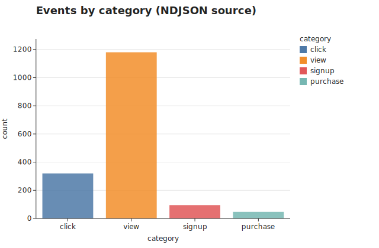

---

## Maps: a county population choropleth

Version 0.8 makes geometry a first-class column type. The `GeoJson(...)` source
constructor loads a `FeatureCollection` — one row per feature, each property a
column, and the geometry in a `geom` column. `Space(geom, projection: ...)`
projects those features into the plot, and the polymorphic `Geo` mark fills each
region by a data value: a choropleth. Here `projection: "albers_usa"` puts the
lower-48 counties into the conventional Albers equal-area layout, and `fill`
maps `population` through the gradient declared on the chart.

```algraf
Chart(data: GeoJson("us_counties.geojson"), width: 900, height: 600,
      title: "US Population by County",
      subtitle: "Lower 48 + DC — 2018 Census estimates") {
    Theme(name: "void")
    Scale(fill: population, gradient: ["#f7fbff", "#08306b"], label: "Population")

    Space(geom, projection: "albers_usa") {
        Geo(fill: population, stroke: "#ffffff", strokeWidth: 0.25)
    }
}
```

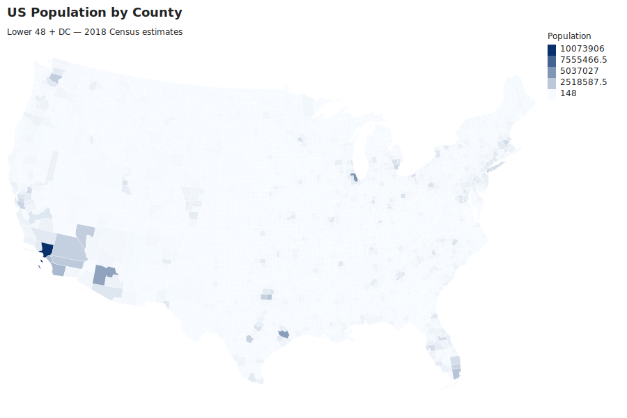

The same map reads from a shapefile by changing only the source — both formats
decode to the identical `geom` column plus attributes, so the `Space`/`Geo`/`Scale`
body is unchanged:

```algraf
Chart(data: Shapefile("cb_2018_us_county_20m.shp"), ...) { ... }
```

(The `examples/fixtures/build_counties.sh` script rebuilds both fixtures from
public-domain US Census sources.)

## Maps: projecting a point layer onto a basemap

Because the projection is shared across overlaid spaces, a `long * lat` point
layer drops onto the same basemap. The county geometry is the primary source; a
chart-scoped `Table` supplies the cities, and both spaces declare the same
`albers_usa` projection so the layers align.

```algraf
Chart(data: GeoJson("us_counties.geojson"), width: 900, height: 600,
      title: "Major US Cities",
      subtitle: "A projected point layer over a county basemap") {
    Theme(name: "void")
    Table cities = "us_cities.csv"

    Space(geom, projection: "albers_usa") {
        Geo(fill: "#eeeeee", stroke: "#ffffff", strokeWidth: 0.25)
    }

    Space(long * lat, projection: "albers_usa", data: cities) {
        Point(size: 5, fill: "#cc3333", alpha: 0.85)
    }
}
```

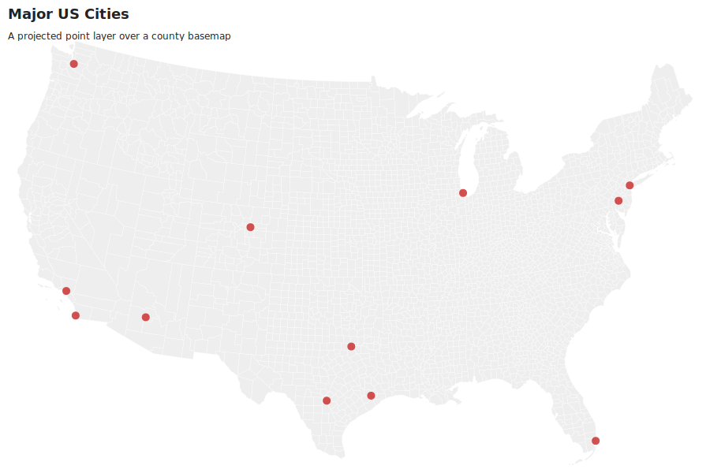

## Maps: a graticule over the `albers_usa` composite

`projection: "albers_usa"` is the conventional `albersUsa` composite: it routes
Alaska and Hawaii through their own equal-area insets while leaving the lower-48
unchanged. A `Graticule` mark draws the projected longitude/latitude grid
through the active spatial scale; `step` sets the spacing in degrees.

```algraf
Chart(data: GeoJson("us_counties.geojson"), width: 900, height: 600,
      title: "US Population by County",
      subtitle: "albers_usa composite with a longitude/latitude graticule") {
    Theme(name: "void")
    Scale(fill: population, gradient: ["#f7fbff", "#08306b"], label: "Population")

    Space(geom, projection: "albers_usa") {
        Graticule(stroke: "#cccccc", strokeWidth: 0.5, step: 10)
        Geo(fill: population, stroke: "#ffffff", strokeWidth: 0.25)
    }
}
```

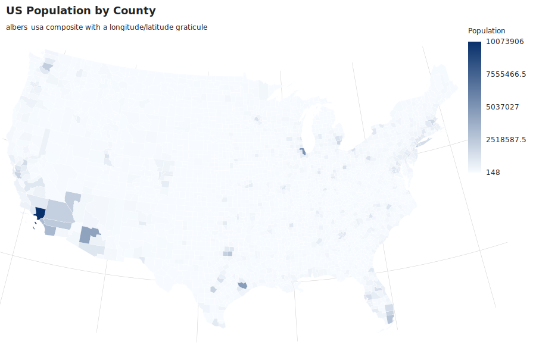

## Maps: geometry-producing stats with `Centroid`

`Centroid(geom)` is a derived stat that reduces each geometry to a point,
passing every scalar column through. The result is an ordinary derived table, so
a `Geo` mark draws the centroids as a point layer — here colored by the
county's population.

```algraf
Chart(data: GeoJson("us_counties.geojson"), width: 900, height: 600,
      title: "County Population Centroids") {
    Theme(name: "void")
    Scale(fill: population, gradient: ["#fee5d9", "#a50f15"], label: "Population")

    Derive centers = Centroid(geom)

    Space(geom, data: centers, projection: "albers_usa") {
        Geo(fill: population, stroke: "#333333", strokeWidth: 0.1)
    }
}
```

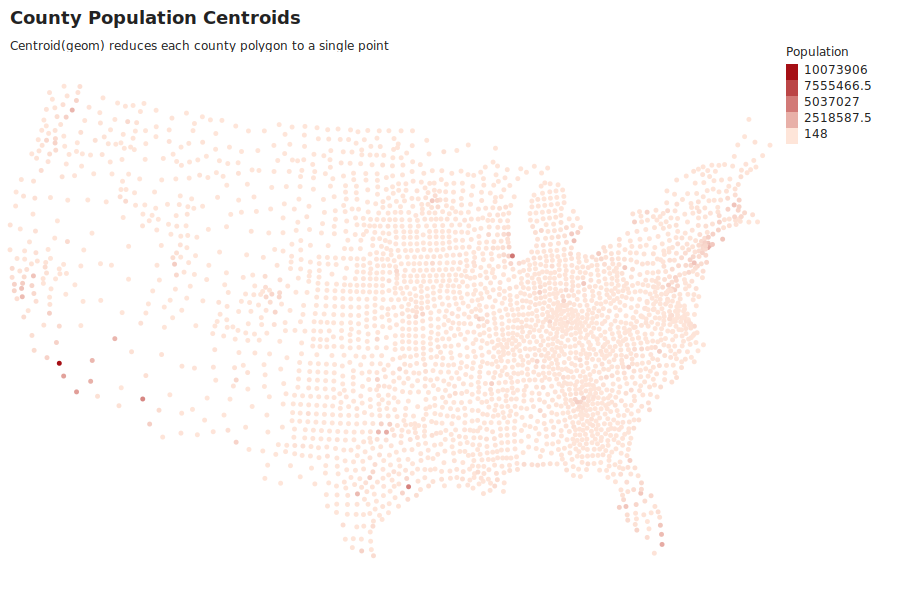

## Maps: TopoJSON input

`TopoJson(...)` decodes a TopoJSON topology — shared boundaries stored once as
arcs — into the same `geom` column as GeoJSON. `object:` names the topology
object to load.

```algraf
Chart(data: TopoJson("grid.topojson", object: "grid"), width: 400, height: 400,
      title: "TopoJSON Grid") {
    Theme(name: "void")
    Scale(fill: value, gradient: ["#edf8e9", "#006d2c"], label: "Value")

    Space(geom, projection: "equirectangular") {
        Geo(fill: value, stroke: "#ffffff", strokeWidth: 1)
        Graticule(stroke: "#bbbbbb", strokeWidth: 0.5, step: 1)
    }
}
```

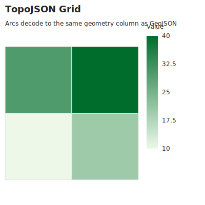

## Maps: spatial join with `SpatialJoin`

`SpatialJoin(geom, table: zones, predicate: "within")` tags each point with the
attributes of the polygon that contains it. The polygon outlines are drawn in
one space; the joined points, colored by their matched zone, in another.

```algraf
Chart(data: GeoJson("sensors.geojson"), width: 500, height: 360,
      title: "Sensors Tagged by Zone") {
    Theme(name: "void")

    Table zones = GeoJson("zones.geojson")
    Derive tagged = SpatialJoin(geom, table: zones, predicate: "within")

    Space(geom, data: zones, projection: "equirectangular") {
        Geo(stroke: "#999999", strokeWidth: 1)
    }
    Space(geom, data: tagged, projection: "equirectangular") {
        Scale(fill: zone, palette: "accent", label: "Zone")
        Geo(fill: zone, stroke: "#222222", strokeWidth: 0.5)
    }
}
```

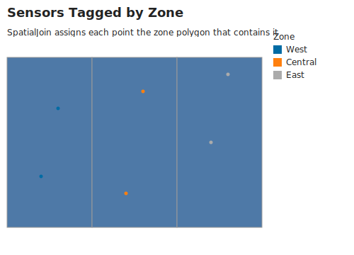

---

## Multiple charts in one document

A document may hold more than one top-level `Chart`. Each chart is fully
independent — its own data source, scales, guides, theme, and layout — and
renders to its own file. With multiple charts, `render` requires `--output` and
writes one file per chart, inserting a 1-based suffix before the extension
(`out.svg` → `out-1.svg`, `out-2.svg`):

```algraf
Chart(data: "penguins.csv", width: 640, height: 400, title: "Observations") {
    Space(flipper_length * body_mass) {
        Point(fill: species, alpha: 0.8)
    }
}

Chart(data: "penguins.csv", width: 640, height: 400, title: "Linear fit") {
    Space(flipper_length * body_mass) {
        Point(alpha: 0.25)
        Smooth(method: "lm")
    }
}
```

```bash
cargo run -p algraf-cli -- render examples/multi_chart.ag --output multi_chart.svg
# writes multi_chart-1.svg and multi_chart-2.svg
```

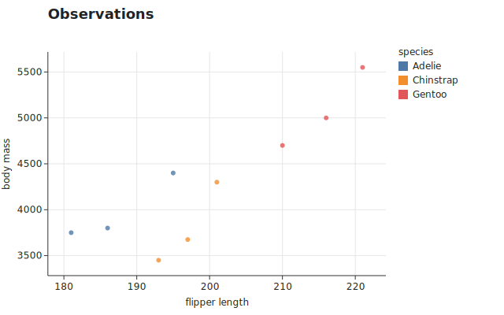

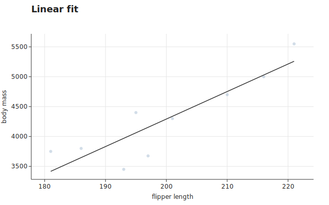

---

## Running the examples yourself

From the repository root:

```bash
# Render a single example
cargo run -p algraf-cli -- render examples/scatter.ag --output /tmp/scatter.svg

# Regenerate every committed SVG and PNG
./examples/generate.sh

# Validate without rendering
cargo run -p algraf-cli -- check examples/scatter.ag

# Inspect inferred schema and IR
cargo run -p algraf-cli -- schema examples/scatter.ag --json
```

## Workspace layout

Cargo workspace with eight crates under [`crates/`](crates/):

| Crate | Responsibility |
| --- | --- |
| `algraf-core` | Shared primitives: `Span`, `Diagnostic`, `Severity` |
| `algraf-syntax` | Lexer, parser, AST/CST (rowan), parse diagnostics, formatter |
| `algraf-data` | CSV loading, schema inference, dataframe |
| `algraf-semantics` | Name resolution, validation, IR, geometry registry |
| `algraf-driver` | Shared source resolution, data/schema loading, and analysis preparation |
| `algraf-render` | Scale training, layout, stats, geometries, SVG emission |
| `algraf-lsp` | tower-lsp backend, document cache, completion, hover |
| `algraf-cli` | The `algraf` binary |
