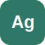

<p>
  
</p>

# Algraf

[](https://github.com/williamcotton/algraf/actions/workflows/ci.yml)

[Download VS Code VSIX](https://github.com/williamcotton/algraf/releases/latest/download/algraf-vscode-latest.vsix) | [Download browser WASM](https://github.com/williamcotton/algraf/releases/latest/download/algraf-wasm-latest.wasm)

Algraf is a block-scoped, algebraic grammar-of-graphics DSL. You describe a
chart declaratively in a `.ag` file, point it at CSV/TSV/JSON/SQLite/GeoJSON or
native CLI Parquet data, or pipe caller-provided Arrow stream data from tools
such as PDL. The `algraf` binary parses the source, validates it against the
data, trains scales, and emits deterministic SVG.

The complete visual gallery lives in [`examples/README.md`](examples/README.md).

Live site: [`https://williamcotton.github.io/algraf/`](https://williamcotton.github.io/algraf/)
Full demos: [`https://williamcotton.github.io/algraf/demos`](https://williamcotton.github.io/algraf/demos)

## A tour in seven charts

Each chart below is a runnable file under [`examples/`](examples/). The examples
start with one `Space` and one geometry, then add one or two features at a time:
layers, statistical transforms, facets, multiple data sources, annotations, and
data-driven paths.

## 1. Scatter: one space, one mark

`Chart` names the data source, `Space(flipper_length * body_mass)` trains the
cartesian x/y frame, and `Point(fill: species)` maps a categorical column to a
legend-backed fill scale. This is the smallest complete Algraf chart: one input
table, one coordinate system, and one mark per row.

New feature: a mapped aesthetic. `fill: species` is not a literal color; it
binds the `species` column to a categorical scale, colors the points, and emits
the legend automatically.

```algraf
Chart(data: "penguins.csv", width: 760, height: 500) {
    Theme(name: "minimal")

    Space(flipper_length * body_mass) {
        Point(fill: species, alpha: 0.82, size: 4)
    }
}
```


## 2. Smooth: add a statistical layer

Layers are just more marks in the same `Space`. Here raw points stay visible
while `Smooth(method: "lm")` derives and draws a fitted trend. Both layers share
the same trained x/y scales, so the statistical output lands in the same
coordinate system as the observations.

New feature: a statistical geometry. `Smooth` computes a new table internally
from the source rows, then renders the fitted values as a line. The chart source
still reads like a visual specification rather than a data-preparation script.

```algraf
Chart(data: "penguins.csv", width: 760, height: 500) {
    Space(flipper_length * body_mass) {
        Point(fill: species, alpha: 0.55, size: 3)
        Smooth(method: "lm", stroke: "#333333", strokeWidth: 2)
    }
}
```


## 3. Facets: split one chart into panels

The `/` algebra operator facets a frame. `(time * sales) / region` builds one
line chart per region while `stroke: product` keeps the product grouping inside
each panel. Faceting is part of the frame expression, so the panel layout is
declared beside the x/y mapping instead of as a separate layout mode.

New feature: nested algebra. `*` crosses two columns into x/y, and `/ region`
splits that frame into repeated panels. Scales, axes, and strip labels are
trained from the faceted structure.

```algraf
Chart(data: "regional_sales.csv") {
    // This creates a separate line chart for each 'region'
    Space((time * sales) / region) {
        Line(stroke: product)
    }
}
```


## 4. Weather: compose layers with multiple spaces

Separate spaces can share the same x axis while mapping different y columns. A
forecast ribbon and line use one y field, while observed temperatures are drawn
as points from another. This is useful when related measures live in the same
table but should be drawn with different marks or y mappings.

New features: multiple `Space` blocks and interval marks. `Ribbon(ymin, ymax)`
draws an uncertainty band around the forecast, while the second space overlays
actual observations without forcing those points to use `temp_forecast` as y.
The explicit `Scale` and `Guide` calls pin the y domain and axis labels.

```algraf
Chart(data: "weather_forecast.csv", width: 760, height: 420, title: "7-Day Weather Forecast & Observations", marginRight: 50) {
    Theme(name: "minimal")
    Scale(axis: y, domain: [8, 28])
    Guide(axis: x, label: "Date")
    Guide(axis: y, label: "Temperature (°C)")

    Space(date * temp_forecast) {
        Ribbon(ymin: temp_min, ymax: temp_max, fill: "#add8e6", alpha: 0.4)
        Line(stroke: "#4a90e2", strokeWidth: 3)
    }

    Space(date * temp_actual) {
        Point(fill: "#ff6b6b", size: 6)
    }
}
```


## 5. Astronauts: blend fields, annotate the result

`mission_age + selection_age` blends two numeric columns into one frame. The
histogram layer uses that derived series, then reference lines and text annotate
the distribution directly in data coordinates. This chart is still a single
space, but it now combines a derived distribution, custom scales, theme
overrides, and hand-placed explanatory annotations.

New features: blended fields, histogram bins, reference marks, and text. The `+`
operator stacks two columns into one series for comparison; `Histogram` bins the
values; `VLine` pins reference values; and `Text` can use literal x/y positions
for chart annotations.

```algraf
Chart(
    data: "astronauts.csv",
    width: 760,
    height: 460,
    title: "How old are astronauts on their most recent mission?",
    subtitle: "Age of astronauts when they were selected and when they were sent on their mission",
) {
    Theme(
        name: "minimal",
        plotBackground: "#EBEBEB",
        gridMajor: Line(stroke: "#FFFFFF", strokeWidth: 1),
    )
    Scale(axis: x, domain: [20, 80])
    Scale(axis: y, domain: [0, 69])
    Scale(
        fill: series,
        range: ["selection_age" => "#beaed4", "mission_age" => "#7fc97f"],
        labels: ["selection_age" => "Age at selection", "mission_age" => "Age at mission"],
        label: "",
    )
    Guide(axis: x, label: "Age of astronaut (years)")
    Guide(axis: y, label: "count")

    Space((mission_age + selection_age)) {
        Histogram(binWidth: 1, alpha: 0.8, stroke: "#000000")
        VLine(x: 34, stroke: "#000000", strokeWidth: 1, dash: "dotted")
        VLine(x: 44, stroke: "#000000", strokeWidth: 1, dash: "dotted")
        Text(x: 34, y: 66, label: "Mean age at selection = 34", anchor: "start", dx: 15, dy: 10, size: 14)
        Text(x: 44, y: 49, label: "Mean age at mission = 44", anchor: "start", dx: 15, dy: 10, size: 14)
        Text(
            x: 60,
            y: 20,
            label: "John Glenn was 77\non his last mission -\nthe oldest person to\ntravel in space!",
            anchor: "start",
            dx: 6,
            size: 14,
        )
    }
}
```


## 6. Minard: multiple tables and data-driven paths

Minard's march combines a primary troop table with a city label table. The path
stroke and width are both data-driven, so direction and surviving troop count
are encoded by the same geometry. The city labels come from a second table but
reuse the same longitude/latitude frame, so the route and annotations stay
aligned.

New features: named tables and data-driven paths. `Table cities = ...` adds a
secondary source, `Space(..., data: cities)` switches a layer to that table, and
`Path(..., group: group)` joins rows into route segments. Mapping
`strokeWidth: survivors` turns a numeric column into visual weight.

```algraf
Chart(
    data: "minard_troops.csv",
    title: "Napoleon's Russian Campaign",
    subtitle: "Inspired by the graphic of C.J. Minard",
    marginRight: 40
) {
    Table cities = "minard_cities.csv"

    Scale(stroke: direction,
          range: ["A" => "burlywood", "R" => "black"],
          labels: ["A" => "Advance", "R" => "Retreat"],
          label: "Direction")
    Scale(strokeWidth: survivors, domain: [0, null], range: [0, 30],
          breaks: [50000, 100000, 200000, 300000, 340000],
          labels: ["50k", "100k", "200k", "300k", "340k"], label: "Troops")

    Guide(axis: x, label: null)
    Guide(axis: y, label: null)

    Space(long * lat) {
        Path(stroke: direction, strokeWidth: survivors, group: group)
    }

    Space(long * lat, data: cities) {
        Text(label: city, size: 6)
    }
}
```


## 7. Station labels: declutter nearby text

Direct labels can collide when several points share a row. `declutter: true`
keeps the text layer deterministic while spreading same-row and same-column
collisions apart after all offsets are applied.

New features: mapped size scales, tooltips, and opt-in text decluttering. The
three stations at six trips have neighboring dock capacities, so the text layer
separates their labels without changing the point positions.

```algraf
Chart(data: "station_throughput.csv", width: 760, height: 470, title: "Station throughput vs dock capacity") {
    Theme(name: "minimal")
    Scale(fill: zone, palette: "accent", label: "Zone")
    Scale(size: revenue,
          range: [5, 13],
          breaks: [20, 50, 100],
          labels: ["$20", "$50", "$100"],
          label: "Revenue")
    Scale(axis: x, domain: [0, 36], breaks: [0, 10, 20, 30], labels: ["0", "10", "20", "30"], expand: [0, 0.05])
    Scale(axis: y, domain: [0, 8], breaks: [0, 2, 4, 6, 8], labels: ["0", "2", "4", "6", "8"], expand: [0, 0.05])
    Guide(axis: x, label: "Dock capacity")
    Guide(axis: y, label: "Trips")

    Space(capacity * trips) {
        Point(
            fill: zone,
            size: revenue,
            alpha: 0.85,
            tooltip: [station_name, zone, capacity, trips, revenue]
        )
        Text(label: station_name, dy: -12, size: 10, declutter: true)
    }
}
```


## Install and run

From a checkout, build the native binary:

```bash
cargo build -p algraf-cli
target/debug/algraf render examples/scatter.ag --output /tmp/scatter.svg
target/debug/algraf check examples/scatter.ag
```

Install the packaged binary with Homebrew:

```bash
brew tap williamcotton/algraf
brew install algraf
```

Then use `algraf` directly:

```bash
algraf render examples/minard.ag --output /tmp/minard.svg
algraf render examples/highlight.ag --format svg+json --output /tmp/highlight
algraf schema examples/scatter.ag --json
```

Pipeline tools and host runtimes can call the same executable commands:

```bash
algraf render path/to/chart.ag --output chart.svg
algraf render path/to/chart.ag --format draw-list --output chart.json
```

`algraf render` accepts `--data -` for piped primary data and `--data-format`
when stdin or an override path cannot be inferred from a file extension.

```bash
cat data.csv | algraf render chart.ag --data - --data-format csv --output chart.svg
pdl run prep.pdl --stdout-format arrow-stream | algraf render chart.ag --data - --data-format arrow-stream --output chart.svg
```

[PDL](https://github.com/williamcotton/pdl) is the recommended preparation
companion: its CLI emits typed Arrow IPC streams that Algraf can read directly
on stdin without an intermediate file.

## Output backends

`render` selects its output backend with `--format` (spec §24.6):

| `--format` | Output | Notes |
| --- | --- | --- |
| `svg` (default) | Deterministic SVG. A `.png` `--output` rasterizes the SVG through a system-font wrapper. | The canonical, pixel-faithful path. |
| `svg+json` | Deterministic SVG plus a `.meta.json` interaction sidecar. | For host runtimes that want tooltips, crosshairs, and highlights without scraping SVG. |
| `draw-list` | A serializable JSON draw list of scene primitives (`clipStart`/`clipEnd`/`rect`/`circle`/`path`/`polygon`/`image`/`line`/`text`). | A complete scene description, one op per mark plus all guides, for Canvas/WebGL/raster clients. |
| `raster` | A PNG drawn directly from the draw-list scene model with a CPU rasterizer. | Honors `--png-scale`/`--png-dpi`. Renders shapes; text glyphs and image ops are not drawn. |

```bash
algraf render examples/scatter.ag --format svg       --output /tmp/scatter.svg
algraf render examples/highlight.ag --format svg+json  --output /tmp/highlight
algraf render examples/scatter.ag --format draw-list  --output /tmp/scatter.json
algraf render examples/scatter.ag --format raster     --output /tmp/scatter.png
```

All backends consume the same planned scene, so they agree on coordinates and
colors; SVG is the source of truth for appearance.

## Large data demos

Large demo inputs and benchmark outputs are generated locally instead of being
checked into git. Use:

```bash
cargo run -p algraf-bench -- generate --tier smoke
cargo run -p algraf-bench -- run --suite large --tier smoke --run-label smoke
```

The smoke suite writes deterministic fixtures under `bench/data/generated/` and
bounded SVG outputs plus `report.csv` under `bench/runs/<run-label>/`. The suite
also generates `bench/data/generated/million-row.csv` and renders it through
`SummaryBin`, so the input can be large while the SVG stays bounded. TLC and SFO
Museum sources are opt-in:

```bash
cargo run -p algraf-bench -- download --dataset all
cargo run -p algraf-bench -- prepare --dataset all
cargo run -p algraf-bench -- run --suite large --run-label with-external
```

Large raw SVG is guarded by a mark budget. Prefer `Bin`, `Bin2D`, `SummaryBin`,
sampling, SQLite aggregate queries, or Parquet columnar sources when the input is
large but the chart should stay visually bounded.

## Embedding in a host runtime

Interactive hosts should render static SVG and consume the JSON sidecar rather
than scraping axis ticks or re-running layout. The sidecar includes chart
metadata (`title`, `subtitle`, `caption`, `alt`, `description`), legend position
and rectangle metadata, `plot_rect`, invertible `axes`, pickable `marks[]` with
`x_px`/`y_px`, tooltip rows, highlight groups, and optional
`interaction` event emitters such as `On(event: "click", emit: zone)`.

```bash
algraf render examples/highlight.ag \
  --output chart.svg \
  --metadata chart.meta.json
```

See [`examples/event_emitter.ag`](examples/event_emitter.ag) for a small chart
whose sidecar lets a host map a clicked bar to a `zone` value.

The in-tree host reference lives in [`demo/src/AlgrafChart.tsx`](demo/src/AlgrafChart.tsx).
It reads the sidecar, picks the nearest mark from `x_px`/`y_px`, inverts
serialized axes for crosshair labels, renders tooltip rows, and dims static SVG
marks by `data-algraf-highlight` group. The host owns the UX; Algraf provides
deterministic data.

## Running Algraf in the browser

The root-level [`demo/`](demo) app builds `crates/algraf-wasm` for the browser,
loads the generated `wasm/algraf.wasm` asset through the host's configured
public base path, and calls the manual render ABI with source text plus
host-supplied data text. The landing page (`/`) includes a small live Monaco
editor, `/docs` provides a guided tutorial, and `/demos` keeps the full demo gallery.

```bash
cd demo
npm install
npm run dev
```

The runtime returns `{ svg, sidecar, diagnostics, error }`. The demo fetches its
sample data before calling WASM; browser networking stays host-owned, and the
WASM runtime itself only sees the in-memory `files` map.

Algraf v0.64 also provides local package-shaped browser integrations:
`packages/wasm` (`algraf-wasm`) for runtime loading and ABI types, and
`editors/monaco` (`algraf-editor`) for Monaco/React editor wiring. During
development, hosts can install them with filesystem `file:` paths and pass a
local `wasmUrl` for a copied `public/wasm/algraf.wasm` artifact. See
[`docs/NPM_PACKAGES.md`](docs/NPM_PACKAGES.md).

## Workspace layout

Cargo workspace with ten crates under [`crates/`](crates/):

| Crate | Responsibility |
| --- | --- |
| `algraf-core` | Shared primitives: `Span`, `Diagnostic`, `Severity` |
| `algraf-syntax` | Lexer, parser, AST/CST (rowan), parse diagnostics, formatter |
| `algraf-data` | CSV loading, schema inference, dataframe, type inference |
| `algraf-semantics` | Name resolution, validation, IR, geometry registry |
| `algraf-driver` | Shared source resolution, data/schema loading, analysis prep |
| `algraf-render` | Scale training, layout, stats, geometries, SVG emission |
| `algraf-editor-services` | Shared editor features: completion, hover, tokens, actions |
| `algraf-lsp` | tower-lsp backend, document cache, LSP transport |
| `algraf-cli` | The `algraf` binary: arg parsing, command dispatch, I/O |
| `algraf-wasm` | Browser/WASM runtime over the driver and render pipeline |
