# Algraf examples

This directory contains the complete visual example gallery for Algraf. Each section shows the runnable `.ag` source followed by its rendered SVG, and each chart keeps relative data paths so it can be rendered from the repository root.

For a shorter feature tour, see the root [`README.md`](../README.md).

## A first chart: scatter with a categorical fill

A `Chart` block holds a `Space`, and a `Space` holds geometries. The
algebra operator `*` is *cross*: it pairs two columns into Cartesian x/y.
Mapping `fill: species` colors each point by the categorical column and
produces a legend automatically.

```algraf
Chart(data: "penguins.csv", width: 760, height: 500) {
    Theme(name: "minimal")

    Space(flipper_length * body_mass) {
        Point(fill: species, alpha: 0.82, size: 4)
    }
}
```


## Naming the primary table

When you want every data source to be introduced with `Table`, declare a table
named `main` and bind spaces to it explicitly. The equivalent header form is
`Chart(data: main)` when `main` is declared at document or chart scope.

```algraf
Chart {
    Table main = "penguins.csv"
    Theme(name: "minimal")

    Space(flipper_length * body_mass, data: main) {
        Point(fill: species, alpha: 0.82, size: 4)
    }
}
```

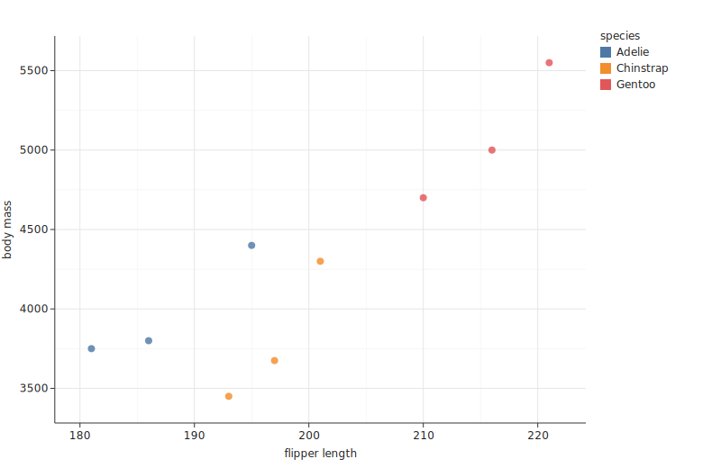

## Line series over time

Temporal columns are detected from the CSV schema and get a time-aware
axis. Mapping `stroke: series` splits one line per group.

```algraf
Chart(data: "series.csv", width: 760, height: 460) {
    Space(day * value) {
        Line(stroke: series, strokeWidth: 2)
    }
}
```


## Embeddable sparkline

A sparkline is just a `void`-themed `Line` shrunk down and stripped of margins.
The `void` theme drops the axes, grid, and labels. Declare it at the `Chart`
level: the chart theme drives the layout and cascades down to each `Space`, so
one declaration both shrinks the margins and hides the marks' guides. (A `Theme`
nested only inside `Space` would hide the guides but still reserve the wide axis
margins, leaving big empty borders.) With no axes, the `marginTop`,
`marginRight`, `marginBottom`, and `marginLeft` arguments set each side exactly
— down to `0` — instead of acting as a floor, so the line can bleed to the
viewport edge. Here a 2px top/bottom margin keeps the stroke from clipping while
the sides go fully flush.

```algraf
Chart(data: "sparkline.csv", width: 200, height: 50,
      marginTop: 2, marginRight: 0, marginBottom: 2, marginLeft: 0) {
    Theme(name: "void")
    Space(t * value) {
        Line(stroke: "#e74c3c", strokeWidth: 1.5)
    }
}
```


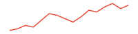

## Image marks

`Image` is point-like: it resolves the active space position for each row and
draws the local image named by `src` centered on that point. A mapped `src`
column produces an image legend, while each file is embedded into the SVG as a
local `data:image/...` href.

```algraf
Chart(data: "image_marks.csv", width: 760, height: 460,
      title: "Example charts as image marks") {
    Theme(name: "minimal")
    Scale(axis: x, domain: [0.5, 3.5])
    Scale(axis: y, domain: [2.3, 3.25])
    Guide(axis: x, label: "Example")
    Guide(axis: y, label: "Score")

    Space(index * score) {
        Image(src: snapshot, size: 96, tooltip: [name, snapshot])
        Text(label: name, dy: -58, anchor: "middle", size: 9)
    }
}
```

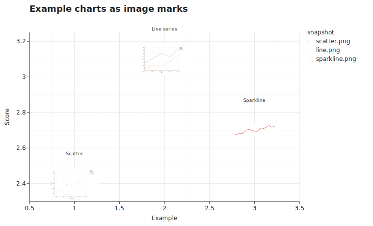

## Host event emitters

`On(event: "click", emit: zone)` attaches inert click metadata to the preceding
mark. The sidecar records the emitted field name and the mark's row value; a
host application decides whether that click updates UI state, PDL state, or
nothing at all.

```algraf
Chart(data: "event_emitter_zones.csv", width: 760, height: 420,
      title: "Zone selector") {
    Theme(name: "minimal")
    Scale(fill: zone, palette: "accent")
    Guide(axis: x, label: "Zone")
    Guide(axis: y, label: "Revenue")

    Space(zone * total_revenue) {
        Bar(fill: zone, layout: "stack", tooltip: [zone, total_revenue, orders])
        On(event: "click", emit: zone)
    }
}
```

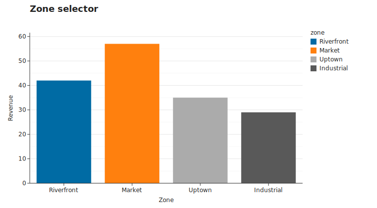

## Scatterplot with glyph sparklines

A `Glyph` declares a chart-valued mark template. The mark renders once per
matched host row, anchored at the row position. Here each country keeps its
scatterplot position, and the glyph's child table contributes the GDP trend
that is matched by `country`.

```algraf
Chart(data: "inset_country_summary.csv", width: 760, height: 500,
      title: "Life expectancy, income, and GDP trend") {
    Table yearly = "inset_country_yearly.csv"

    Glyph spark(data: yearly, key: [country], scales: "shared") {
        Space(year * gdp_per_capita) {
            Line(stroke: "#1f77b4", strokeWidth: 1.2)
        }
    }

    Space(income * life_expectancy) {
        spark(width: 58, height: 24, clip: "rect", padding: 2)
        Text(label: country, dy: -22, size: 8, anchor: "middle")
    }
}
```

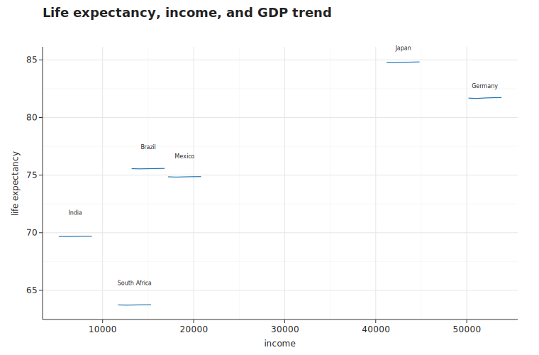

## One-dimensional point-line

Wilkinson's `point(position(pop1980))` is a 1D point-line graph. In Algraf,
`Space(pop1980)` trains a single x axis and places the point-line marks on the
plot-center baseline without drawing a y axis.

```algraf
Chart(data: "population_point_line.csv", width: 760, height: 240, title: "1980 population point-line") {
    Theme(name: "minimal")
    Guide(grid: false)
    Guide(axis: x, label: "Population in 1980 (millions)")

    Space(pop1980) {
        Line(stroke: "#9aa0a6", strokeWidth: 2)
        Point(fill: "#3366cc", size: 5)
    }
}
```

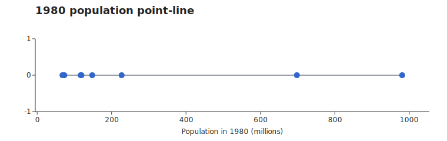

## Broader automatic time parsing

Algraf recognizes unambiguous temporal strings across common CSV/JSON-style
inputs, including year-first dates, ISO datetimes, RFC timestamps, and
English-month forms. Axis labels can use the built-in temporal format names.

```algraf
Chart(data: "temporal_formats_auto.csv", width: 760, height: 420, title: "Automatic temporal parsing") {
    Guide(axis: x, label: "Observed time", timeFormat: "iso-minute")
    Guide(axis: y, label: "Value")

    Space(time * value) {
        Line(stroke: "#3366cc", strokeWidth: 2.5)
        Point(fill: "#3366cc", size: 5)
    }
}
```

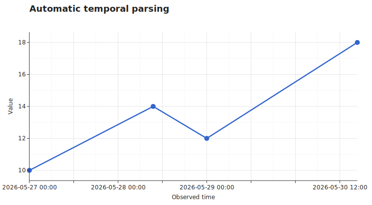

## Explicit time parsing and custom labels

Ambiguous local date orders stay explicit. Use `Parse(...)` to declare the input
format and `Guide(timeFormat: ...)` for project-specific axis labels. By default a
cell that fails to parse becomes missing with an aggregated warning; for stricter
pipelines `Parse(onError: "error")` makes any failure blocking, and
`Parse(onError: "missing")` coerces silently.

```algraf
Chart(data: "temporal_parse_custom.csv", width: 760, height: 420, title: "Explicit temporal parsing") {
    Parse(column: started_at, as: "datetime", format: "%m/%d/%Y %I:%M %p", timezone: "UTC")
    Guide(axis: x, label: "Start time", timeFormat: "%b %-d %I:%M")
    Guide(axis: y, label: "Latency (ms)")

    Space(started_at * latency_ms) {
        Line(stroke: "#cc6633", strokeWidth: 2.5)
        Point(fill: "#cc6633", size: 5)
    }
}
```

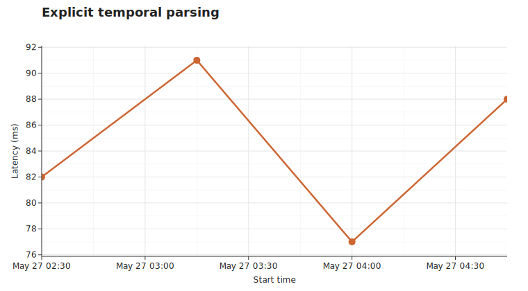

## IANA timezones and temporal literals

`Parse(timezone: ...)` accepts named IANA zones (e.g. `"America/Chicago"`), which
resolve a naive declared datetime — daylight saving and all — to a UTC instant.
`datetime("…")` and `date("…")` are typed temporal literals usable wherever a
position or scale-domain bound is accepted, such as a reference line or an
explicit domain. Here the data is read in Chicago local time and a `VLine` marks
a deploy at a precise UTC instant:

```algraf
Chart(data: "deploy_latency.csv", width: 820, height: 420, title: "Request latency around a deploy") {
  Parse(column: started_at, as: "datetime", format: "%m/%d/%Y %H:%M", timezone: "America/Chicago")

  Space(started_at * latency_ms) {
    Scale(axis: x, domain: [datetime("2026-05-27T22:30:00Z"), datetime("2026-05-28T03:30:00Z")])
    Line(stroke: "#3b6ea5")
    VLine(x: datetime("2026-05-28T01:00:00Z"), stroke: "#c0392b", dash: "dashed", label: "deploy")
  }

  Guide(axis: x, timeFormat: "iso-minute")
}
```

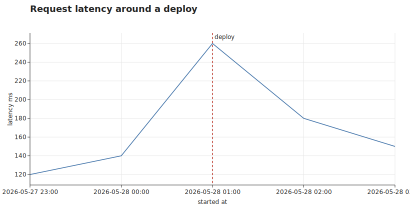

## Off-axis temporal formatting

A `Text` label that maps a temporal column can format it with `timeFormat:`,
reusing the same named and custom formats as `Guide(timeFormat: ...)`. The axis
and the labels can use different formats:

```algraf
Chart(data: "milestones.csv", width: 720, height: 360, title: "Release milestones") {
  Parse(column: due, as: "date", format: "%Y-%m-%d")

  Space(due * progress) {
    Point(size: 4, fill: "#3b6ea5")
    Text(label: due, timeFormat: "%b %-d, %Y", dy: -10, size: 11)
  }

  Guide(axis: x, timeFormat: "month")
}
```

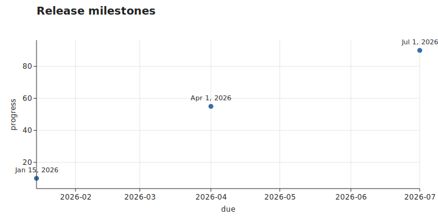

## Temporal legend labels

When a temporal column drives a categorical color scale, `Scale(timeFormat:)`
formats the legend entries without changing the temporal category keys or color
binding. This is useful for daily or weekly cohort charts where the raw category
key would otherwise be a full RFC3339 timestamp.

```algraf
Chart(data: "temporal_legend_format.csv", width: 760, height: 420,
      title: "Temporal legend labels",
      subtitle: "Scale(timeFormat:) formats temporal color legend entries") {
    Theme(name: "minimal")
    Scale(axis: x, type: "temporal")
    Scale(axis: y, domain: [0, null])
    Scale(fill: origin_day, palette: "accent", label: "Origin day", timeFormat: "iso-date")
    Guide(axis: x, label: "Snapshot", timeFormat: "%b %-d")
    Guide(axis: y, label: "Surviving lines")

    Space(snapshot_day * lines) {
        Area(group: origin_day, fill: origin_day, alpha: 0.76, layout: "stack")
    }
}
```

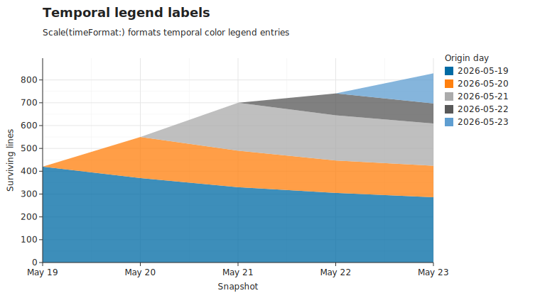

## Time-only columns with an anchor date

A time-only column (no date) parses when `Parse(...)` supplies an `anchor:` date;
each time is placed on that day so a temporal scale has something to span:

```algraf
Chart(data: "hourly_load.csv", width: 720, height: 360, title: "Requests over the working day") {
  Parse(column: clock, as: "datetime", format: "%H:%M", anchor: "2026-03-14")

  Space(clock * requests) {
    Area(fill: "#9ecae1")
    Line(stroke: "#3b6ea5")
  }

  Guide(axis: x, timeFormat: "time-minute")
}
```

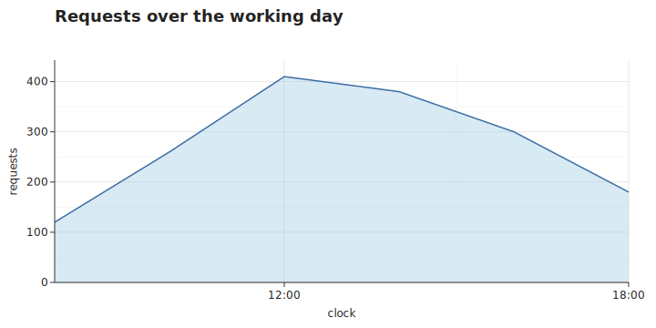

## Sparse timeseries keep real elapsed time

Temporal axes are continuous: missing dates stay visible as proportional
gaps rather than collapsing like categorical bands. The nine-day outage in
this series occupies nine days of horizontal space. The explicit
`Scale(axis: x, type: "temporal")` is an assertion — temporal columns train
temporal axes automatically — that documents intent and guards against a
silent categorical fallback:

```algraf
Chart(data: "timeseries_gaps.csv", width: 780, height: 420,
      title: "Sparse checks keep real elapsed time") {
    Theme(name: "minimal")

    Scale(axis: x, type: "temporal")
    Guide(axis: x, label: "Day", timeFormat: "%b %-d")
    Guide(axis: y, label: "Response (ms)")

    Space(day * response_ms) {
        Line(stroke: "#4c78a8", strokeWidth: 1.5)
        Point(fill: "#4c78a8", size: 2.5)
    }
}
```

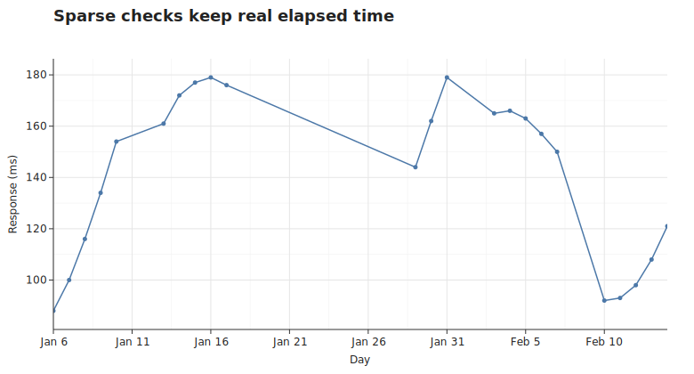

## Calendar tick cadence with `tickInterval`

`Scale(tickInterval: ...)` asks for ticks on a calendar grid: `"3 months"`
lands on January/April/July/October every year, regardless of where the
domain starts. The scale controls tick positions; `Guide(timeFormat: ...)`
and `tickLabelAngle` control their presentation:

```algraf
Chart(data: "temporal_tick_interval.csv", width: 900, height: 420,
      title: "Monthly deploys with quarterly ticks") {
    Theme(name: "minimal")

    Scale(axis: x, tickInterval: "3 months")
    Guide(axis: x, label: "Month", timeFormat: "%b %Y", tickLabelAngle: -45)
    Guide(axis: y, label: "Deploys")

    Space(month * deploys) {
        Line(stroke: "#e45756", strokeWidth: 2)
        Point(fill: "#e45756", size: 2.5)
    }
}
```

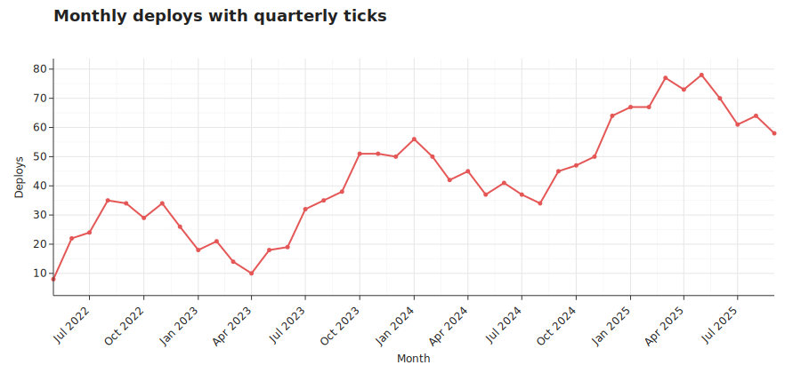

## Weekly ticks anchor to ISO Mondays

Week cadences count from the ISO Monday grid, so every tick is a Monday:

```algraf
Chart(data: "temporal_weekly_ticks.csv", width: 860, height: 420,
      title: "Daily signups with Monday week ticks") {
    Theme(name: "minimal")

    Scale(axis: x, tickInterval: "1 week")
    Guide(axis: x, label: "Week starting", timeFormat: "%b %-d")
    Guide(axis: y, label: "Signups")

    Space(day * signups) {
        Line(stroke: "#54a24b", strokeWidth: 1.5)
        Point(fill: "#54a24b", size: 2)
    }
}
```

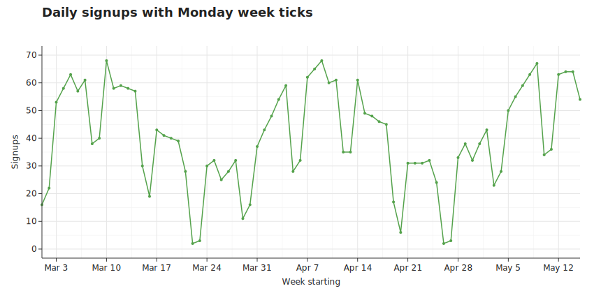

## Multi-year cadences land on round years

Year steps land on years divisible by the step count — `"5 years"` reads
1985, 1990, 1995 rather than arbitrary domain-relative years. With no
`timeFormat`, default labels adapt to the tick granularity, so year-start
ticks read `1985` instead of `1985-01-01`:

```algraf
Chart(data: "temporal_year_ticks.csv", width: 820, height: 420,
      title: "Four decades with five-year ticks") {
    Theme(name: "minimal")

    Scale(axis: x, tickInterval: "5 years")
    Guide(axis: x, label: "Year")
    Guide(axis: y, label: "Index")

    Space(year * index_value) {
        Line(stroke: "#b279a2", strokeWidth: 2)
    }
}
```

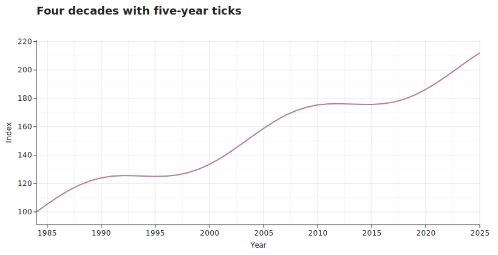

## Sub-second cadences for telemetry

Clock units restart at every UTC midnight, so `"500 milliseconds"` ticks
land on whole half-seconds. A custom chrono pattern renders the millisecond
labels:

```algraf
Chart(data: "temporal_subsecond_ticks.csv", width: 820, height: 420,
      title: "Sensor telemetry with half-second ticks") {
    Theme(name: "minimal")

    Scale(axis: x, tickInterval: "500 milliseconds")
    Guide(axis: x, label: "Time", timeFormat: "%H:%M:%S%.3f")
    Guide(axis: y, label: "Reading")

    Space(stamp * reading) {
        Line(stroke: "#f58518", strokeWidth: 1.5)
        Point(fill: "#f58518", size: 2)
    }
}
```

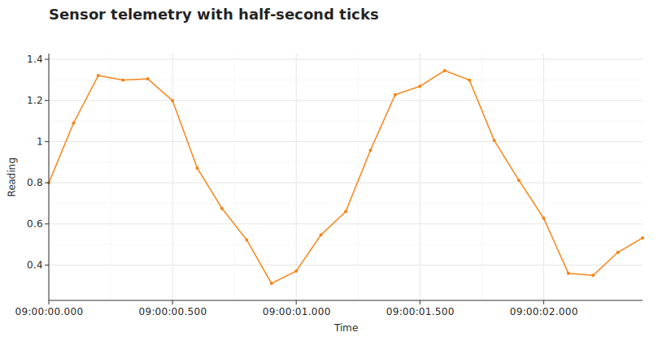

## Layering multiple space blocks: weather forecast

You can overlay different geometries mapped to different y-axis columns by defining multiple `Space` blocks inside the same `Chart`. They will share the same trained coordinate system. Here, we layer a forecast range (`Ribbon`), a mean forecast line (`Line`), and actual observed temperatures (`Point`).

```algraf
Chart(data: "weather_forecast.csv", width: 760, height: 420, title: "7-Day Weather Forecast & Observations", marginRight: 50) {
    Theme(name: "minimal")
    Scale(axis: y, domain: [8, 28])
    Guide(axis: x, label: "Date")
    Guide(axis: y, label: "Temperature (°C)")

    Space(date * temp_forecast) {
        Ribbon(ymin: temp_min, ymax: temp_max, fill: "#add8e6", alpha: 0.4)
        Line(stroke: "#4a90e2", strokeWidth: 3)
    }

    Space(date * temp_actual) {
        Point(fill: "#ff6b6b", size: 6)
    }
}
```


## Grouping lines without changing color

`group:` separates series independently from `stroke`, so several series can
share a constant visual style while still drawing as separate paths.

```algraf
Chart(data: "series.csv", width: 760, height: 460, title: "Grouped constant-color lines") {
    Space(day * value) {
        Line(group: series, stroke: "#777777", strokeWidth: 2)
        Point(fill: series, size: 4)
    }
}
```


## Layered marks: connected scatter

Geometries inside a `Space` render in source order, so listing `Line`
before `Point` draws the points on top of the connecting lines.

```algraf
Chart(data: "timeseries.csv") {
    Space(time * value) {
        // Renders the connecting lines first
        Line(stroke: series, strokeWidth: 2)
        // Renders the data points on top of the lines
        Point(fill: series, size: 4)
    }
}
```


## Point shapes as a non-color channel

`shape:` can be a literal shape or a categorical mapping. Category order
assigns shapes deterministically. When the same column also drives `fill`, the
legend swatches become those marker glyphs filled with the category colors, so
the legend matches the points.

```algraf
Chart(data: "series.csv", width: 760, height: 460, title: "Series shapes") {
    Space(day * value) {
        Line(group: series, stroke: "#888888")
        Point(shape: series, fill: series, size: 4)
    }
}
```


## Mapping many channels at once

A single `Point` layer can carry several independent variables. Here position
(`flipper_length` × `body_mass`), `fill` (species), `shape` (sex), and `size`
(bill length) are all mapped from different columns, and the whole space is
faceted into one panel per island with `/ island`. Each mapped aesthetic gets
its own legend; because `shape` maps a different column than `fill`, the sex
legend stands on its own with circle/square swatches that match the points.

```algraf
Chart(data: "penguin_measurements.csv", width: 900, height: 420, title: "Palmer penguins across five channels") {
    Theme(name: "minimal")
    Scale(fill: species, palette: "default")
    Scale(size: bill_length, breaks: [36, 40, 44, 48, 52], range: [3, 11], label: "Bill length (mm)")
    Guide(axis: x, label: "Flipper length (mm)")
    Guide(axis: y, label: "Body mass (g)")

    Space((flipper_length * body_mass) / island) {
        Point(fill: species, shape: sex, size: bill_length, alpha: 0.8)
    }
}
```


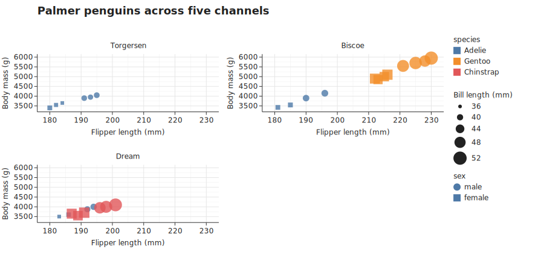

## Bubble chart with size mapping and labels

Continuous point sizes are mapped using the `size` property. We can customize the output range with a `Scale(size: ...)` and add label overlays to each point using the `Text` geometry.

```algraf
Chart(data: "co2_gdp.csv", width: 800, height: 500, title: "CO2 Emissions vs. GDP per Capita (2024)") {
    Theme(name: "minimal")
    Scale(fill: continent, palette: "default")
    Scale(size: population, range: [4, 25], breaks: [25, 100, 500, 1000, 1400], label: "Population (M)")
    Guide(axis: x, label: "GDP per Capita ($)")
    Guide(axis: y, label: "CO2 Emissions per Capita (Tons)")

    Space(gdp_per_capita * co2_per_capita) {
        Point(fill: continent, size: population, alpha: 0.6)
        Text(label: country, dy: -14, size: 8, fill: "#444444", anchor: "middle")
    }
}
```


## Statistical overlay: linear smooth

`Smooth(method: "lm")` fits a linear model and draws the resulting line
on top of the data, sharing the same x/y space as the points.

```algraf
Chart(data: "penguins.csv", width: 760, height: 500) {
    Space(flipper_length * body_mass) {
        Point(fill: species, alpha: 0.55, size: 3)
        Smooth(method: "lm", stroke: "#333333", strokeWidth: 2)
    }
}
```


## Loess smoothing with a confidence band

`Smooth(method: "loess")` fits a locally weighted curve instead of a straight
line; `span` sets how much of the data each local fit sees, and `se: true` draws
a confidence band (filled with `fill`, behind the line).

```algraf
Chart(data: "penguins.csv", width: 760, height: 500, title: "Loess fit with confidence band") {
    Space(flipper_length * body_mass) {
        Point(fill: species, alpha: 0.55, size: 3)
        Smooth(method: "loess", span: 0.6, se: true, stroke: "#222222", fill: "#999999", strokeWidth: 2)
    }
}
```

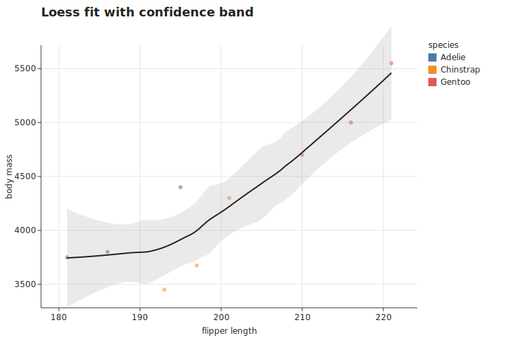

A loess fit follows the `stroke`/`group` aesthetics, so mapping `stroke` to a
category draws one curve per group:

```algraf
Chart(data: "penguins.csv", width: 760, height: 500, title: "Per-species loess fits") {
    Space(flipper_length * body_mass) {
        Point(fill: species, alpha: 0.4, size: 3)
        Smooth(method: "loess", span: 0.75, stroke: species, strokeWidth: 2)
    }
}
```

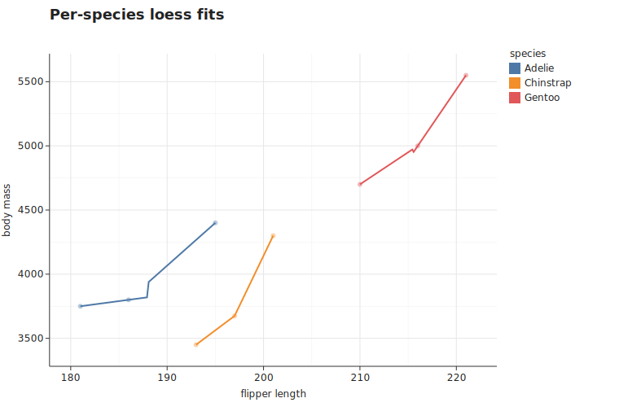

## Grouped bars via the `/` (nest) operator

`/` is *nest*: `quarter / type` makes `type` a sub-band inside each
`quarter` band. The result is a dodged/grouped bar chart with no extra
configuration.

```algraf
Chart(data: "financials.csv", width: 760, height: 460) {
    Theme(name: "classic")

    Space((quarter / type) * amount) {
        Bar(fill: type)
    }
}
```


## Stacked bars

Switching the bar `layout` from the default `"identity"` to `"stack"`
keeps the single `quarter` band and stacks the type contributions.

```algraf
Chart(data: "financials.csv", width: 760, height: 460) {
    Space(quarter * amount) {
        Bar(fill: type, layout: "stack")
    }
}
```


## Proportional fill bars

`layout: "fill"` normalizes each stack to 1.0 so the bars compare shares
instead of totals.

```algraf
Chart(data: "financials.csv", width: 760, height: 460) {
    Space(quarter * amount) {
        Bar(fill: type, layout: "fill")
    }
}
```


## Horizontal bars with physical frame order

The left side of `*` is the physical x axis and the right side is the physical
y axis. Put the value column on x and the category column on y for horizontal
bars.

```algraf
Chart(data: "sales_by_rep.csv", width: 720, height: 440, title: "Sales by rep") {
    Guide(axis: x, label: "Sales")
    Guide(axis: y, label: "Rep")
    Space(amount * rep) {
        Bar(fill: "#4E79A7", alpha: 0.86)
    }
}
```

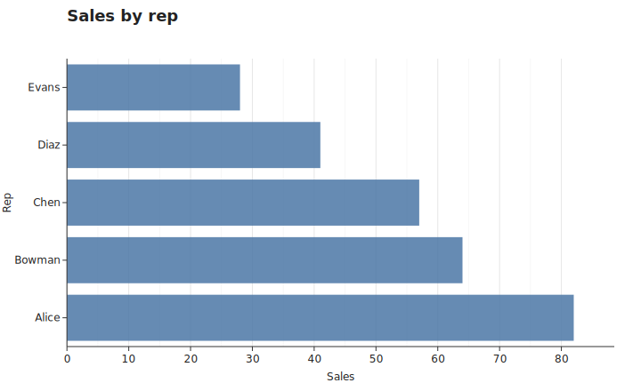

Migration note: older Algraf source may contain `transpose(category * value)`;
write `value * category` instead. The language server offers a quick fix for
simple legacy frames.

## Horizontal grouped bars

Nest categorical groups on the physical y axis for horizontal dodged/grouped
bars.

```algraf
Chart(data: "financials.csv", width: 760, height: 460, title: "Quarterly amount by type") {
    Guide(axis: x, label: "Amount")
    Guide(axis: y, label: "Quarter")
    Space(amount * (quarter / type)) {
        Bar(fill: type, alpha: 0.88)
    }
}
```

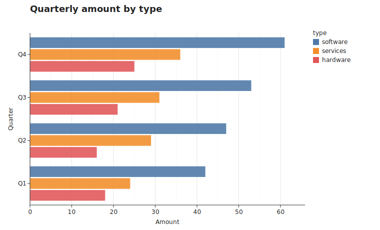

## Horizontal stacked bars

Stacking accumulates along the physical value axis, which is x here.

```algraf
Chart(data: "financials.csv", width: 760, height: 460, title: "Quarterly amount by type") {
    Guide(axis: x, label: "Amount")
    Guide(axis: y, label: "Quarter")
    Space(amount * quarter) {
        Bar(fill: type, layout: "stack", alpha: 0.88)
    }
}
```

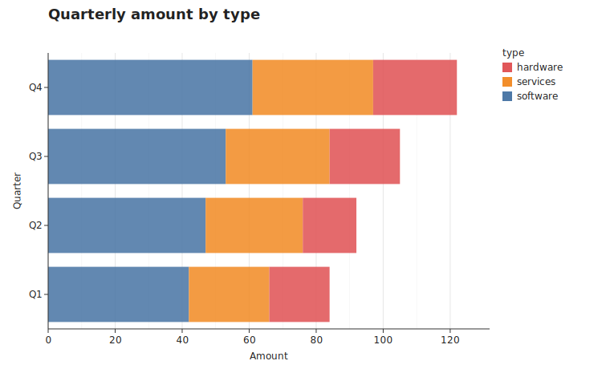

## Horizontal proportional fill bars

`layout: "fill"` normalizes along the physical value axis, producing 100% bars
that read left to right.

```algraf
Chart(data: "financials.csv", width: 760, height: 460, title: "Quarterly composition by type") {
    Guide(axis: x, label: "Share")
    Guide(axis: y, label: "Quarter")
    Space(amount * quarter) {
        Bar(fill: type, layout: "fill", alpha: 0.88)
    }
}
```

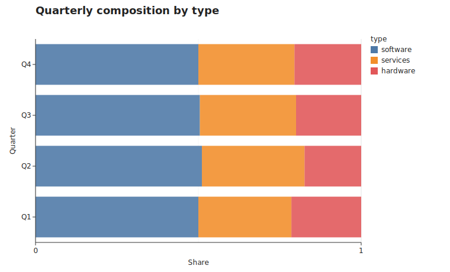

## Reversed and upside-down bar axes

`Scale(reverse: true)` reverses a physical axis direction. This vertical example
puts zero at the top by reversing y.

```algraf
Chart(data: "financials.csv", width: 760, height: 460, title: "Quarterly amount with reversed y axis") {
    Guide(axis: x, label: "Quarter")
    Guide(axis: y, label: "Amount")
    Scale(axis: y, reverse: true)
    Space(quarter * amount) {
        Bar(fill: type, layout: "stack", alpha: 0.88)
    }
}
```

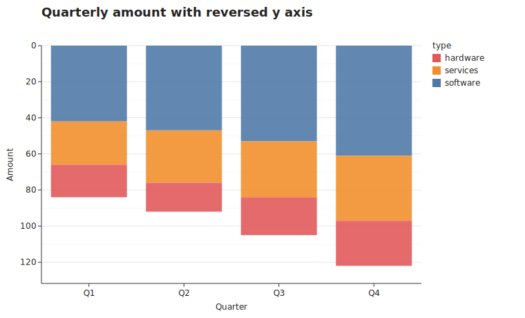

The same reversal can be applied to a horizontal chart, sending bars leftward
from the right-side zero baseline.

```algraf
Chart(data: "sales_by_rep.csv", width: 720, height: 440, title: "Sales by rep, reversed axis") {
    Guide(axis: x, label: "Sales")
    Guide(axis: y, label: "Rep")
    Scale(axis: x, reverse: true)
    Space(amount * rep) {
        Bar(fill: "#4E79A7", alpha: 0.86)
    }
}
```

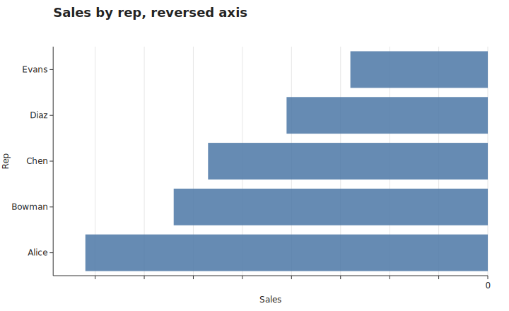

## Counting categories: `Bar(stat: "count")`

When you only have a categorical column, `stat: "count"` aggregates rows
per category and uses the count as the y value — no explicit `Derive`
needed.

```algraf
Chart(
    data: "demographics.csv",
    width: 640,
    height: 420,
    title: "Sample distribution by gender",
) {
    Space(gender) {
        Bar(stat: "count", fill: gender, alpha: 0.85)
    }
}
```


## Diverging bars around a baseline

Bars can extend in both positive and negative directions. Custom color scales let you highlight positive vs negative values, and `HLine` provides a reference line at the zero baseline. Tick labels can be rotated by specifying `tickLabelAngle: number`.

```algraf
Chart(data: "monthly_profit.csv", width: 720, height: 420, title: "Monthly Profit / Loss Analysis") {
    Theme(name: "minimal")
    Scale(fill: status, range: ["Profit" => "#2ca02c", "Loss" => "#d62728"])
    Guide(axis: x, label: "Month", tickLabelAngle: -45)
    Guide(axis: y, label: "Profit / Loss ($)")

    Space(month * profit) {
        Bar(fill: status, layout: "stack", alpha: 0.85)
        HLine(y: 0, stroke: "#333333", strokeWidth: 1.2)
    }
}
```


## Horizontal diverging bars

In a horizontal diverging bar chart, the zero reference is a vertical line
because the physical value axis is x.

```algraf
Chart(data: "monthly_profit.csv", width: 760, height: 520, title: "Monthly profit / loss") {
    Theme(name: "minimal")
    Scale(fill: status, range: ["Profit" => "#2ca02c", "Loss" => "#d62728"])
    Guide(axis: x, label: "Profit / Loss ($)")
    Guide(axis: y, label: "Month")
    Space(profit * month) {
        Bar(fill: status, layout: "stack", alpha: 0.85)
        VLine(x: 0, stroke: "#333333", strokeWidth: 1.2)
    }
}
```

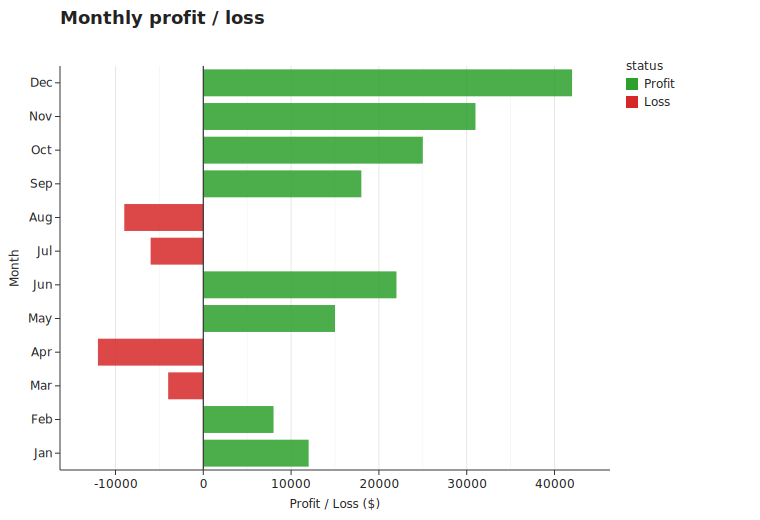

## Layered bar and point chart

You can layer a background `Bar` with a `Point` to build a clean and elegant comparison chart. This keeps the bars light and draws focus to the individual data points.

```algraf
Chart(data: "programming_languages.csv", width: 700, height: 450, title: "Programming Language Popularity") {
    Theme(name: "minimal")
    Scale(fill: paradigm, palette: "accent")
    Scale(stroke: paradigm, palette: "accent")
    Guide(axis: y, label: "Share (%)")
    Guide(axis: x, label: "Programming Language")

    Space(language * popularity) {
        Bar(fill: "#f3f3f3", stroke: "#dddddd", strokeWidth: 1.5)
        Point(fill: paradigm, size: 9)
    }
}
```


## Horizontal layered bar and point chart

Layered geoms share the same physical frame, so the background bars and
foreground points both resolve against the horizontal value scale.

```algraf
Chart(data: "programming_languages.csv", width: 760, height: 500, title: "Programming language popularity") {
    Theme(name: "minimal")
    Scale(fill: paradigm, palette: "accent")
    Scale(stroke: paradigm, palette: "accent")
    Guide(axis: x, label: "Share (%)")
    Guide(axis: y, label: "Programming Language")
    Space(popularity * language) {
        Bar(fill: "#f3f3f3", stroke: "#dddddd", strokeWidth: 1.5)
        Point(fill: paradigm, size: 9)
    }
}
```

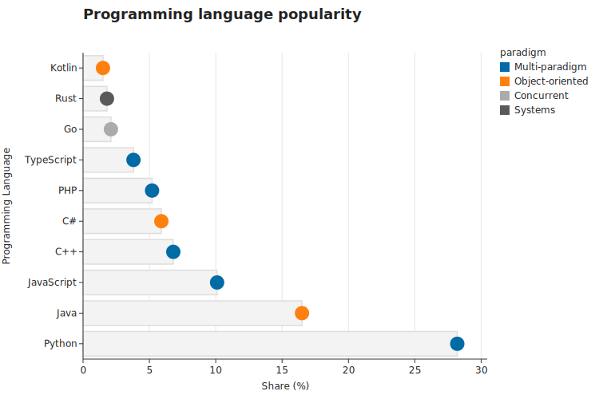

## Histograms the explicit way: `Derive` + `Rect`

`Derive` produces a named derived table from a stat. Here `Bin` returns
`bin_start`, `bin_end`, `count`, and `density`, and `Rect` draws the
bars by reading from `data: bins`.

```algraf
Chart(data: "distribution.csv", width: 760, height: 460) {
    Derive bins = Bin(value, binWidth: 1, boundary: 0)

    Space(bin_start * count, data: bins) {
        Rect(
            xmin: bin_start,
            xmax: bin_end,
            ymin: 0,
            ymax: count,
            fill: "steelblue",
            stroke: "#ffffff",
            strokeWidth: 1,
            alpha: 0.86,
        )
    }
}
```


## Histograms the short way: the `Histogram` geometry

`Histogram` desugars to the same `Derive` + `Rect` pair above, so you
get binning, count, density and the rectangles in a single line.

```algraf
Chart(data: "distribution.csv", width: 760, height: 460) {
    Space(value) {
        Histogram(
            binWidth: 1,
            boundary: 0,
            fill: "steelblue",
            stroke: "#ffffff",
            strokeWidth: 1,
            alpha: 0.86,
        )
    }
}
```


## Horizontal histograms

Generated-axis geoms use `orientation` only when they synthesize the missing
positional axis. Here the histogram keeps `Space(value)` as the input axis and
puts the generated count axis on physical x.

```algraf
Chart(data: "distribution.csv", width: 760, height: 460, title: "Horizontal histogram") {
    Guide(axis: x, label: "Count")
    Guide(axis: y, label: "Value")
    Space(value) {
        Histogram(
            bins: 16,
            orientation: "horizontal",
            fill: "steelblue",
            stroke: "#ffffff",
            strokeWidth: 1,
            alpha: 0.86,
        )
    }
}
```

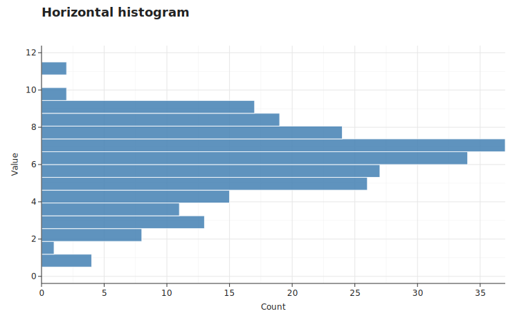

## Grouped histograms

Mapping `fill` to a categorical column groups the histogram: every group is
binned over the same shared edges and the per-group counts are stacked within
each bin, colored by the group with a fill legend.

```algraf
Chart(data: "exam_scores.csv", width: 720, height: 460, title: "Exam scores by cohort (stacked)") {
    Guide(axis: x, label: "Score")
    Guide(axis: y, label: "Count")

    Space(score) {
        Histogram(fill: cohort, bins: 16, alpha: 0.9)
    }
}
```

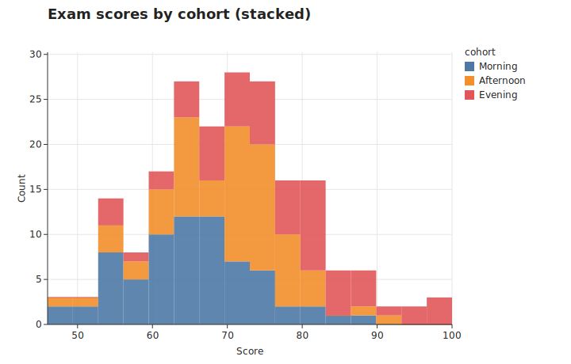

## Dodged histograms via the nest operator

To place the groups side-by-side instead of stacked, nest the group inside the
binned value axis with `/` — the same algebraic move that dodges bars. Each bin
splits into one sub-bar per group on a continuous x-axis; there is no
`position`/`layout` keyword.

```algraf
Chart(
    data: "exam_scores.csv",
    width: 760,
    height: 460,
    title: "Exam scores by cohort (dodged)"
) {
    Guide(axis: x, label: "Score")
    Guide(axis: y, label: "Count")
    Space(score / cohort) {
        Histogram(fill: cohort, binWidth: 5, boundary: 45)
    }
}
```

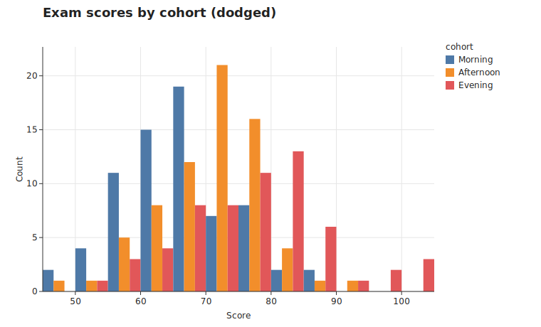

## Overlaid histograms via the blend operator

`+` is *blend*: `selection_age + mission_age` trains one shared continuous axis
over both columns. `Histogram` uses that blend to bin each column over the same
edges and draw the series on top of each other with alpha. Literal `VLine` and
`Text` annotations in the same space are placed on the derived count axes.

```algraf
Chart(
    data: "astronauts.csv",
    width: 760,
    height: 460,
    title: "How old are astronauts on their most recent mission?",
    subtitle: "Age of astronauts when they were selected and when they were sent on their mission",
) {
    Theme(
        name: "minimal",
        plotBackground: "#EBEBEB",
        gridMajor: Line(stroke: "#FFFFFF", strokeWidth: 1),
    )
    Scale(axis: x, domain: [20, 80])
    Scale(axis: y, domain: [0, 69])
    Scale(
        fill: series,
        range: ["selection_age" => "#beaed4", "mission_age" => "#7fc97f"],
        labels: ["selection_age" => "Age at selection", "mission_age" => "Age at mission"],
        label: "",
    )
    Guide(axis: x, label: "Age of astronaut (years)")
    Guide(axis: y, label: "count")

    Space((mission_age + selection_age)) {
        Histogram(binWidth: 1, alpha: 0.8, stroke: "#000000")
        VLine(x: 34, stroke: "#000000", strokeWidth: 1, dash: "dotted")
        VLine(x: 44, stroke: "#000000", strokeWidth: 1, dash: "dotted")
        Text(x: 34, y: 66, label: "Mean age at selection = 34", anchor: "start", dx: 15, dy: 10, size: 14)
        Text(x: 44, y: 49, label: "Mean age at mission = 44", anchor: "start", dx: 15, dy: 10, size: 14)
        Text(
            x: 60,
            y: 20,
            label: "John Glenn was 77\non his last mission -\nthe oldest person to\ntravel in space!",
            anchor: "start",
            dx: 6,
            size: 14,
        )
    }
}
```

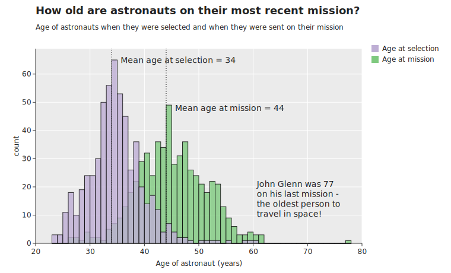

## Frequency polygon

`FreqPoly` uses the same binning controls as `Histogram`, but connects bin
centers with a line instead of drawing bars.

```algraf
Chart(data: "distribution.csv", width: 760, height: 460, title: "Frequency polygon") {
    Space(value) {
        FreqPoly(bins: 16, stroke: "steelblue", strokeWidth: 2)
    }
}
```


## Empirical CDF from raw samples

`Ecdf(...)` creates step vertices from one numeric column. The derived table has
ordinary `x` and `y` columns, so rendering is still a primitive `Path`.

```algraf
Chart(data: "latency_samples.csv", width: 720, height: 420, title: "Latency empirical CDF") {
    Theme(name: "minimal")
    Derive ecdf_rows = Ecdf(latency_ms)

    Guide(axis: x, label: "Latency (ms)")
    Guide(axis: y, label: "Share of requests")
    Scale(axis: y, domain: [0, 1], breaks: [0, 0.25, 0.5, 0.75, 1], labels: ["0", "25%", "50%", "75%", "100%"])

    Space(x * y, data: ecdf_rows) {
        Path(stroke: "#2f6fbb", strokeWidth: 2.5)
    }
}
```

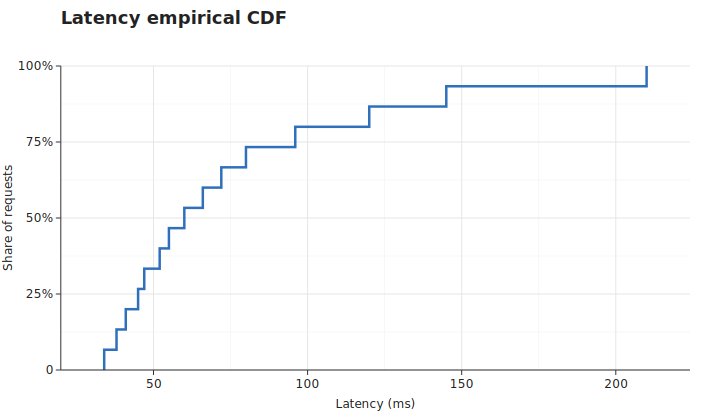

## Normal QQ plot

`Qq(...)` computes sample and theoretical quantiles. The optional reference-line
endpoint columns can feed `Segment`; this example keeps only the point rows.

```algraf
Chart(data: "model_residuals.csv", width: 560, height: 560, title: "Normal QQ check") {
    Theme(name: "minimal")
    Derive qq = Qq(residual, distribution: "normal", reference: false)

    Guide(axis: x, label: "Theoretical quantile")
    Guide(axis: y, label: "Sample quantile")

    Space(theoretical * sample, data: qq) {
        Point(fill: "#4c78a8", alpha: 0.75, size: 2.8)
    }
}
```

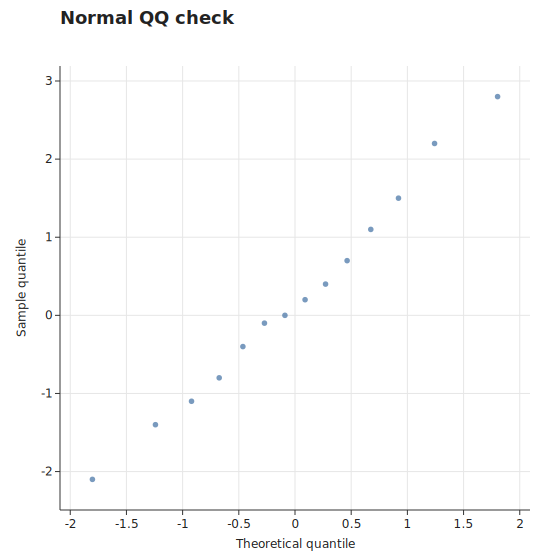

## Grouped summaries with intervals

`Summary(..., reducer: "mean_se")` groups raw observations, computes the mean,
and emits `lower`/`upper` standard-error bounds for interval marks.

```algraf
Chart(data: "trial_observations.csv", width: 760, height: 460, title: "Mean outcome with standard error") {
    Theme(name: "minimal")
    Derive summary = Summary(outcome, by: [treatment, cohort], reducer: "mean_se")

    Scale(fill: cohort, palette: "accent")
    Scale(stroke: cohort, palette: "accent")
    Guide(axis: x, label: "Treatment")
    Guide(axis: y, label: "Outcome")

    Space(treatment * value, data: summary) {
        ErrorBar(ymin: lower, ymax: upper, capWidth: 0.25, stroke: cohort, strokeWidth: 2)
        Point(fill: cohort, stroke: "#ffffff", size: 4)
    }
}
```

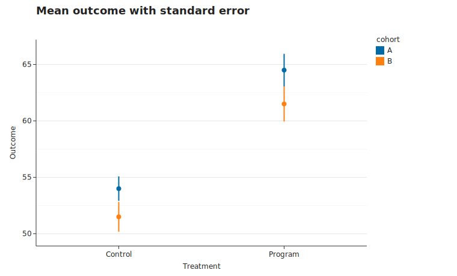

## Binned summaries

`SummaryBin(...)` shares `Bin`'s boundary rules, then summarizes another value
inside each bin. The result feeds a plain `Line` and `Point` layer.

```algraf
Chart(data: "traffic_events.csv", width: 760, height: 430, title: "Average conversion by traffic bin") {
    Theme(name: "minimal")
    Derive bins = SummaryBin(traffic, conversion, bins: 8, reducer: "mean")

    Guide(axis: x, label: "Traffic")
    Guide(axis: y, label: "Mean conversion rate")
    Scale(axis: y, domain: [0, 0.25], breaks: [0, 0.05, 0.10, 0.15, 0.20, 0.25], labels: ["0", "5%", "10%", "15%", "20%", "25%"])

    Space(bin_center * value, data: bins) {
        Line(stroke: "#111827", strokeWidth: 2)
        Point(fill: "#111827", size: 2.6)
    }
}
```

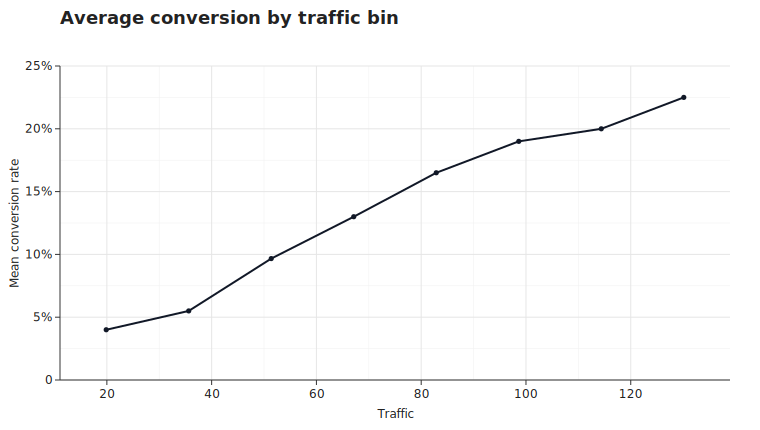

## Chained derived tables

A `Derive` can explicitly read from another derived table with `from`. Here
`Smooth` fits a line over binned counts.

```algraf
Chart(data: "distribution.csv", width: 760, height: 460, title: "Binned trend") {
    Derive bins = Bin(value, bins: 12)
    Derive trend from bins = Smooth(bin_center, count, method: "lm")

    Space(bin_center * count, data: bins) {
        Rect(xmin: bin_start, xmax: bin_end, ymin: 0, ymax: count, fill: "#c7dcef")
    }

    Space(x * y, data: trend) {
        Line(stroke: "#333333", strokeWidth: 2)
    }
}
```


## Binned 2D regression chain

A multi-stage statistical chaining chart that runs 2D density binning (`Bin2D`), chains a linear regression (`Smooth`) over the binned coordinate centers, and overlays the binned rectangles, center points, and regression line.

```algraf
Chart(data: "samples.csv", width: 760, height: 500, title: "Binned 2D Regression Chain") {
    Theme(name: "minimal")
    Derive binned = Bin2D(x, y, bins: 10)
    Derive trend from binned = Smooth(x_center, y_center, method: "lm")

    Space(x_center * y_center, data: binned) {
        Rect(xmin: x_start, xmax: x_end, ymin: y_start, ymax: y_end, fill: count, alpha: 0.6)
        Point(fill: "#333333", size: 4, alpha: 0.8)
    }

    Space(x * y, data: trend) {
        Line(stroke: "red", strokeWidth: 3)
    }
}
```


## Binning over time

`Bin` and `Histogram` work on temporal columns too. Mapping a single date
column into the space and adding `Histogram(bins: ...)` buckets the rows by
date and keeps the temporal type on the axis, so you get time-aware tick
labels for free. For calendar bins, use `interval: "month"` (or `day`, `week`,
`quarter`, etc.) and optional temporal labels such as `timeFormat: "iso-minute"`.

```algraf
Chart(data: "signups.csv", width: 760, height: 460, title: "Signups over the launch quarter") {
    Guide(axis: x, label: "Signup date", timeFormat: "iso-date")

    Space(signup_date) {
        Histogram(
            interval: "week",
            fill: "steelblue",
            stroke: "#ffffff",
            strokeWidth: 1,
            alpha: 0.86,
        )
    }
}
```


## Heatmap with `Tile`

Two categorical axes plus a continuous fill give you a heatmap.

```algraf
Chart(data: "heatmap.csv", width: 700, height: 460) {
    Space(day * hour) {
        Tile(fill: value, alpha: 0.92)
    }
}
```


## Custom continuous gradients

`Scale(fill: ..., gradient: [...])` sets color stops for a continuous fill or
stroke mapping. Use `Stop(value: ..., color: ...)` when the colors should land
at explicit domain values; stops accept hex, alpha hex, `rgb(...)`, and
`rgba(...)` color strings.

```algraf
Algraf(version: "0.20")

Chart(data: "heatmap.csv", width: 700, height: 460, title: "Custom continuous gradient") {
    Scale(
        fill: value,
        gradient: [
            Stop(value: 3, color: "rgba(51, 102, 204, 1)"),
            Stop(value: 7, color: "rgb(80, 120, 160)"),
            Stop(value: 10, color: "#cc3333ff"),
        ],
        label: "Intensity",
    )

    Space(day * hour) {
        Tile(fill: value, alpha: 0.92)
    }
}
```


## Rectangular 2D bins

`Bin2D` groups observations over two continuous axes and fills rectangles by
count.

```algraf
Chart(data: "samples.csv", width: 720, height: 500, title: "2D rectangular bins") {
    Space(x * y) {
        Bin2D(bins: 12)
    }
}
```


## 2D binning with raw points and thresholds overlay

Continuous 2D density heatmap using `Bin2D` overlaid with raw scatter points and threshold reference lines.

```algraf
Chart(data: "samples.csv", width: 760, height: 500, title: "2D Density Binning with Points Overlay") {
    Theme(name: "minimal")
    Guide(axis: x, label: "Variable X")
    Guide(axis: y, label: "Variable Y")

    Space(x * y) {
        Bin2D(bins: 12, alpha: 0.8)
        Point(fill: "red", stroke: "#ffffff", size: 3, alpha: 0.6)
        HLine(y: 3500, stroke: "#111111", strokeWidth: 1.5, label: "Upper Limit")
        VLine(x: 185, stroke: "#111111", strokeWidth: 1.5, label: "Midpoint")
    }
}
```


## Hex bins

`HexBin` is the hexagonal counterpart for dense two-dimensional scatter data.
Observations are assigned to the nearest hexagon on a tessellating lattice and
each cell is shaded by count.

```algraf
Chart(data: "samples.csv", width: 720, height: 500, title: "Hex bins") {
    Space(x * y) {
        HexBin(bins: 12, alpha: 0.9)
    }
}
```


## Regular raster field with explicit cells

Regular numeric grids use explicit cell bounds when the centers should not infer
the visible extent. `Rect` keeps the raster path primitive and deterministic.

```algraf
Chart(data: "surface_grid.csv", width: 720, height: 480, title: "Regular raster field") {
    Theme(name: "minimal")
    Scale(fill: z, gradient: ["#2b6cb0", "#f7fafc", "#c53030"])
    Guide(axis: x, label: "Grid x")
    Guide(axis: y, label: "Grid y")

    Space(x * y) {
        Rect(xmin: x0, xmax: x1, ymin: y0, ymax: y1,
             fill: z, stroke: "#ffffff", strokeWidth: 0.2)
    }
}
```

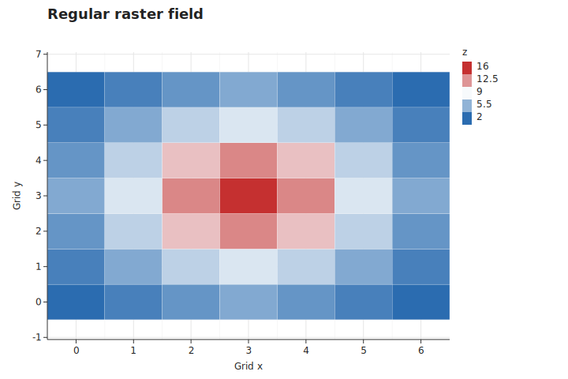

## Contour lines from a z field

`ContourLines` reads x/y positions plus a numeric z column and returns ordinary
path vertices with `level` and `contour_id` columns.

```algraf
Chart(data: "surface_grid.csv", width: 720, height: 480, title: "Contour lines from a z field") {
    Theme(name: "minimal")
    Guide(axis: x, label: "Grid x")
    Guide(axis: y, label: "Grid y")

    Derive contours = ContourLines(x, y, z: z, levels: [4, 7, 10, 13])

    Space(x * y, data: contours) {
        Scale(stroke: level, gradient: ["#6b7280", "#111827"])
        Path(group: contour_id, stroke: level, strokeWidth: 1.4)
    }
}
```

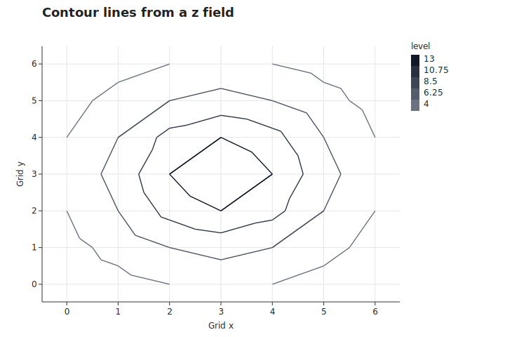

## Filled contour bands

`ContourBands` clips each regular-grid cell into filled level-band geometry. The
derived table renders through `Geo`, preserving the same fill scale machinery.

```algraf
Chart(data: "surface_grid.csv", width: 720, height: 480, title: "Filled contour bands") {
    Theme(name: "minimal")

    Derive bands = ContourBands(x, y, z, levels: [2, 5, 8, 11, 14, 17])

    Space(geom, data: bands) {
        Scale(fill: level_mid, gradient: ["#2b6cb0", "#e6fffa", "#c53030"])
        Geo(fill: level_mid, stroke: "#ffffff", strokeWidth: 0.1)
    }
}
```

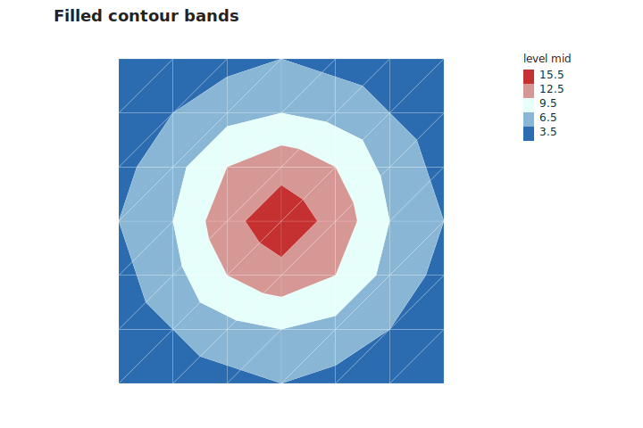

## 2D density contours

`Density2DContours` estimates a bivariate Gaussian KDE on a bounded grid and
then emits contour paths. The raw samples can stay in the primary table.

```algraf
Chart(data: "samples.csv", width: 760, height: 500, title: "2D density contours") {
    Theme(name: "minimal")
    Guide(axis: x, label: "Height")
    Guide(axis: y, label: "Mass")

    Derive density = Density2DContours(x, y, grid: [48, 48], levels: 7)

    Space(x * y) {
        Point(fill: "#334155", alpha: 0.18, size: 1.6)
    }

    Space(x * y, data: density) {
        Path(group: contour_id, stroke: "#475569", strokeWidth: 1.2)
    }
}
```

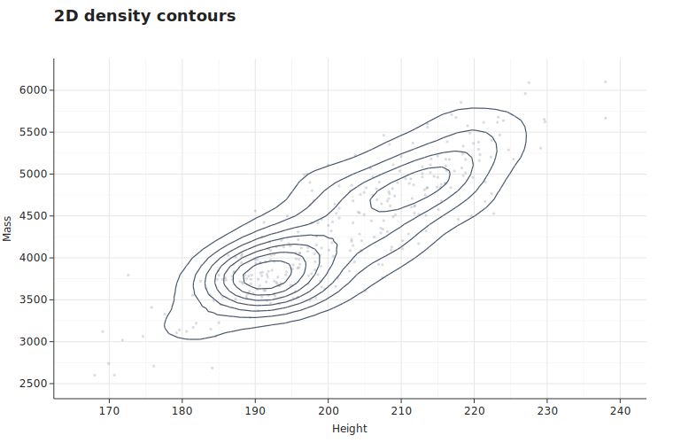

## Rectangular z summaries

`Summary2D` bins by x and y, then reduces a third column with a deterministic
reducer such as `mean`, `sum`, `min`, `max`, `count`, or `median`.

```algraf
Chart(data: "sensor_z_samples.csv", width: 760, height: 500, title: "Mean signal by rectangular bin") {
    Theme(name: "minimal")
    Guide(axis: x, label: "Sensor x")
    Guide(axis: y, label: "Sensor y")

    Derive grid = Summary2D(x, y, z: signal, bins: [6, 4], reducer: "mean")

    Space(x_center * y_center, data: grid) {
        Scale(fill: value, gradient: ["#f7fbff", "#2171b5", "#08306b"])
        Rect(xmin: x_start, xmax: x_end,
             ymin: y_start, ymax: y_end,
             fill: value, stroke: "#ffffff", strokeWidth: 0.35)
    }
}
```

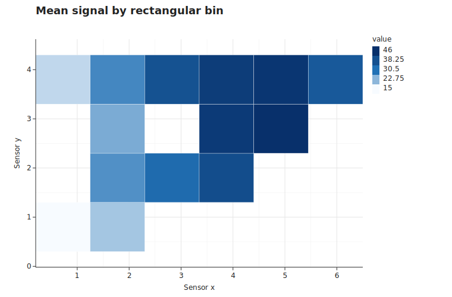

## Hexagonal z summaries

`SummaryHex` uses the same deterministic hex lattice as `HexBin`, but the fill
comes from a reducer over the z column rather than from count alone.

```algraf
Chart(data: "sensor_z_samples.csv", width: 720, height: 500, title: "Mean signal by hex bin") {
    Theme(name: "minimal")

    Derive hexes = SummaryHex(x, y, z: signal, bins: 7, reducer: "mean")

    Space(geom, data: hexes) {
        Scale(fill: value, gradient: ["#f7fcf0", "#41ab5d", "#00441b"])
        Geo(fill: value, stroke: "#ffffff", strokeWidth: 0.25)
    }
}
```

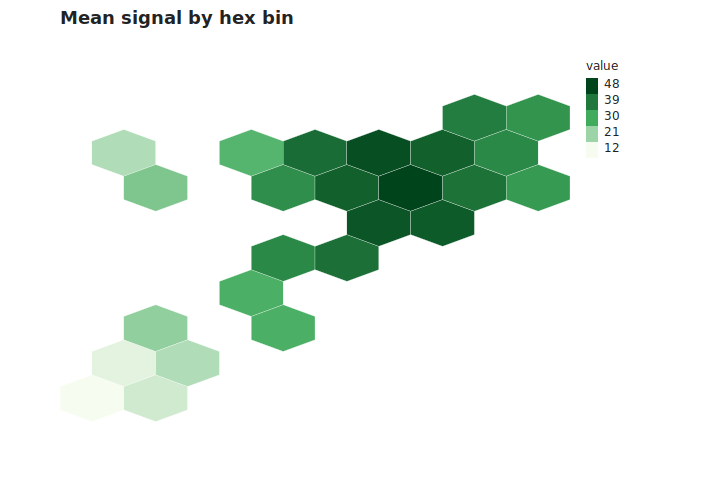

## Boxplot with a rug

`Boxplot` summarizes a continuous distribution per categorical level,
and `Rug` adds tick marks along an axis to show raw values. `sides: "l"`
puts the rug on the left.

```algraf
Chart(data: "demographics.csv", width: 700, height: 460) {
    Space(gender * height) {
        Boxplot(fill: gender, alpha: 0.78)
        Rug(sides: "l", alpha: 0.35)
    }
}
```


## Boxplot outliers

Observations beyond the `1.5 · IQR` whiskers render as small circles by default.
Set `outliers: false` to suppress them.

```algraf
Chart(data: "sensor_readings.csv", width: 700, height: 460, title: "Sensor readings with outliers") {
    Guide(axis: x, label: "Sensor")
    Guide(axis: y, label: "Reading")

    Space(sensor * reading) {
        Boxplot(fill: sensor, alpha: 0.78, outliers: true)
    }
}
```

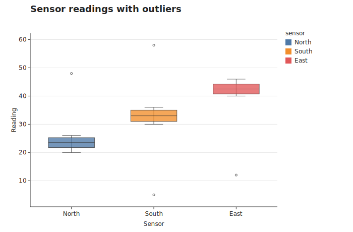

## Violin distributions

`Violin` mirrors a Gaussian KDE within each categorical band. Optional
`quantiles` draw deterministic reference lines inside each violin.

```algraf
Chart(data: "demographics.csv", width: 720, height: 460, title: "Height distribution by group") {
    Space(gender * height) {
        Violin(fill: gender, quantiles: [0.25, 0.5, 0.75], alpha: 0.62)
        Rug(sides: "l", alpha: 0.25)
    }
}
```


## Horizontal boxplots

Grouped distribution summaries use the same physical frame rule: value on x,
group on y.

```algraf
Chart(data: "demographics.csv", width: 720, height: 460, title: "Height distribution by group") {
    Guide(axis: x, label: "Height")
    Guide(axis: y, label: "Group")
    Space(height * gender) {
        Boxplot(fill: gender, alpha: 0.78)
    }
}
```

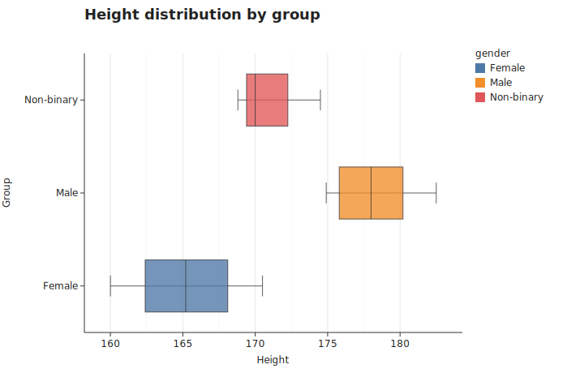

## Horizontal violin distributions

Horizontal violins keep the density on the value axis and mirror around each
y-axis category band.

```algraf
Chart(data: "demographics.csv", width: 720, height: 460, title: "Height distribution by group") {
    Guide(axis: x, label: "Height")
    Guide(axis: y, label: "Group")
    Space(height * gender) {
        Violin(fill: gender, quantiles: [0.25, 0.5, 0.75], alpha: 0.62)
    }
}
```

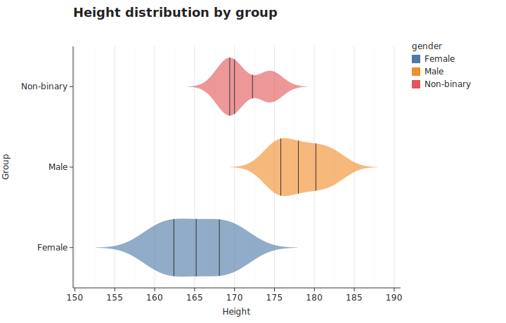

## Layered violin and boxplot distributions

Geometries can be overlaid inside a single `Space` to build compound charts. Here, a transparent `Violin` is paired with a narrow, opaque `Boxplot` to show both the detailed density curve and summary statistics.

```algraf
Chart(data: "demographics.csv", width: 720, height: 460, title: "Height Distribution by Group (Violin + Boxplot)") {
    Theme(name: "minimal")
    Guide(axis: x, label: "Gender Group")
    Guide(axis: y, label: "Height (cm)")

    Space(gender * height) {
        Violin(fill: gender, alpha: 0.45)
        Boxplot(width: 15, fill: "#ffffff", stroke: "#2b2b2b", strokeWidth: 1.5)
    }
}
```


## Deterministic jittered observations

`Point(jitter: [x, y])` spreads overlapping point marks with a stable,
seed-free offset. On categorical axes the x amount is a fraction of the band
width.

```algraf
Chart(data: "demographics.csv", width: 720, height: 420,
      title: "Deterministic jittered observations") {
    Guide(axis: x, label: "Group")
    Guide(axis: y, label: "Height")

    Space(gender * height) {
        Boxplot(fill: gender, alpha: 0.18, outliers: false)
        Point(fill: gender, alpha: 0.45, size: 3, jitter: [0.32, 0])
    }
}
```

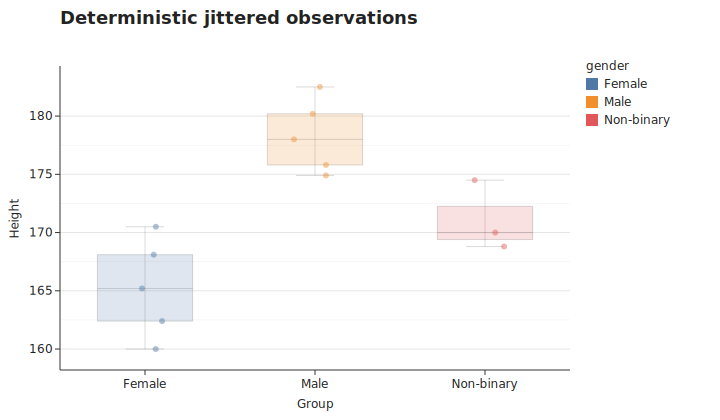

## Horizontal layered violin and boxplot distributions

The same overlay can be written horizontally by putting the density/value axis
on x and each group on y.

```algraf
Chart(data: "demographics.csv", width: 720, height: 460, title: "Height distribution by group") {
    Theme(name: "minimal")
    Guide(axis: x, label: "Height (cm)")
    Guide(axis: y, label: "Gender Group")
    Space(height * gender) {
        Violin(fill: gender, alpha: 0.45)
        Boxplot(width: 15, fill: "#ffffff", stroke: "#2b2b2b", strokeWidth: 1.5)
    }
}
```

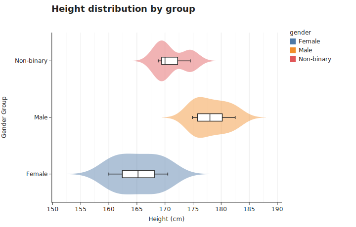

## Faceted violin and boxplot distributions with rug

Overlaying `Violin`, narrow `Boxplot`, and marginal `Rug` plots inside a faceted space layout.

```algraf
Chart(data: "regional_sales.csv", width: 840, height: 500, title: "Sales Distribution by Product and Region") {
    Theme(name: "minimal")
    Scale(fill: product, palette: "accent")
    Scale(stroke: product, palette: "accent")
    Guide(axis: y, label: "Sales Amount")

    Space((product * sales) / region) {
        Violin(fill: product, alpha: 0.5, quantiles: [0.25, 0.5, 0.75])
        Boxplot(width: 0.12, fill: "#ffffff", stroke: "#000000", strokeWidth: 1.2, alpha: 0.9)
        Rug(sides: "l", stroke: product, alpha: 0.35)
    }
}
```


## Horizontal faceted violin and boxplot distributions

Faceted horizontal summaries keep the faceting outside the physical two-axis
frame.

```algraf
Chart(data: "regional_sales.csv", width: 860, height: 520, title: "Sales distribution by product and region") {
    Theme(name: "minimal")
    Scale(fill: product, palette: "accent")
    Scale(stroke: product, palette: "accent")
    Guide(axis: x, label: "Sales Amount")
    Space((sales * product) / region) {
        Violin(fill: product, alpha: 0.5, quantiles: [0.25, 0.5, 0.75])
        Boxplot(width: 0.12, fill: "#ffffff", stroke: "#000000", strokeWidth: 1.2, alpha: 0.9)
    }
}
```

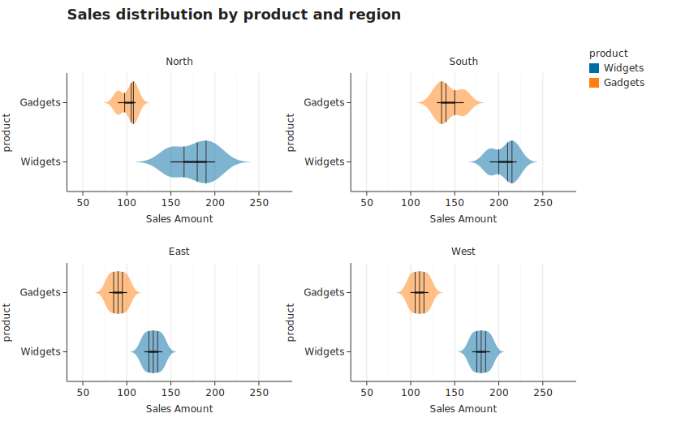

## Density: a smooth distribution

`Density` estimates the distribution of a single numeric column with a
Gaussian kernel and fills the resulting curve down to a zero baseline. The
bandwidth defaults to Silverman's rule of thumb; pass `bandwidth:` or `n:`
(grid points) to control it. This example also shows a `/* ... */` block
comment, which the lexer and formatter treat as trivia.

```algraf
/*
 * A kernel density estimate of a single numeric column.
 * Density() desugars to a filled Area over the estimated curve.
 */
Chart(data: "distribution.csv", width: 760, height: 460, title: "Estimated density") {
    Space(value) {
        Density(fill: "#4c78a8", stroke: "#1f3b57", strokeWidth: 1.5, alpha: 0.6)
    }
}
```


## Overlaid Densities: blended distributions

By using the `+` blend operator in the `Space` block, `Density` can compute and overlay density curves for multiple continuous columns. The synthetic `series` column tracks the source variable names, allowing them to drive categorical aesthetics like `fill` and generate matching legends.

```algraf
Chart(data: "astronauts.csv", width: 760, height: 460, title: "Astronaut Age Distribution", subtitle: "Overlaid densities of age at selection and age at mission") {
    Scale(
        fill: series,
        range: ["selection_age" => "#beaed4", "mission_age" => "#7fc97f"],
        labels: ["selection_age" => "Age at selection", "mission_age" => "Age at mission"],
        label: ""
    )
    Guide(axis: x, label: "Age of astronaut (years)")

    Space((selection_age + mission_age)) {
        Density(alpha: 0.6)
    }
}
```

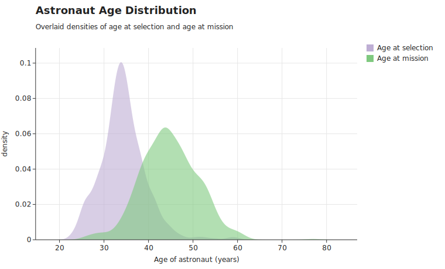

## Ribbon: confidence band

`Ribbon` closes a band between `ymin` and `ymax` per x value. The `+`
operator in the algebra is *blend*: it tells the y scale to consider
both columns when training its domain.

```algraf
Chart(data: "ribbon.csv", width: 760, height: 460, marginRight: 50) {
    Space(day * (lower + upper)) {
        Ribbon(ymin: lower, ymax: upper, fill: "steelblue", alpha: 0.25)
    }
}
```


## Filled area under a line

`Area` closes a polygon down to its `baseline` — when the baseline is 0
the bottom edge sits flush against the x axis. Layering a `Line` on top
preserves the original series outline.

```algraf
Chart(data: "timeseries.csv", width: 760, height: 420) {
    Space(time * value) {
        Area(baseline: 0, fill: series, alpha: 0.35)
        Line(stroke: series, strokeWidth: 2)
    }
}
```


## Stacked area layout

`Area(layout: "stack")` groups rows by `group` when present, otherwise by a
categorical `fill` or `stroke` mapping. The y domain is trained from the
stacked totals, so each polygon stays inside the plot area. If a group is absent
at one x-position, it contributes zero there and the stacked bands remain
contiguous.

```algraf
Chart(data: "area_layouts.csv", width: 760, height: 420, title: "Trips by rider type") {
    Theme(name: "minimal")
    Scale(fill: rider_type, palette: "accent", label: "Rider type")
    Guide(axis: x, label: "Day")
    Guide(axis: y, label: "Trips")

    Space(day * trips) {
        Area(fill: rider_type, layout: "stack", baseline: 0, alpha: 0.42)
    }
}
```

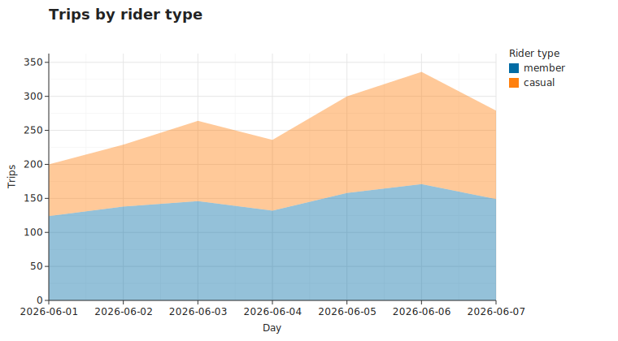

## Stacked legends read like the stack

Stacked layouts list their default legend in rendered visual order: the top
band of a vertical stack comes first, not the raw scale/domain order. The
manual `range:` map below binds colors in baseline-outward stack order
(deletions first), yet each cohort's legend reads top-to-bottom — additions
above deletions. The reorder is cohort-aware: the `v1` and `v2` segments never
stack in the same month, so the `v1` entries stay ahead of the `v2` entries
instead of the whole domain reversing. Colors stay bound to their categories
throughout.

```algraf
Chart(
    data: "release_line_changes.csv",
    width: 760,
    height: 440,
    title: "Lines changed per month around the v2 cutover",
    subtitle: "Each stack cohort's legend reads top-to-bottom like the rendered bands"
) {
    Theme(name: "minimal")
    Parse(column: month, as: "date", format: "%Y-%m-%d")
    Scale(
        fill: change_segment,
        range: [
            "v1 deletions" => "#8ecae6",
            "v1 additions" => "#1f77b4",
            "v2 deletions" => "#ffbf69",
            "v2 additions" => "#ff7f0e"
        ],
        label: "Lines"
    )
    Guide(axis: x, label: "Month")
    Guide(axis: y, label: "Lines")

    Space(month * lines) {
        Area(fill: change_segment, layout: "stack", alpha: 0.76)
    }
}
```

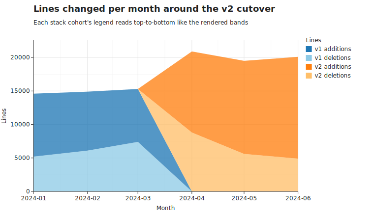

## Overlaying a named-table line on a stacked area

Compatible overlaid spaces train one shared position scale even when they back
onto different tables: the continuous and temporal extents are unioned, and so
is the zero-baseline requirement. Here the stacked area pins y at zero, and the
capacity line from the named `fleet` table adopts the same baseline — both
layers resolve the identical zero-based y domain with no manual
`Scale(axis: y, domain: …)`. An explicit chart-level domain, when you do want
one, applies to the joined scale across every overlaid space.

```algraf
Chart(data: "area_layouts.csv", width: 760, height: 420, title: "Trips by rider type vs. fleet capacity") {
    Table fleet = "fleet_capacity.csv"
    Theme(name: "minimal")
    Scale(fill: rider_type, palette: "accent", label: "Rider type")
    Guide(axis: x, label: "Day")
    Guide(axis: y, label: "Trips")

    Space(day * trips) {
        Area(fill: rider_type, layout: "stack", alpha: 0.42)
    }

    Space(day * capacity, data: fleet) {
        Line(stroke: "#111111", strokeWidth: 1.4, dash: "dashed")
        Point(fill: "#111111", size: 2)
    }
}
```

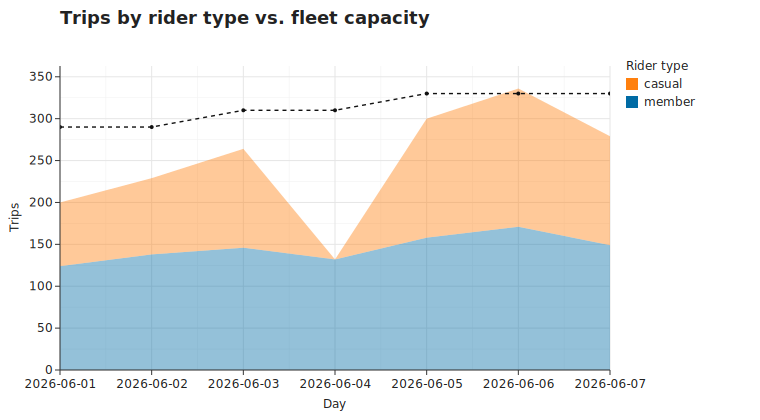

## Fill-normalized area layout

`Area(layout: "fill")` normalizes each x-position stack to a share-of-total
axis. The y domain is locked to the normalized range, independent of the raw
counts in the source table.

```algraf
Chart(data: "area_layouts.csv", width: 760, height: 420, title: "Trip mix by rider type") {
    Theme(name: "minimal")
    Scale(fill: rider_type, palette: "accent", label: "Rider type")
    Scale(axis: y, breaks: [0, 0.5, 1], labels: ["0%", "50%", "100%"])
    Guide(axis: x, label: "Day")
    Guide(axis: y, label: "Share of trips")

    Space(day * trips) {
        Area(fill: rider_type, layout: "fill", baseline: 0, alpha: 0.55)
    }
}
```

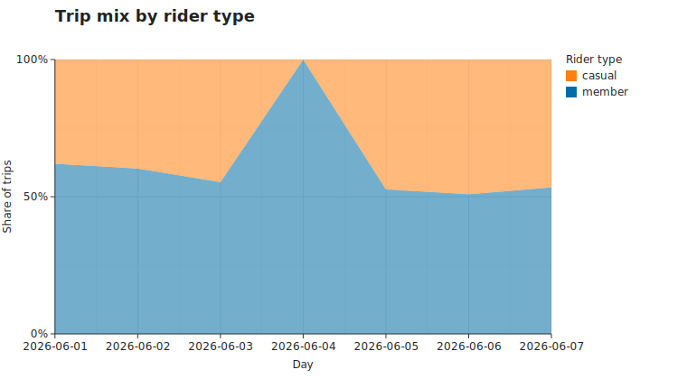

## Categorical strip / barcode

A categorical x paired with a continuous y and a low-alpha `Point` makes
a strip plot — useful for inspecting distributions without binning.

```algraf
Chart(data: "demographics.csv") {
    // Categorical X, Continuous Y
    Space(gender * height) {
        Point(fill: gender, alpha: 0.4, size: 3)
    }
}
```


## Floating intervals with `Rect`

`Rect` is the general rectangle primitive: any combination of
`xmin/xmax/ymin/ymax` from columns or literals.

```algraf
Chart(data: "intervals.csv", marginRight: 150) {
    // Both axes must be continuous/temporal
    Space(time * value) {
        Rect(
            xmin: start_time, 
            xmax: end_time, 
            // Hardcode a literal baseline if you don't have a column
            ymin: 0,       
            ymax: peak_value,
            fill: "steelblue",
            alpha: 0.5
        )
    }
}
```


## Top-down icicle with precomputed rectangles

Algraf does not yet have a native hierarchy partition stat, but a top-down
icicle can be rendered from precomputed rectangle bounds. Reversing the y scale
puts depth `0` at the top.

```algraf
Chart(data: "top_down_icicle.csv", width: 820, height: 420, title: "Revenue hierarchy") {
    Theme(name: "minimal", axes: false, grid: false)
    Scale(axis: x, domain: [0, 100])
    Scale(axis: y, domain: [0, 3], reverse: true)
    Scale(
        fill: segment,
        range: ["Total" => "#c7dcef", "Product" => "#f6b26b", "Services" => "#d9ead3", "Support" => "#d0d0d0"],
    )
    Space(x1 * y1) {
        Rect(
            xmin: x0,
            xmax: x1,
            ymin: y0,
            ymax: y1,
            fill: segment,
            stroke: "#ffffff",
            strokeWidth: 2,
            alpha: 0.92,
        )
        Text(x: x_mid, y: y_mid, label: label, anchor: "middle", size: 11, fill: "#222222")
    }
}
```

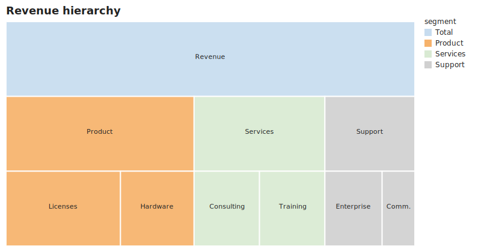

## Time series with shaded peak intervals

Drawing shaded peak intervals (`Rect`) and overlaying a blue line trend series (`Line`, `Point`, `Text`) with shared temporal x and value-constrained y axes.

```algraf
Chart(data: "intervals.csv", width: 760, height: 460, title: "Time Series with Shaded Peak Intervals") {
    Theme(name: "minimal")
    Scale(axis: x, label: "Timeline")
    Scale(axis: y, label: "Value")

    Space(time * peak_value) {
        Rect(xmin: start_time, xmax: end_time, ymin: value, ymax: peak_value, fill: "#e2e2e2", alpha: 0.6)
        Line(stroke: "blue", strokeWidth: 2)
        Point(fill: "blue", size: 6)
        Text(label: peak_value, dy: -8, size: 9, fill: "#333333", anchor: "middle")
    }
}
```


## Gantt chart / timeline with categorical `Rect` bounds

A Gantt chart illustrates a project timeline by plotting intervals for each
phase. `Rect` can use temporal bounds on x and categorical band bounds on y.

```algraf
Chart(data: "gantt.csv", width: 760, height: 420, title: "Project Schedule") {
    Theme(name: "classic")

    Guide(axis: x, label: "Timeline")
    Guide(axis: y, label: "Attorney / phase")

    Space((start_date + end_date) * (attorney / phase)) {
        Rect(
            xmin: start_date,
            xmax: end_date,
            ymin: phase,
            ymax: phase,
            fill: phase,
            alpha: 0.85,
        )
    }
}
```


## Stock market candlestick chart via custom rectangles

You can construct complex custom plots like financial candlestick charts using `Rect` primitives. By calculating coordinate offsets for the wicks and bodies in the input data, you can layer a thin rectangle for the high/low wick and a wider rectangle for the open/close body, utilizing conditional color scales for gains and losses.

```algraf
Chart(data: "stock_prices.csv", width: 720, height: 450, title: "Stock Price Candlestick Chart") {
    Theme(name: "minimal")
    Scale(fill: status, range: ["Gain" => "#2ca02c", "Loss" => "#d62728"])
    Scale(stroke: status, range: ["Gain" => "#2ca02c", "Loss" => "#d62728"])
    Scale(axis: x, domain: [0.5, 10.5])
    Scale(axis: y, domain: [90, 115])
    Guide(axis: x, label: "Trading Day")
    Guide(axis: y, label: "Price ($)")

    Space(day * close) {
        // Wick: drawn from low to high
        Rect(xmin: w_left, xmax: w_right, ymin: low, ymax: high, fill: status, alpha: 0.7)
        // Body: drawn from open to close
        Rect(xmin: b_left, xmax: b_right, ymin: open, ymax: close, fill: status)
    }
}
```


## Flight price dumbbell plot

A dumbbell plot displays range changes or category comparisons using horizontal segments connecting two points per category. In Algraf, you can build this by combining a `Line` (grouped by category with a constant stroke) and a `Point` geometry over a category-continuous space.

```algraf
Chart(data: "flights.csv", width: 760, height: 440, title: "Flight Ticket Prices by Airline and Class") {
    Theme(name: "classic")
    Scale(axis: x, domain: [100, 1000])
    Scale(fill: class, palette: "default")
    Guide(axis: x, label: "Ticket Price ($)")
    Guide(axis: y, label: "Airline")

    Space(price * airline) {
        Line(group: airline, stroke: "#cccccc", strokeWidth: 4)
        Point(fill: class, size: 7)
    }
}
```


## Faceting via nested algebra

Nesting the space with `/ region` produces one panel per region, all
sharing the same scales and axes.

```algraf
Chart(data: "regional_sales.csv") {
    // This creates a separate line chart for each 'region'
    Space((time * sales) / region) {
        Line(stroke: product)
    }
}
```


## Facet grids

`Layout(facetRows: ..., facetCols: ...)` places categorical facet levels into a
row-by-column grid. Label and spacing controls keep strip text predictable.

```algraf
Chart(data: "layout_controls.csv", width: 760, height: 520,
      title: "Facet grid by row and column") {
    Layout(facetRows: row_band, facetCols: col_band,
           facetLabel: "name-value", panelSpacing: [24, 56])
    Guide(axis: x, label: "x")
    Guide(axis: y, label: "y")

    Space(x * y) {
        Point(fill: series, alpha: 0.8, size: 4)
    }
}
```

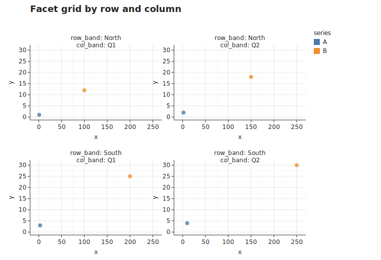

## Free facet scales

`facetScales: "free"` trains each panel's x and y axes from the data in that
panel while keeping the facet layout and legends shared.

```algraf
Chart(data: "layout_controls.csv", width: 760, height: 360,
      title: "Free facet scales") {
    Layout(facetCols: series, facetScales: "free")
    Guide(axis: x, label: "Panel-local x")
    Guide(axis: y, label: "Panel-local y")

    Space(x * y) {
        Line(stroke: series, strokeWidth: 2)
        Point(fill: series, size: 4)
    }
}
```

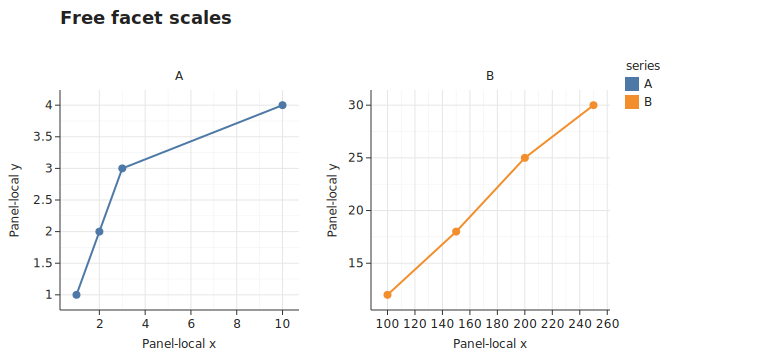

## Faceted sales performance with target line

Combining nested space algebra faceting, line and point series, custom axes/color scales, and reference overlays.

```algraf
Chart(data: "regional_sales.csv", width: 800, height: 480, title: "Regional Sales Performance vs. Target") {
    Theme(name: "minimal")
    Scale(stroke: product, palette: "accent")
    Scale(fill: product, palette: "accent")
    Scale(axis: y, domain: [50, 250])
    Guide(axis: y, grid: true, label: "Sales (k$)")
    Guide(axis: x, label: "Date")

    Space((time * sales) / region) {
        Line(stroke: product, strokeWidth: 2.5)
        Point(fill: product, size: 5)
        HLine(y: 150, stroke: "#ff4444", strokeWidth: 1.5, label: "Daily Target")
    }
}
```


## Reference marks: title, `HLine`, `VLine`, `Rug`

`HLine` and `VLine` accept literal data values and optional labels. Annotation
is ordinary geometry in Algraf: use literal-valued `HLine`, `VLine`, `Segment`,
`Rect`, or `Text` marks instead of a separate annotation function.
`Guide(legend: false)` suppresses the auto-generated legend when you don't need
it. `Chart(title: ...)` puts a title at the top.

```algraf
Chart(data: "penguins.csv", width: 760, height: 500, title: "Penguin measurements") {
    Guide(legend: false)

    Space(flipper_length * body_mass) {
        Point(fill: species, alpha: 0.62, size: 3)
        HLine(y: 4200, stroke: "#b22222", label: "4.2 kg")
        VLine(x: 45, stroke: "#555555", label: "45 mm")
        Rug(sides: "bl", alpha: 0.3)
    }
}
```


## Line segments between literal points

`Segment` draws a straight line between (`x`, `y`) and (`xend`, `yend`).
The endpoints participate in scale training, so the segment always
stays inside the plot rect.

```algraf
Chart(data: "penguins.csv", width: 720, height: 480) {
    Space(flipper_length * body_mass) {
        Point(fill: species, alpha: 0.7, size: 3)
        Segment(
            x: 175,
            y: 3000,
            xend: 230,
            yend: 6000,
            stroke: "#d62728",
            strokeWidth: 2,
        )
    }
}
```


## Dumbbell ranges with mapped `Segment` endpoints

`Segment` endpoints can be column mappings, not just literals. When any of `x`,
`y`, `xend`, or `yend` maps a column, one segment is drawn per row — ideal for
dumbbell and slope charts. A categorical endpoint resolves to its band center.

```algraf
Chart(data: "temperature_range.csv", width: 720, height: 420, title: "Annual temperature range by city") {
    Theme(name: "minimal")
    Guide(axis: x, label: "Temperature (°C)")
    Guide(axis: y, label: "City")

    Space(low * city) {
        Segment(x: low, y: city, xend: high, yend: city, stroke: "#bbbbbb", strokeWidth: 4)
        Point(fill: "#1f77b4", size: 6)
    }
}
```

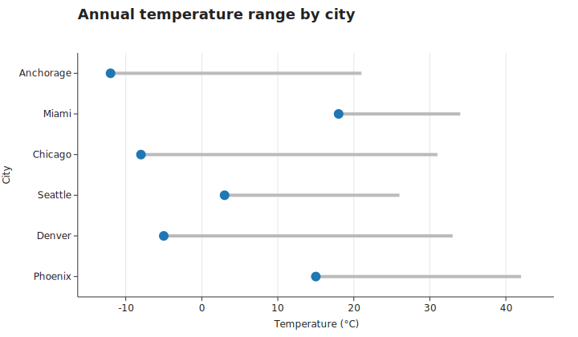

## Error bars and point estimates

`ErrorBar` is promoted sugar over `IntervalSegments` plus `Segment`. Use it in
the same `Space` as the estimate `Point` layer so the center marks and interval
segments train one shared coordinate system.

```algraf
Chart(data: "uncertainty_intervals.csv", width: 720, height: 440, title: "Dose response intervals") {
    Theme(name: "minimal")
    Scale(fill: cohort, palette: "accent")
    Guide(axis: x, label: "Dose")
    Guide(axis: y, label: "Estimated response")

    Space(dose * estimate) {
        ErrorBar(ymin: lower, ymax: upper, capWidth: 0.35, stroke: "#333333", strokeWidth: 1.2)
        Point(fill: cohort, stroke: "#333333", size: 4)
    }
}
```

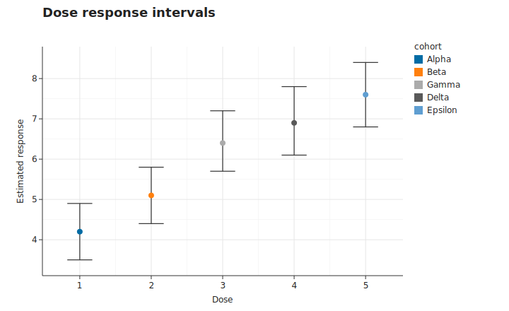

## Horizontal lineranges

`LineRange` is promoted sugar over the same `IntervalSegments` plus `Segment`
model. Here the interval bounds are horizontal (`xmin`/`xmax`), and the point
layer supplies the center estimate.

```algraf
Chart(data: "horizontal_intervals.csv", width: 720, height: 440, title: "Metric estimates and intervals") {
    Theme(name: "minimal")
    Scale(fill: domain, palette: "accent")
    Guide(axis: x, label: "Estimate")
    Guide(axis: y, label: "Metric")

    Space(estimate * metric) {
        LineRange(xmin: lower, xmax: upper, orientation: "horizontal", stroke: "#444444", strokeWidth: 1.4)
        Point(fill: domain, stroke: "#333333", size: 4)
    }
}
```

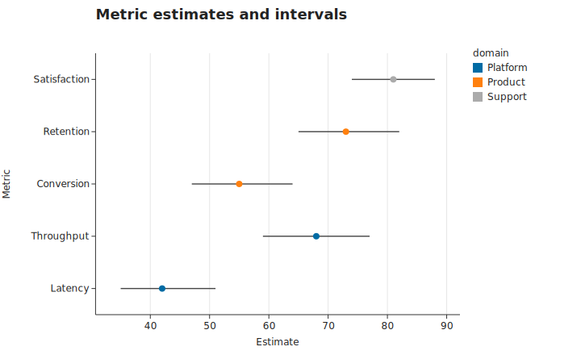

## Text labels per row

`Text` places one label per data row at its (`x`, `y`) position, using
the column you map to `label`.

```algraf
Chart(data: "penguins.csv", width: 720, height: 480) {
    Space(flipper_length * body_mass) {
        Point(fill: species, alpha: 0.4, size: 3)
        Text(label: species, anchor: "middle", dy: -8, size: 10)
    }
}
```


## Multiline text labels from JSON

JSON string values can contain newline characters. `Text` renders those as
separate SVG text lines, so longer annotations can stay attached to their data
position without pre-splitting the source table.

```algraf
Chart(data: "text.json",) {
    Scale(axis: x, domain: [0, 80])
    Scale(axis: y, domain: [0, 100])
    Space(x * y) {
        Text(label: label)
    }
}
```


## Slopegraph with text labels

A slopegraph compares values at two points in time/categories (e.g. 2024 vs 2026) for different groups, drawing a line between the two states. In Algraf, you can do this by using a continuous or categorical x-axis, using `Line` grouped and colored by group, `Point` markers, and `Text` labels. By leaving the label column blank for the starting year, text labels are rendered only at the end points to cleanly name the series.

Because the end-labels name the series directly, the `metric` legend is redundant, so it is turned off with `Guide(legend: false)`. With the legend gone there is nothing to reserve space on the right for those labels, so `marginRight: 150` keeps a minimum right margin wide enough for them to fit on the canvas.

Two of the 2026 endpoints (Customer Support and Platform Ease) are nearly tied, so their labels would collide. `declutter: true` on the `Text` layer spreads overlapping labels apart automatically — it operates on the final label positions, handles same-column and same-row collisions, and keeps adjusted labels within the plot when the group fits.

```algraf
Chart(data: "satisfaction.csv", width: 760, height: 480, marginRight: 150, title: "Customer Satisfaction Shift (2024 vs 2026)") {
    Theme(name: "minimal")
    Scale(axis: x, domain: [2024, 2026], integer: true)
    Scale(axis: y, domain: [50, 100])
    Scale(stroke: metric, palette: "accent")
    Scale(fill: metric, palette: "accent")
    Guide(axis: x, label: "Year")
    Guide(axis: y, label: "Satisfaction Score (%)")
    Guide(legend: false)

    Space(year * value) {
        Line(group: metric, stroke: metric, strokeWidth: 3)
        Point(fill: metric, size: 6)
        Text(label: label, dx: 10, dy: -2, anchor: "start", size: 10, fill: "#444444", declutter: true)
    }
}
```


## Station bubble labels with decluttering

Direct labels can collide when several points share the same row. Here the three stations with six trips have neighboring dock capacities, so their labels would overlap horizontally if each one stayed centered above its point. `declutter: true` keeps the point layer fixed and spreads only the text labels.

```algraf
Chart(data: "station_throughput.csv", width: 760, height: 470, title: "Station throughput vs dock capacity") {
    Theme(name: "minimal")
    Scale(fill: zone, palette: "accent", label: "Zone")
    Scale(size: revenue,
          range: [5, 13],
          breaks: [20, 50, 100],
          labels: ["$20", "$50", "$100"],
          label: "Revenue")
    Scale(axis: x, domain: [0, 36], breaks: [0, 10, 20, 30], labels: ["0", "10", "20", "30"], expand: [0, 0.05])
    Scale(axis: y, domain: [0, 8], breaks: [0, 2, 4, 6, 8], labels: ["0", "2", "4", "6", "8"], expand: [0, 0.05])
    Guide(axis: x, label: "Dock capacity")
    Guide(axis: y, label: "Trips")

    Space(capacity * trips) {
        Point(
            fill: zone,
            size: revenue,
            alpha: 0.85,
            tooltip: [station_name, zone, capacity, trips, revenue]
        )
        Text(label: station_name, dy: -12, size: 10, declutter: true)
    }
}
```

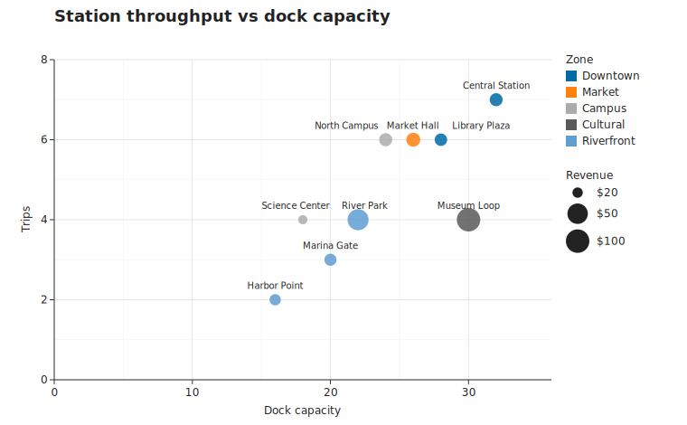

## Numeric text formatting

`Text(format: ...)` formats numeric label columns with deterministic,
locale-independent output. This keeps data preparation focused on values while
Algraf handles the display form.

```algraf
Chart(data: "formatted_text.csv", width: 720, height: 440, title: "Revenue per dock") {
    Theme(name: "minimal")
    Scale(fill: zone, palette: "accent", label: "Zone")
    Guide(axis: x, label: "Dock capacity")
    Guide(axis: y, label: "Trips")

    Space(capacity * trips) {
        Point(fill: zone, size: 7, alpha: 0.86)
        Text(label: revenue_per_dock, format: "$.2f", dx: 8, anchor: "start", size: 10)
    }
}
```

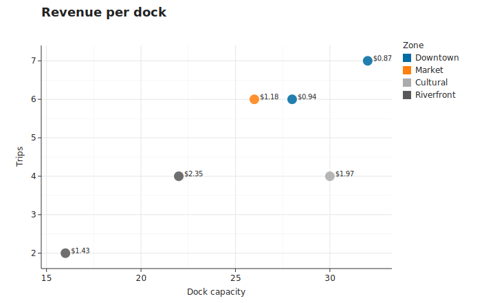

## Terminal series labels

`Label` places one text mark per group at the physical x-axis start or end.
It is useful for direct labels on line endings without preparing a helper label
table.

```algraf
Chart(data: "terminal_labels.csv", width: 760, height: 440, marginRight: 130, title: "Series-end labels") {
    Theme(name: "minimal")
    Scale(stroke: segment, palette: "accent")
    Scale(fill: segment, palette: "accent")
    Guide(axis: x, label: "Month")
    Guide(axis: y, label: "Share")
    Guide(legend: false)

    Space(month * share) {
        Line(group: segment, stroke: segment, strokeWidth: 3)
        Point(fill: segment, size: 5)
        Label(label: segment, group: segment, at: "end", dx: 8, anchor: "start", fill: segment, size: 11)
    }
}
```

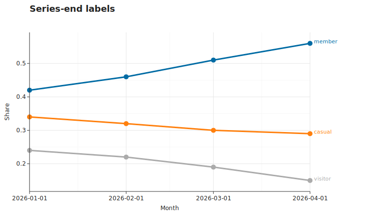

## Per-row label offsets

When you want full control over where each label sits rather than automatic decluttering, `dx` and `dy` can take a **column** instead of a literal number, so every label is offset by its own value from the data. Here a `labeldy` column lifts some labels above their point and drops others below, keeping each clear of its marker.

```algraf
Chart(data: "labeled_points.csv", width: 640, height: 440, title: "Product Positioning") {
    Theme(name: "minimal")
    Scale(axis: y, domain: [3.5, 5.0])
    Guide(axis: x, label: "Price ($)")
    Guide(axis: y, label: "Rating")

    Space(price * rating) {
        Point(size: 6, fill: "#4E79A7")
        Text(label: label, dy: labeldy, anchor: "middle", size: 11, fill: "#333333")
    }
}
```


## Nudged point labels

`nudgeData` offsets labels in data units, while `nudge` offsets them in pixels.
They compose with ordinary `Text` labels for direct annotation.

```algraf
Chart(data: "layout_controls.csv", width: 720, height: 420,
      title: "Nudged point labels") {
    Guide(axis: x, label: "x")
    Guide(axis: y, label: "y")

    Space(x * y) {
        Point(fill: series, size: 4)
        Text(label: label, fill: series, anchor: "start",
             nudgeData: [4, 0], nudge: [6, -4], size: 11)
    }
}
```

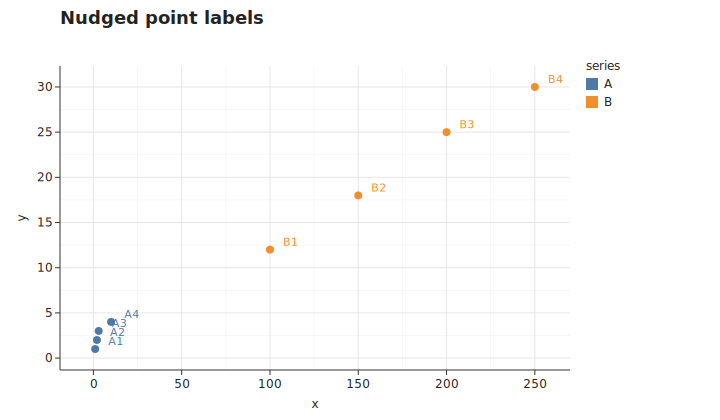

## Overriding labels and palettes

`Guide(axis: x, label: ...)` and `Guide(axis: y, label: ...)` replace
the default column-name axis titles with custom text. `Scale(fill: ...,
palette: "accent")` switches the categorical fill palette for the mapped
column.

```algraf
Chart(data: "penguins.csv", width: 720, height: 480) {
    Guide(axis: x, label: "Flipper length (mm)")
    Guide(axis: y, label: "Body mass (g)")
    Scale(fill: species, palette: "accent")

    Space(flipper_length * body_mass) {
        Point(fill: species, alpha: 0.7, size: 3)
    }
}
```


## Renaming a legend with `Scale(label: ...)`

A `fill` or `stroke` scale can carry a `label`, which becomes the legend
title instead of the raw column name. Combine it with `palette:` to control
both the colors and the heading of the legend.

```algraf
Chart(data: "penguins.csv", width: 720, height: 480, title: "Scale-driven legend label") {
    Scale(fill: species, palette: "accent", label: "Penguin Species")

    Space(flipper_length * body_mass) {
        Point(fill: species, size: 4, alpha: 0.85)
    }
}
```


## Exact breaks, labels, and tick rows

Scale `breaks:` place axis ticks exactly, and a parallel `labels:` array controls
their text. `expand:` pads the trained domain, while `tickLabelRows:` dodges
crowded tick labels deterministically.

```algraf
Chart(data: "revenue_breaks.csv", width: 760, height: 460, title: "Revenue against target") {
    Theme(name: "minimal")
    Scale(axis: y,
          domain: [0, 1000000],
          breaks: [0, 250000, 500000, 750000, 1000000],
          labels: ["0", "250k", "500k", "750k", "1M"],
          expand: [0.02, 0])
    Scale(fill: region, palette: "accent")
    Guide(axis: x, tickLabelRows: 2)
    Guide(axis: y, label: "Revenue")

    Space(quarter * revenue) {
        Bar(fill: region, layout: "stack")
    }
}
```

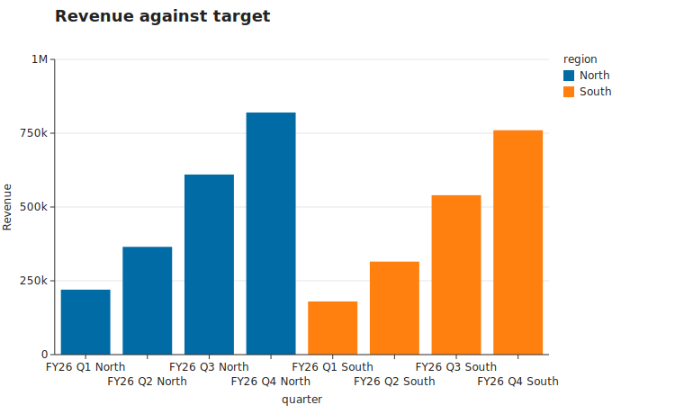

## Binned color scale

When a continuous value only needs visual classes, `mode: "binned"` classifies
the original column inside the scale instead of requiring a prepared category
column.

```algraf
Chart(data: "density_points.csv", width: 720, height: 440, title: "Density classes from a binned scale") {
    Theme(name: "minimal")
    Scale(fill: density,
          mode: "binned",
          breaks: [0, 100, 250, 500, 800],
          labels: ["0-100", "100-250", "250-500", "500-800", "800+"],
          range: ["#eff3ff", "#bdd7e7", "#6baed6", "#3182bd", "#08519c"],
          label: "Density")

    Guide(axis: x, label: "Longitude index")
    Guide(axis: y, label: "Latitude index")

    Space(x * y) {
        Point(fill: density, stroke: "#ffffff", size: 8)
    }
}
```

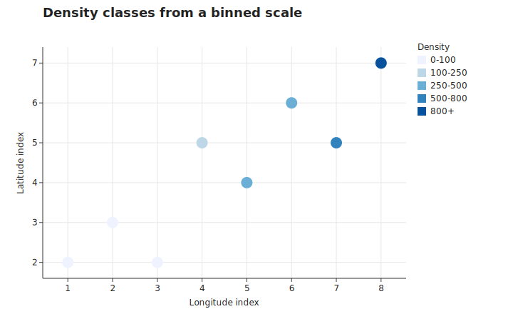

## Identity color scale

`mode: "identity"` uses safe color values from the data directly. It is useful
for brand or status colors that are already encoded as hex colors or approved
SVG color names.

```algraf
Chart(data: "brand_points.csv", width: 700, height: 430, title: "Brand colors from data") {
    Theme(name: "minimal")
    Scale(fill: brand_color, mode: "identity")
    Guide(fill: null)
    Guide(axis: x, label: "Campaign")
    Guide(axis: y, label: "Response")

    Space(x * y) {
        Point(fill: brand_color, size: 5, alpha: 0.9)
        Text(label: label, dy: -14, anchor: "middle", size: 11)
    }
}
```

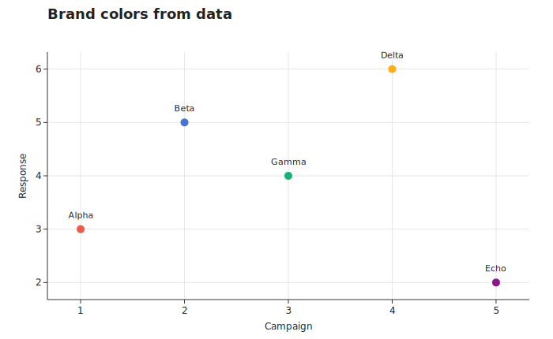

## Merging fill and stroke legends

When `fill` and `stroke` map to the same categorical column, Algraf merges
their legends into one. Each swatch shows the fill color with the stroke
color drawn as an outline, instead of two redundant legends with the same
title.

```algraf
Chart(data: "penguins.csv", width: 720, height: 480, title: "Merged fill and stroke legend") {
    Space(flipper_length * body_mass) {
        Point(fill: species, stroke: species, size: 4, alpha: 0.8)
    }
}
```


## Tall right legends expand the output

Right and left legends reserve measured width, and when a vertical legend has
more rows than the requested chart height, Algraf expands the SVG/draw-list
height so every legend entry remains visible.

```algraf
Chart(data: "tall_legend_viewport.csv", width: 560, height: 160,
      title: "Tall right legend") {
    Theme(name: "minimal")
    Scale(fill: origin_bucket, label: "Origin bucket")
    Guide(axis: x, label: "Snapshot")
    Guide(axis: y, label: "Lines")

    Space(x * y) {
        Point(fill: origin_bucket, size: 5)
    }
}
```

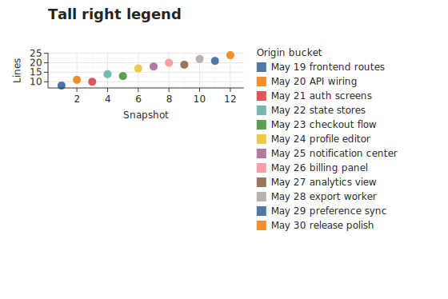

## Log-scaled axes

`Scale(axis: y, type: "log10")` switches a continuous position axis to a
base-10 log scale, which spreads out values that span several orders of
magnitude. A log axis needs a strictly positive domain, so pin it with
`domain: [...]` rather than relying on the data-driven bounds.

```algraf
Chart(data: "cities.csv", width: 720, height: 460, title: "Population across settlement sizes") {
    Scale(axis: y, type: "log10", domain: [100, 10000000])
    Guide(axis: y, label: "Population (log scale)")

    Space(place * population) {
        Point(fill: place, size: 6)
    }
}
```


## Square-root axes

`Scale(axis: y, type: "sqrt")` positions values by their square root, so a
squared relationship plots as a straight line. Ticks stay at nice data values.

```algraf
Chart(data: "squares.csv", width: 640, height: 420, title: "Area on a square-root axis") {
    Scale(axis: y, type: "sqrt", domain: [0, 100])
    Guide(axis: y, label: "Area (sqrt scale)")
    Guide(axis: x, label: "Side length")

    Space(side * area) {
        Line(stroke: "#3366cc", strokeWidth: 2)
        Point(fill: "#cc3333", size: 5)
    }
}
```

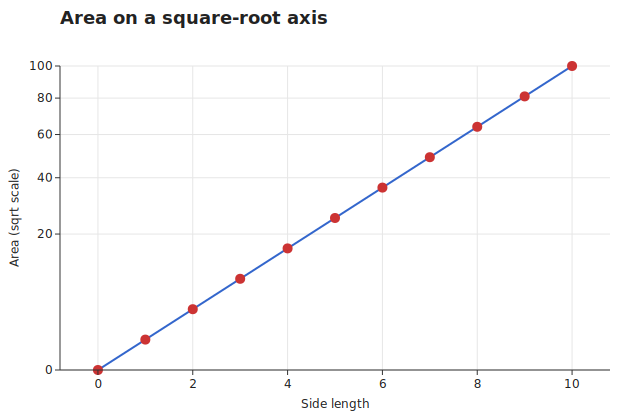

## Pinning a domain

`Scale(axis: y, domain: [min, max])` fixes the axis bounds to an explicit
range instead of fitting them to the data. This is handy for keeping a
consistent y range across charts, or for adding headroom around the points.

```algraf
Chart(data: "penguins.csv", width: 720, height: 480) {
    Scale(axis: y, domain: [2500, 6500])
    Guide(axis: y, label: "Body mass (g), pinned axis")

    Space(flipper_length * body_mass) {
        Point(fill: species, alpha: 0.7, size: 3)
    }
}
```


## Clipping from a pinned floor

A half-open domain pins only the bound you write. Here `domain: [0, null]`
closes the lower y edge so losses below zero are masked at the floor, while the
upper edge remains data-trained and open.

```algraf
Chart(data: "monthly_profit.csv", width: 760, height: 420, title: "Pinned floor clips losses") {
    Theme(name: "minimal")
    Scale(axis: y, domain: [0, null],
          breaks: [0, 10000, 20000, 30000, 40000],
          labels: ["0", "10k", "20k", "30k", "40k"])
    Guide(axis: x, label: "Month")
    Guide(axis: y, label: "Monthly profit")

    Space(month * profit) {
        Area(baseline: 0, fill: "#9ecae1", alpha: 0.45)
        Line(stroke: "#1f77b4", strokeWidth: 2.5)
        Point(fill: "#1f77b4", size: 4)
        HLine(y: 0, stroke: "#333333", strokeWidth: 1)
    }
}
```

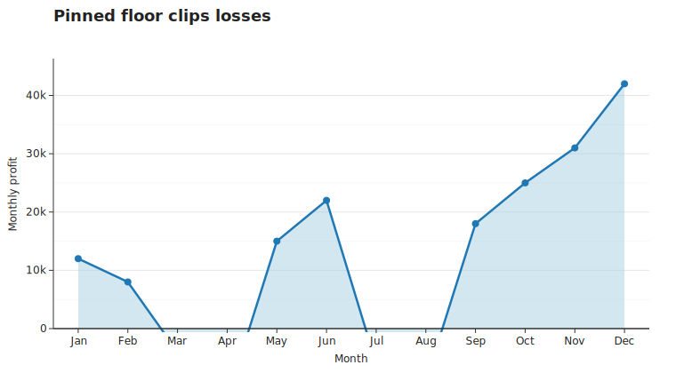

## Declared categorical domain order

String-array `domain:` values on position scales declare categorical axis order.
Categories with no rows still reserve a band, and data categories not listed in
the declaration are appended after the declared values.

```algraf
Chart(data: "categorical_domain_order.csv", width: 720, height: 420, title: "Metrics in declared order") {
    Theme(name: "minimal")
    Scale(axis: x, domain: ["Trips", "Revenue", "Stations", "Docks"])
    Guide(axis: x, label: "Metric")
    Guide(axis: y, label: "Value")

    Space(metric * value) {
        Bar(fill: "#4E79A7", alpha: 0.88)
        Text(label: value, format: ".0f", dy: -8, anchor: "middle", size: 10)
    }
}
```

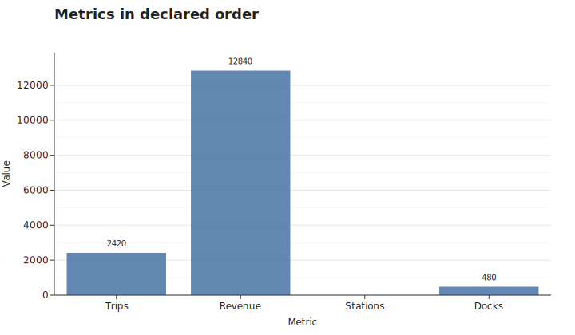

## Numeric categories on an axis

Numeric identifiers such as day numbers often need a discrete band axis rather
than a continuous scale. `type: "categorical"` keeps the source column numeric
for the data model while training the selected position axis as categories.

```algraf
Chart(data: "numeric_categorical_axis.csv", width: 620, height: 380, title: "Day numbers as categories") {
    Theme(name: "minimal")
    Scale(axis: x, type: "categorical", domain: ["1", "2", "3", "4", "5", "6"])
    Scale(axis: y, domain: [0, 100], breaks: [0, 25, 50, 75, 100])
    Scale(fill: value, gradient: ["#d8f3dc", "#145f52"], label: "Value")
    Guide(axis: x, label: "Day")
    Guide(axis: y, label: "Value")

    Space(day * value) {
        Bar(fill: value, layout: "stack", tooltip: [day_label, value])
        Text(label: value, dy: -8, anchor: "middle", size: 10)
    }
}
```

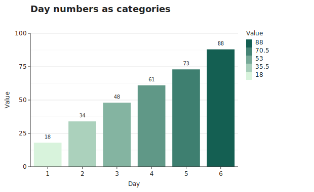

## Visual coordinate zoom

`zoomX` and `zoomY` are coordinate controls on `Space`. They limit the visible
panel range and clip marks after stats are computed, instead of changing the
data used by the layer.

```algraf
Chart(data: "layout_controls.csv", width: 720, height: 440,
      title: "Visual coordinate zoom") {
    Guide(axis: x, label: "x (zoomed view)")
    Guide(axis: y, label: "y (zoomed view)")

    Space(x * y, zoomX: [0, 20], zoomY: [0, 8]) {
        Point(fill: series, alpha: 0.75, size: 4)
        Smooth(method: "lm", stroke: "#2f2f2f", se: false)
    }
}
```

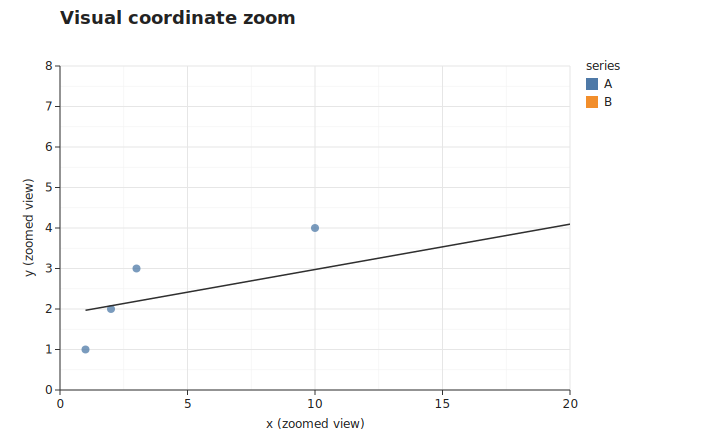

## Fixed aspect

`aspect: 1` keeps one x unit visually equal to one y unit by shrinking and
centering the plot rectangle inside the available chart area.

```algraf
Chart(data: "aspect_segments.csv", width: 720, height: 360,
      title: "Fixed aspect calibration square") {
    Scale(axis: x, domain: [0, 10])
    Scale(axis: y, domain: [0, 10])
    Guide(axis: x, label: "Measured x")
    Guide(axis: y, label: "Measured y")

    Space(x * y, aspect: 1) {
        Segment(x: x, y: y, xend: xend, yend: yend, stroke: "#4b5563", strokeWidth: 2)
        Point(fill: "#ffffff", stroke: "#111827", size: 3)
    }
}
```

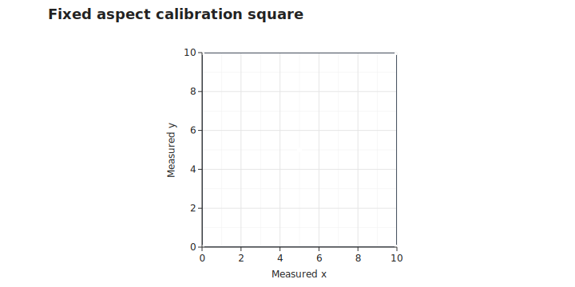

## Reversing an axis

`Scale(axis: y, reverse: true)` flips the axis direction. For rank-style
data — where 1 is best — reversing the y axis puts first place at the top,
turning a line chart into a bump chart. Adding `integer: true` constrains the
ticks to whole numbers, so ranks and weeks read as `1, 2, 3` instead of
half-steps — without having to pin an explicit `domain`.

```algraf
Chart(data: "rankings.csv", width: 720, height: 440, title: "League standings by week") {
    Scale(axis: x, integer: true)
    Scale(axis: y, reverse: true, integer: true)
    Guide(axis: y, label: "Rank")

    Space(week * rank) {
        Line(stroke: team, strokeWidth: 2)
        Point(fill: team, size: 5)
    }
}
```


## Hiding grid lines and individual legends

Guide controls compose: `Guide(grid: false)` drops the background grid, and
`Guide(fill: null)` suppresses just the `fill` legend while keeping the
colors mapped. The result is a stripped-down canvas that still encodes the
categorical fill.

```algraf
Chart(data: "penguins.csv", width: 720, height: 480) {
    Guide(grid: false)
    Guide(fill: null)

    Space(flipper_length * body_mass) {
        Point(fill: species, alpha: 0.75, size: 4)
    }
}
```


## Space-local themes

`Theme` can appear at the chart level or inside a `Space`. A
space-scoped `Theme` overrides the chart theme just for that panel —
useful when one space wants a stripped-down look.

```algraf
Chart(data: "timeseries.csv", width: 760, height: 420) {
    Theme(name: "minimal")

    Space(time * value) {
        Theme(name: "void")
        Line(stroke: series, strokeWidth: 2)
    }
}
```


---

## Variables with `let`

A `let` binding names a constant value so it can be reused across a chart
instead of repeating the literal. Bindings are valid at chart scope (visible
everywhere) and space scope (visible in that space, shadowing a chart binding of
the same name). They resolve in property value positions; a bare identifier
matching a binding wins over a column of the same name, while a backtick-quoted
identifier is always a column.

```algraf
Chart(data: "penguins.csv") {
    let primary = "#3366cc"
    let muted = Style(fill: "#6b7280", alpha: 0.55)

    Space(flipper_length * body_mass) {
        Point(style: muted, stroke: primary)
    }
}
```


---

## Custom themes

`Theme` accepts override properties layered on top of a named base. Grouped,
geometry-style overrides such as `axisText: Text(...)`, `legendTitle: Text(...)`,
`panelBackground: Rect(...)`, and `gridMajor: Line(...)` sit alongside direct
scalar keys such as `plotBackground`, `axisColor`, `textColor`, `fontSize`,
`lineWidth`, `grid`, and `axes`. Override values reuse the usual value forms and
may reference `let` variables for shared colors.

```algraf
Chart(data: "penguins.csv") {
    let ink = "#333333"
    let faint = "#dddddd"

    Theme(
        name: "minimal",
        axisText: Text(size: 12, fill: ink),
        gridMajor: Line(stroke: faint, strokeWidth: 1),
        plotBackground: "#fafafa"
    )

    Space(flipper_length * body_mass) {
        Point(fill: species, alpha: 0.8)
    }
}
```


## Presentation theme, bottom legend, and accessibility text

The neutral `gray`, `bw`, and `linedraw` themes are presets. Structured theme
elements refine title, axis, legend, panel, and grid styling, while
`legendPosition` moves the legend into the measured layout. `alt` and
`description` are chart-level metadata used by SVG and interaction sidecars.

```algraf
Chart(data: "penguins.csv", width: 760, height: 500,
      title: "Penguin measurements",
      subtitle: "Body mass and flipper length by species",
      caption: "Source: sample penguin measurements",
      alt: "Scatter plot of penguin body mass by flipper length with species colors.",
      description: "A scatter plot compares flipper length on the x axis with body mass on the y axis. Adelie, Chinstrap, and Gentoo penguins are distinguished by point color and a bottom legend.") {
    Theme(
        name: "bw",
        legendPosition: "bottom",
        legendSpacing: 14,
        plotTitle: Text(size: 20, fill: "#1f2937"),
        plotSubtitle: Text(size: 13, fill: "#4b5563"),
        plotCaption: Text(size: 11, fill: "#6b7280"),
        axisTitle: Text(size: 12, fill: "#374151"),
        axisText: Text(size: 11, fill: "#4b5563"),
        legendTitle: Text(size: 12, fill: "#111827"),
        legendText: Text(size: 11, fill: "#374151"),
        panelBackground: Rect(fill: "#ffffff", stroke: "#111827", strokeWidth: 1),
        gridMajor: Line(stroke: "#d1d5db", strokeWidth: 0.8),
        gridMinor: Line(stroke: "#f3f4f6", strokeWidth: 0.5)
    )
    Guide(axis: x, label: "Flipper length (mm)")
    Guide(axis: y, label: "Body mass (g)")
    Scale(fill: species, label: "Species")

    Space(flipper_length * body_mass) {
        Point(fill: species, alpha: 0.72, size: 3)
    }
}
```

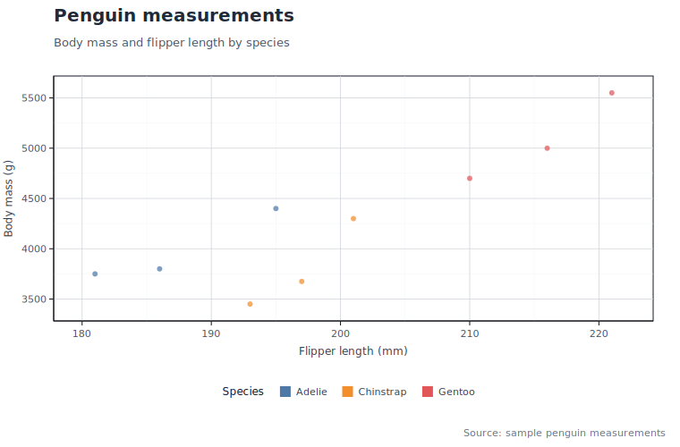

---

## Paths and data-driven line width

`Path` connects rows in source order — unlike `Line`, which sorts by x — so it
can trace a route that doubles back on itself. Mapping `strokeWidth` to a column
turns the line into a variable-width ribbon: a continuous `Scale(strokeWidth:)`
trains the column's domain into a pixel `range`, and each segment is drawn at the
width of its endpoints. A `domain` (or `range`) bound may be `null` to infer it
from the data.

```algraf
Chart(data: "route.csv", title: "Path with variable width") {
    Scale(strokeWidth: load, domain: [0, null], range: [1, 18], breaks: [10, 25, 45, 70], label: "Load")

    Space(x * y) {
        Path(stroke: "#4E79A7", strokeWidth: load)
    }
}
```


## Step lines with `StepVertices`

`StepVertices` expands source rows into the intermediate vertices that a
source-order `Path` needs for horizontal-then-vertical steps. Missing values
split the path into separate runs, and the derived `step_group` column can be
used as the `Path` group.

```algraf
Chart(data: "step_vertices.csv", width: 760, height: 420,
      title: "Inventory step vertices") {
    Guide(axis: x, label: "Day")
    Guide(axis: y, label: "Units on hand")

    Derive step_rows = StepVertices(day, units, direction: "hv")

    Space(day * units, data: step_rows) {
        Path(group: step_group, stroke: "#2f6fbb", strokeWidth: 2, dash: "dashed")
    }

    Space(day * units) {
        Point(fill: "#2f6fbb", size: 3)
    }
}
```

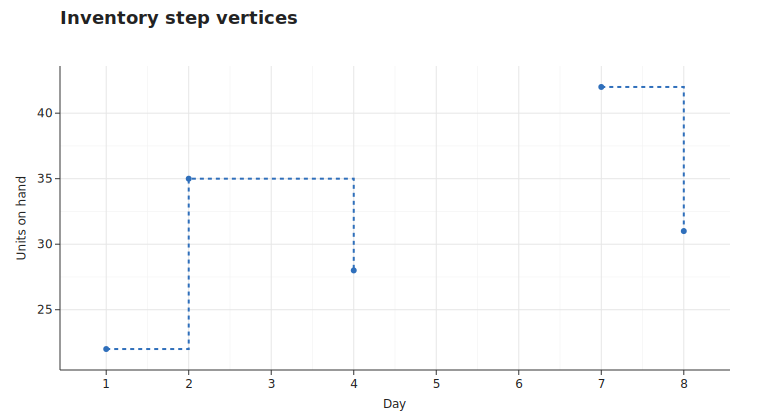

## Vectors and sampled curves as primitive rows

`VectorEndpoints` turns angle-and-length rows into `Segment` endpoints.
`CurveSample` turns paired endpoints into grouped `Path` vertices. Both derived
tables pass through non-conflicting source columns, so aesthetics like
`stroke: cohort` remain available on the primitive marks.

```algraf
Chart(data: "primitive_links.csv", width: 760, height: 460,
      title: "Vectors and sampled curves") {
    Scale(fill: cohort, palette: "accent", label: "Cohort")
    Scale(stroke: cohort, palette: "accent", label: "Cohort")
    Guide(axis: x, label: "x")
    Guide(axis: y, label: "y")

    Derive vectors = VectorEndpoints(x, y, angle, speed, lengthScale: 0.4)
    Derive curves = CurveSample(x, y, x1, y1, curvature: 0.28, points: 18)

    Space(x * y, data: curves) {
        Path(group: link_id, stroke: cohort, strokeWidth: 1.4, dash: "dashed", alpha: 0.55)
    }

    Space(x * y, data: vectors) {
        Segment(x: x, y: y, xend: xend, yend: yend,
                stroke: cohort, strokeWidth: 2, dash: "dotted")
    }

    Space(x * y) {
        Point(fill: cohort, size: 4)
        Text(label: cohort, dx: 5, dy: -6, size: 10)
    }
}
```

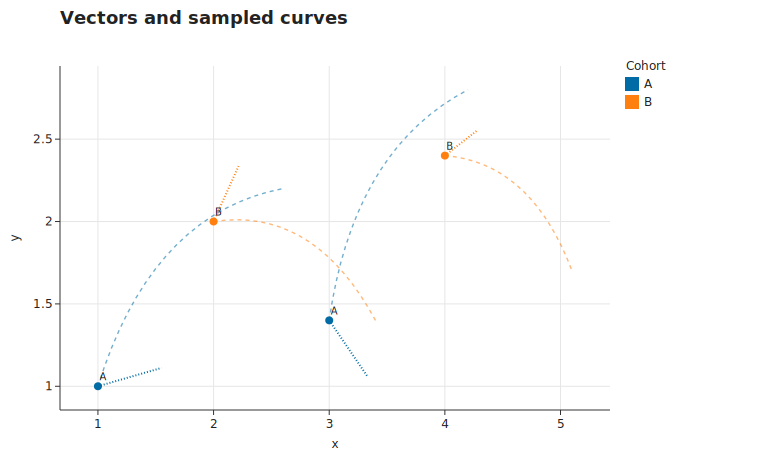

## Manual colors and renamed legend entries

A categorical `fill`/`stroke` scale can take a `=>` map for `range:`, assigning
each category an exact color, and a `labels:` map that renames the legend
entries. The map keys also fix the category order, so no separate `domain` is
needed.

```algraf
Chart(data: "penguins.csv", title: "Manual colors and renamed legend") {
    Scale(fill: species,
          range:  ["Adelie" => "#4E79A7", "Chinstrap" => "#E15759", "Gentoo" => "#59A14F"],
          labels: ["Adelie" => "Adélie", "Chinstrap" => "Chinstrap", "Gentoo" => "Gentoo"],
          label:  "Species")

    Space(flipper_length * body_mass) {
        Point(fill: species, alpha: 0.8)
    }
}
```


## Minard's march: overlaying a second data source

The capstone pulls the v0.6 primitives together to recreate Minard's map of
Napoleon's 1812 Russian campaign. A chart-scoped `Table` loads a second CSV of
city labels onto the same long/lat space as the troop path. The troop layer is a
`Path` drawn in data order, its width encoding the surviving troop count and its
color split between advance and retreat with two hand-picked colors and renamed
legend entries. The two mapped aesthetics produce two legends: a "Direction"
swatch legend for the stroke colors and a "Troops" size legend whose swatch lines
thicken with the surviving-troop count. Axis titles are suppressed with
`label: null`, since raw longitude and latitude need no heading.

```algraf
Chart(
    data: "minard_troops.csv",
    title: "Napoleon's Russian Campaign",
    subtitle: "Inspired by the graphic of C.J. Minard",
    marginRight: 40
) {
    Table cities = "minard_cities.csv"

    Scale(stroke: direction,
          range: ["A" => "burlywood", "R" => "black"],
          labels: ["A" => "Advance", "R" => "Retreat"],
          label: "Direction")
    Scale(strokeWidth: survivors, domain: [0, null], range: [0, 30],
          breaks: [50000, 100000, 200000, 300000, 340000],
          labels: ["50k", "100k", "200k", "300k", "340k"], label: "Troops")

    Guide(axis: x, label: null)
    Guide(axis: y, label: null)

    Space(long * lat) {
        Path(stroke: direction, strokeWidth: survivors, group: group)
    }

    Space(long * lat, data: cities) {
        Text(label: city, size: 6)
    }
}
```


## Tapered ribbons with `taper`

By default a mapped `strokeWidth` draws one stroke per segment. Adding
`taper: true` instead renders the series as a single filled polygon whose
half-width follows the scaled `strokeWidth` at each vertex — a smooth tapered
ribbon, as in the Minard troop flow.

```algraf
Chart(data: "tapered_flow.csv", width: 720, height: 420, title: "Tapered flow ribbon") {
    Scale(strokeWidth: volume, domain: [0, null], range: [0, 28], breaks: [10, 25, 50, 75, 100], label: "Volume")
    Guide(axis: x, label: "Distance")
    Guide(axis: y, label: "Elevation")

    Space(distance * elevation) {
        Path(strokeWidth: volume, taper: true, stroke: "#8b5a2b")
    }
}
```

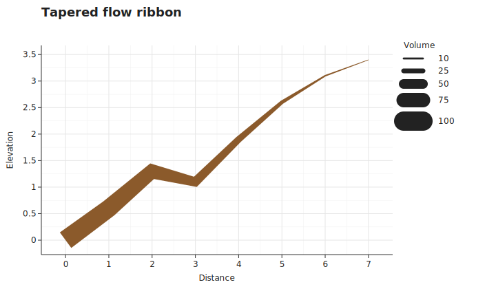

## Data formats: TSV, JSON, and NDJSON

Every example so far reads CSV, but a data source can also be TSV, JSON, or
NDJSON. The format is chosen by the file extension (`.tsv`/`.tab`, `.json`,
`.ndjson`/`.jsonl`); an unrecognized extension is read as CSV. Whatever the
format, the data lands in the same dataframe and runs through the same
type-inference pipeline, so the chart language is identical.

A `.tsv` source is just CSV with tab separators:

```algraf
Chart(
    data: "sales.tsv",
    width: 640,
    height: 420,
    title: "Revenue by region (TSV source)",
) {
    Space(region * revenue) {
        Bar(stat: "identity", fill: region, alpha: 0.85, layout: "stack")
    }
}
```


SQLite sources use an explicit constructor with a database path and a read-only
query. The `sql` feature gate is required, and the query includes `ORDER BY` so
row order is deterministic:

```algraf
Algraf(version: "0.21", features: ["sql"])

Chart(
    data: Sqlite("sales.db", "SELECT region, revenue FROM sales ORDER BY region"),
    width: 640,
    height: 420,
    title: "Revenue by region (SQLite source)",
) {
    Space(region * revenue) {
        Bar(stat: "identity", fill: region, alpha: 0.85, layout: "stack")
    }
}
```


A `.json` source is an array of row objects. Each object is a row; keys become
columns (in first-seen order). JSON values are inferred exactly as their CSV
text would be — `null` is a missing cell, and the number `1` and string `"1"`
both infer as an integer:

```algraf
Chart(
    data: "temperatures.json",
    width: 760,
    height: 460,
    title: "Monthly temperature (JSON source)",
) {
    Space(date * temp) {
        Line(stroke: city, strokeWidth: 2)
        Point(fill: city, size: 5)
    }
}
```


A `.ndjson` source is one JSON row object per line (blank lines are skipped):

```algraf
Chart(
    data: "events.ndjson",
    width: 640,
    height: 420,
    title: "Events by category (NDJSON source)",
) {
    Space(category * count) {
        Bar(stat: "identity", fill: category, alpha: 0.85, layout: "stack")
    }
}
```


## Baseball division standings

A faceted chart with free scales and no labels, showing the division standings for each division.

```algraf
Chart(data: "baseball.csv", width: 720, height: 380, title: "MLB Division Standings") {
    Theme(name: "minimal")
    
    Layout(facetCols: division, facetScales: "free", facetLabel: "null")
    
    Scale(axis: y, reverse: true, integer: true, domain: [1, 5])
    
    Guide(axis: x, label: null)
    Guide(axis: y, label: "Rank", grid: true)
    
    Space((division * division_wins_rank) / division) {
        Text(label: team, dx: -130, dy: -9, anchor: "start", size: 12, fill: "#111827")
        Text(label: wins, dx: -60, dy: -9, anchor: "start", size: 9.5, fill: "#4b5563")
        Text(label: losses, dx: -35, dy: -9, anchor: "start", size: 9.5, fill: "#4b5563")
        Text(label: win_loss_ratio, dx: 0, dy: -9, anchor: "start", size: 9.5, fill: "#4b5563")
    }
}
```

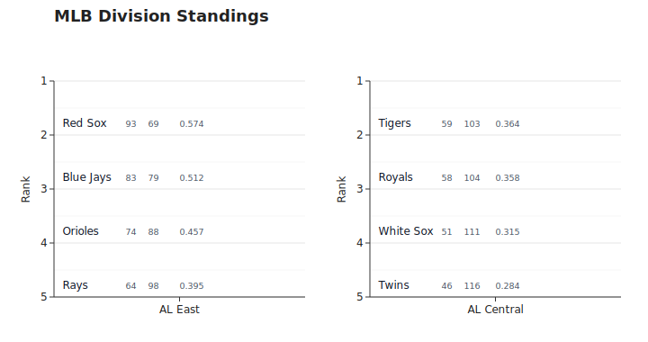

---

## Maps: a county population choropleth

Version 0.8 makes geometry a first-class column type. The `GeoJson(...)` source
constructor loads a `FeatureCollection` — one row per feature, each property a
column, and the geometry in a `geom` column. `Space(geom, projection: ...)`
projects those features into the plot, and the polymorphic `Geo` mark fills each
region by a data value: a choropleth. Here `projection: "albers_usa"` puts the
lower-48 counties into the conventional Albers equal-area layout, and `fill`
maps `population` through the gradient declared on the chart.

```algraf
Chart(data: GeoJson("us_counties.geojson"), width: 900, height: 600,
      title: "US Population by County",
      subtitle: "Lower 48 + DC — 2018 Census estimates") {
    Theme(name: "void")
    Scale(fill: population, gradient: ["#f7fbff", "#08306b"], label: "Population")

    Space(geom, projection: "albers_usa") {
        Geo(fill: population, stroke: "#ffffff", strokeWidth: 0.25)
    }
}
```


The same map reads from a shapefile by changing only the source — both formats
decode to the identical `geom` column plus attributes, so the `Space`/`Geo`/`Scale`
body is unchanged:

```algraf
Chart(data: Shapefile("cb_2018_us_county_20m.shp"), ...) { ... }
```

(The `examples/fixtures/build_counties.sh` script rebuilds both fixtures from
public-domain US Census sources.)

## Maps: projecting a point layer onto a basemap

Because the projection is shared across overlaid spaces, a `long * lat` point
layer drops onto the same basemap. The county geometry is the primary source; a
chart-scoped `Table` supplies the cities, and both spaces declare the same
`albers_usa` projection so the layers align.

```algraf
Chart(data: GeoJson("us_counties.geojson"), width: 900, height: 600,
      title: "Major US Cities",
      subtitle: "A projected point layer over a county basemap") {
    Theme(name: "void")
    Table cities = "us_cities.csv"

    Space(geom, projection: "albers_usa") {
        Geo(fill: "#eeeeee", stroke: "#ffffff", strokeWidth: 0.25)
    }

    Space(long * lat, projection: "albers_usa", data: cities) {
        Point(size: 5, fill: "#cc3333", alpha: 0.85)
    }
}
```


## Maps: proportional symbol (bubble) map overlay

You can map point attributes like population to both color and size scales. By overlaying the projected points on top of a county outline basemap, we can create a proportional symbol map.

```algraf
Chart(data: GeoJson("us_counties.geojson"), width: 800, height: 500,
      title: "Major US Cities by Population",
      subtitle: "Proportional symbol (bubble) map overlaid on county boundaries") {
    Theme(name: "void")
    Table cities = "us_cities.csv"

    Scale(fill: population, gradient: ["#feb24c", "#f03b20"], label: "Population")
    Scale(size: population, range: [5, 25], breaks: [500000, 1000000, 2500000, 5000000, 8000000],
          labels: ["0.5M", "1M", "2.5M", "5M", "8M"], label: "Population Scale")

    // Basemap
    Space(geom, projection: "albers_usa") {
        Geo(fill: "#f7f7f7", stroke: "#e0e0e0", strokeWidth: 0.25)
    }

    // Cities bubble overlay
    Space(long * lat, projection: "albers_usa", data: cities) {
        Point(size: population, fill: population, alpha: 0.85)
        Text(label: city, dy: -14, size: 7, fill: "#222222", anchor: "middle")
    }
}
```

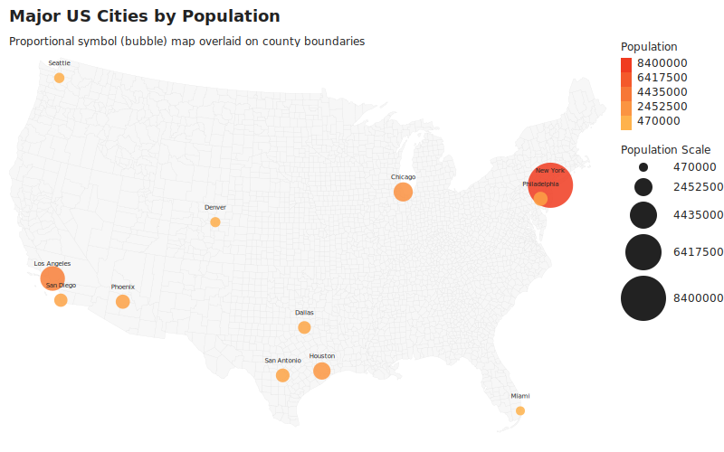

## Maps: glyph pies on projected city anchors

A glyph can wrap a polar child space, replacing a city point with a small pie
chart whose rows come from a second table. Map the host-row size through the
ordinary `Scale(size:, range:)` so each pie's footprint reflects city
population.

```algraf
Chart(data: GeoJson("us_counties.geojson"), width: 860, height: 520,
      title: "Major cities with population mix pies",
      subtitle: "Glyph pie charts are projected onto the same county basemap") {
    Theme(name: "void")
    Table cities = "inset_cities.csv"
    Table city_mix = "city_population_mix.csv"

    Glyph pie(data: city_mix, key: [city], scales: "shared") {
        Space(count, coords: "polar", theta: "y") {
            Scale(fill: age_group,
                  range: ["under 25" => "#4E79A7", "25-64" => "#F28E2B", "65+" => "#59A14F"],
                  label: "Age group")
            Bar(fill: age_group, layout: "fill")
        }
    }

    Scale(size: population, range: [20, 48], label: "Population")

    Space(geom, projection: "albers_usa") {
        Geo(fill: "#f3f4f6", stroke: "#d1d5db", strokeWidth: 0.25)
    }

    Space(long * lat, projection: "albers_usa", data: cities) {
        pie(size: population, clip: "circle", padding: 1)
        Text(label: city, dy: -25, size: 7, fill: "#1f2937", anchor: "middle")
    }
}
```

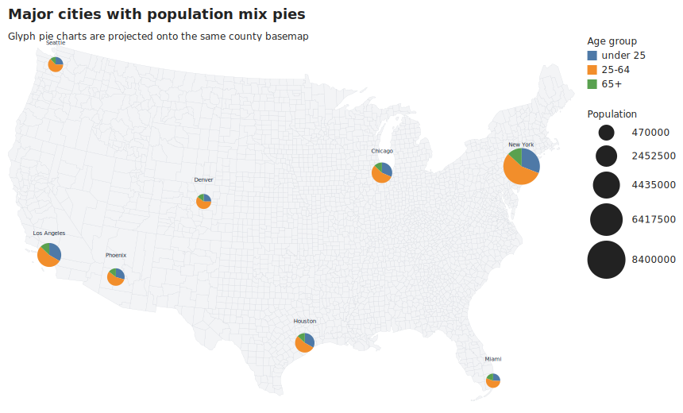

## Maps: route segments overlay with flight hubs

A `Path` geometry inside a projected `long * lat` space can draw lines between sequential points. By grouping the rows by a route identifier, we can draw individual flight paths between hubs, with line thickness scaled by passenger volume and airline colored categorically.

```algraf
Chart(data: "flight_routes.csv", width: 900, height: 600,
      title: "US Commercial Flight Routes & Hubs",
      subtitle: "Route segments and passenger volumes (Delta, United, American)") {
    Theme(name: "void")
    Table counties = GeoJson("us_counties.geojson")
    Table cities = "us_cities.csv"

    Scale(stroke: airline, palette: "default", label: "Airline")
    Scale(strokeWidth: passengers, domain: [0, null], range: [1.2, 7.5],
          breaks: [1.5, 2.5, 3.5, 4.2], label: "Passengers (M)")

    // Basemap
    Space(geom, data: counties, projection: "albers_usa") {
        Geo(fill: "#f8f9fa", stroke: "#e9ecef", strokeWidth: 0.25)
    }

    // Flight routes path segments
    Space(long * lat, projection: "albers_usa") {
        Path(group: route_id, stroke: airline, strokeWidth: passengers, alpha: 0.65)
    }

    // City landmarks overlay
    Space(long * lat, projection: "albers_usa", data: cities) {
        Point(size: 6, fill: "#212529", stroke: "#ffffff")
        Text(label: city, dy: -10, size: 7.5, fill: "#212529", anchor: "middle")
    }
}
```

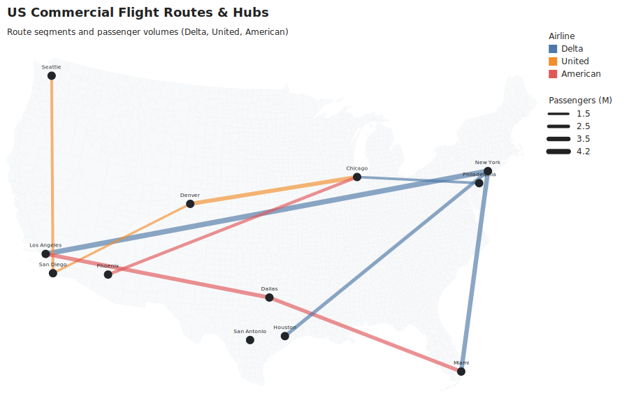

## Maps: a graticule over the `albers_usa` composite

`projection: "albers_usa"` is the conventional `albersUsa` composite: it routes
Alaska and Hawaii through their own equal-area insets while leaving the lower-48
unchanged. A `Graticule` mark draws the projected longitude/latitude grid
through the active spatial scale; `step` sets the spacing in degrees.

```algraf
Chart(data: GeoJson("us_counties.geojson"), width: 900, height: 600,
      title: "US Population by County",
      subtitle: "albers_usa composite with a longitude/latitude graticule") {
    Theme(name: "void")
    Scale(fill: population, gradient: ["#f7fbff", "#08306b"], label: "Population")

    Space(geom, projection: "albers_usa") {
        Graticule(stroke: "#cccccc", strokeWidth: 0.5, step: 10)
        Geo(fill: population, stroke: "#ffffff", strokeWidth: 0.25)
    }
}
```


## Maps: geometry-producing stats with `Centroid`

`Centroid(geom)` is a derived stat that reduces each geometry to a point,
passing every scalar column through. The result is an ordinary derived table, so
a `Geo` mark draws the centroids as a point layer — here colored by the
county's population.

```algraf
Chart(data: GeoJson("us_counties.geojson"), width: 900, height: 600,
      title: "County Population Centroids",
      subtitle: "Centroid(geom) reduces each county polygon to a single point") {
    Theme(name: "void")
    Scale(fill: population, gradient: ["#fee5d9", "#a50f15"], label: "Population")

    Derive centers = Centroid(geom)

    Space(geom, data: centers, projection: "albers_usa") {
        Geo(fill: population, stroke: "#333333", strokeWidth: 0.1)
    }
}
```


## Maps: geometry-simplifying stats with `Simplify`

Similar to `Centroid`, the `Simplify(geom, tolerance: t)` derived stat consumes a geometry column and returns a simplified version using the Douglas–Peucker algorithm. This is particularly useful for reducing complex boundaries to speed up rendering or create stylized, abstract maps.

Here, we declare three charts in one document to compare different simplification tolerances (0.02, 0.1, and 0.4 degrees):

```algraf
Chart(data: GeoJson("us_counties.geojson"), width: 600, height: 400,
      title: "Douglas-Peucker Simplification: 0.02 Degrees Tolerance",
      subtitle: "Medium-detail county boundaries") {
    Theme(name: "void")
    Derive simple = Simplify(geom, tolerance: 0.02)
    Space(geom, data: simple, projection: "albers_usa") {
        Geo(fill: "#f8f9fa", stroke: "#212529", strokeWidth: 0.2)
    }
}

Chart(data: GeoJson("us_counties.geojson"), width: 600, height: 400,
      title: "Douglas-Peucker Simplification: 0.1 Degrees Tolerance",
      subtitle: "Low-detail county boundaries") {
    Theme(name: "void")
    Derive simple = Simplify(geom, tolerance: 0.1)
    Space(geom, data: simple, projection: "albers_usa") {
        Geo(fill: "#f8f9fa", stroke: "#212529", strokeWidth: 0.2)
    }
}

Chart(data: GeoJson("us_counties.geojson"), width: 600, height: 400,
      title: "Douglas-Peucker Simplification: 0.4 Degrees Tolerance",
      subtitle: "Ultra-coarse outline") {
    Theme(name: "void")
    Derive simple = Simplify(geom, tolerance: 0.4)
    Space(geom, data: simple, projection: "albers_usa") {
        Geo(fill: "#f8f9fa", stroke: "#212529", strokeWidth: 0.2)
    }
}
```

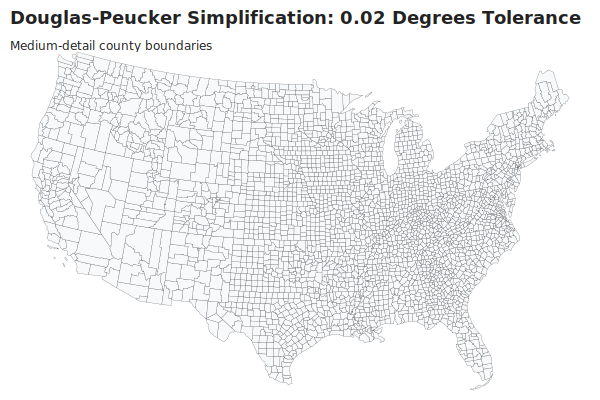

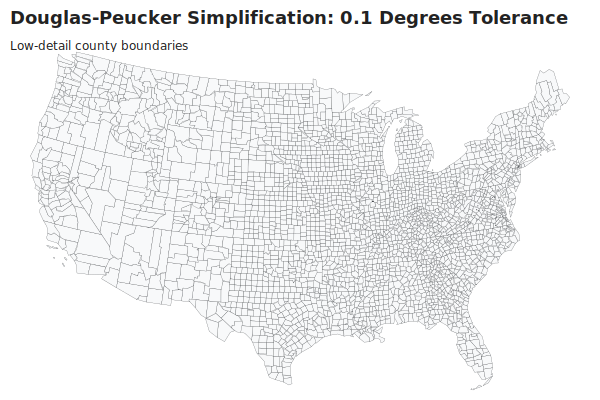

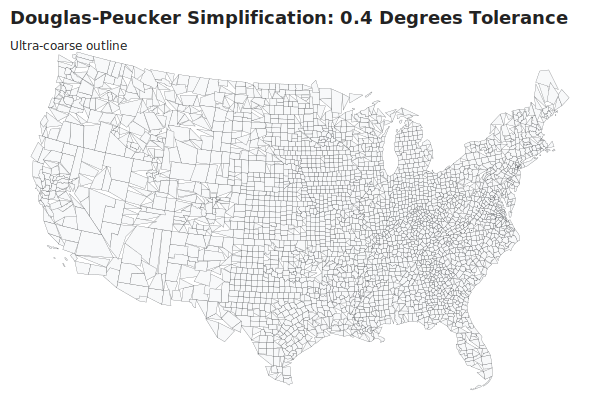

## Maps: TopoJSON input

`TopoJson(...)` decodes a TopoJSON topology — shared boundaries stored once as
arcs — into the same `geom` column as GeoJSON. `object:` names the topology
object to load.

```algraf
Chart(data: TopoJson("grid.topojson", object: "grid"), width: 400, height: 400,
      title: "TopoJSON Grid",
      subtitle: "Arcs decode to the same geometry column as GeoJSON") {
    Theme(name: "void")
    Scale(fill: value, gradient: ["#edf8e9", "#006d2c"], label: "Value")

    Space(geom, projection: "equirectangular") {
        Geo(fill: value, stroke: "#ffffff", strokeWidth: 1)
        Graticule(stroke: "#bbbbbb", strokeWidth: 0.5, step: 1)
    }
}
```


## Maps: spatial join with `SpatialJoin`

`SpatialJoin(geom, table: zones, predicate: "within")` tags each point with the
attributes of the polygon that contains it. The polygon outlines are drawn in
one space; the joined points, colored by their matched zone, in another.

```algraf
Chart(data: GeoJson("sensors.geojson"), width: 500, height: 360,
      title: "Sensors Tagged by Zone",
      subtitle: "SpatialJoin assigns each point the zone polygon that contains it") {
    Theme(name: "void")

    Table zones = GeoJson("zones.geojson")
    Derive tagged = SpatialJoin(geom, table: zones, predicate: "within")

    Space(geom, data: zones, projection: "equirectangular") {
        Geo(stroke: "#999999", strokeWidth: 1)
    }
    Space(geom, data: tagged, projection: "equirectangular") {
        Scale(fill: zone, palette: "accent", label: "Zone")
        Geo(fill: zone, stroke: "#222222", strokeWidth: 0.5)
    }
}
```


## Maps: compound dashboard combining choropleth and Cartesian bar chart

You can combine geographic visualizations with Cartesian statistical plots in a single multi-chart document to create a cohesive data dashboard. Here, Chart 1 displays a US county population choropleth with major city hubs overlaid. Chart 2 displays a Cartesian bar chart showing the populations of those same cities.

```algraf
Chart(data: GeoJson("us_counties.geojson"), width: 900, height: 500,
      title: "US County Populations and Major City Hubs",
      subtitle: "Population density (Lower 48) with major city markers") {
    Theme(name: "void")
    Table cities = "us_cities.csv"

    Scale(fill: population, gradient: ["#f7fbff", "#08306b"], label: "Population")

    // Basemap: Counties filled by population
    Space(geom, projection: "albers_usa") {
        Geo(fill: population, stroke: "#ffffff", strokeWidth: 0.25)
    }

    // Overlay cities
    Space(long * lat, projection: "albers_usa", data: cities) {
        Point(size: 6, fill: "#ff3333", stroke: "#ffffff")
        Text(label: city, dy: -12, size: 7.5, fill: "#212529", anchor: "middle")
    }
}

Chart(data: "us_cities.csv", width: 900, height: 400,
      title: "Urban Population of Major US Cities",
      subtitle: "Comparison of top metropolitan areas") {
    Theme(name: "minimal")
    Scale(fill: population, gradient: ["#feb24c", "#f03b20"], label: "Population")
    Guide(axis: x, label: "City", tickLabelAngle: -45)
    Guide(axis: y, label: "Population")

    Space(city * population) {
        Bar(stat: "identity", fill: population, layout: "stack")
    }
}
```

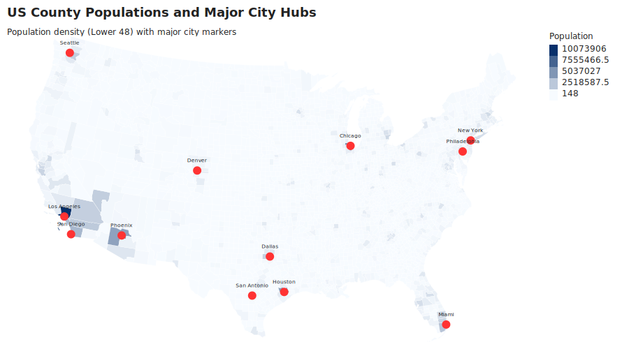

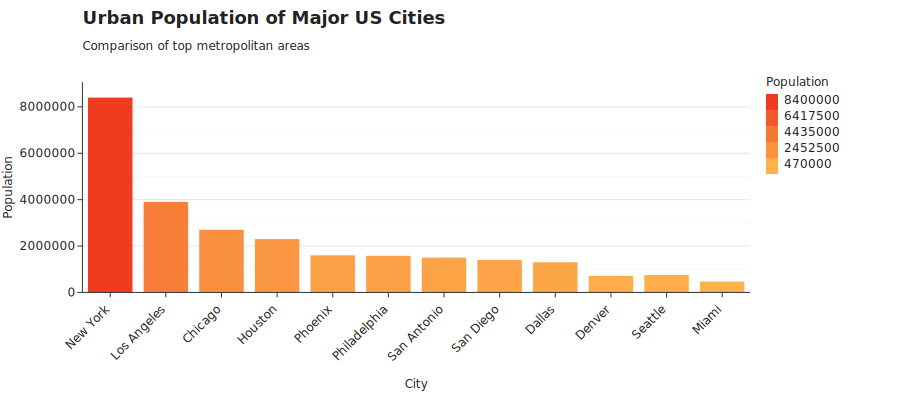

## Maps: comparing map projections side-by-side

A multi-chart document can also be used to compare how different cartographic projections distort shapes, areas, and directions of the same dataset. Here, we render the identical US counties dataset under three different projections: `albers_usa`, `mercator`, and `equirectangular`.

```algraf
Chart(data: GeoJson("us_counties.geojson"), width: 600, height: 400,
      title: "US Counties - Albers USA Projection",
      subtitle: "Composite equal-area projection with Alaska & Hawaii insets") {
    Theme(name: "void")
    Space(geom, projection: "albers_usa") {
        Geo(fill: "#f8f9fa", stroke: "#adb5bd", strokeWidth: 0.2)
    }
}

Chart(data: GeoJson("us_counties.geojson"), width: 600, height: 400,
      title: "US Counties - Mercator Projection",
      subtitle: "Web Mercator projection (conformal cylindrical)") {
    Theme(name: "void")
    Space(geom, projection: "mercator") {
        Geo(fill: "#f8f9fa", stroke: "#adb5bd", strokeWidth: 0.2)
    }
}

Chart(data: GeoJson("us_counties.geojson"), width: 600, height: 400,
      title: "US Counties - Equirectangular Projection",
      subtitle: "Plate Carrée planar projection (default)") {
    Theme(name: "void")
    Space(geom, projection: "equirectangular") {
        Geo(fill: "#f8f9fa", stroke: "#adb5bd", strokeWidth: 0.2)
    }
}
```

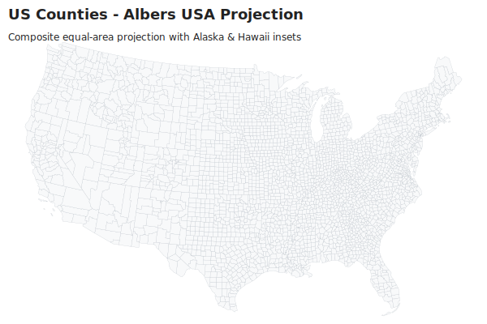

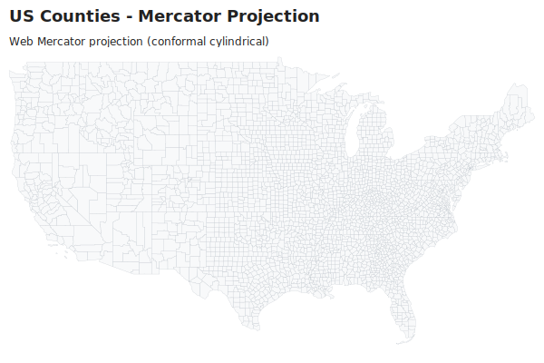

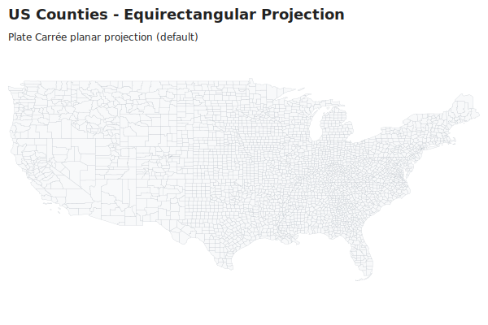

---

## Polar coordinates: circular charts

Algraf has no `Pie` or `Donut` geometry. Instead, a `Space` can opt into a
**polar coordinate system** with `coords: "polar"`, and the *existing* Cartesian
geometries map into it. One frame axis wraps around the angle (`theta: "x"` or
`"y"`); the other extends along the radius. `innerRadius` (a fraction in
`[0, 1)`) cuts a donut hole. By default the angle starts at 12 o'clock and runs
clockwise; `startAngle` (degrees) and `direction` (`"clockwise"` /
`"counterclockwise"`) rotate and reverse it. Cartesian charts are completely
unaffected.

A **pie** is a 1D space whose value wraps the full angle (`theta: "y"`, a `fill`
layout), drawn as `Bar` wedges:

```algraf
Chart(data: "pie_sales.csv", width: 360, height: 360, title: "Revenue share", marginLeft: 30) {
  Space(sales, coords: "polar", theta: "y") {
    Bar(fill: product, layout: "fill")
  }
}
```

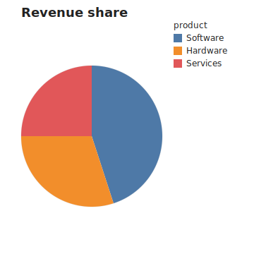

A **donut** is the same chart with `innerRadius` set:

```algraf
Chart(data: "pie_sales.csv", width: 360, height: 360, title: "Revenue share", marginLeft: 30) {
  Space(sales, coords: "polar", theta: "y", innerRadius: 0.55) {
    Bar(fill: product, layout: "fill")
  }
}
```

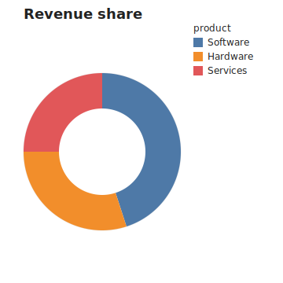

A **coxcomb** (Nightingale rose) keeps the category on the angle (`theta: "x"`)
and lets the value drive the radius:

```algraf
Chart(data: "coxcomb_deaths.csv", width: 420, height: 420, title: "Deaths by month (coxcomb)") {
  Space(month * deaths, coords: "polar", theta: "x") {
    Bar(fill: month)
  }
}
```

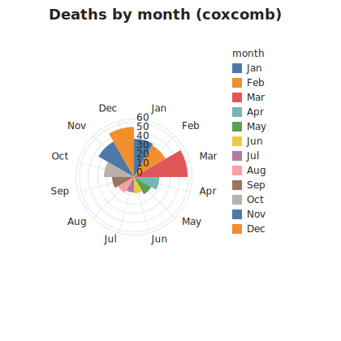

A **wind rose** stacks a sub-category within each angular wedge:

```algraf
Chart(data: "wind.csv", width: 420, height: 420, title: "Wind rose") {
  Space(direction * freq, coords: "polar", theta: "x") {
    Bar(fill: speed, layout: "stack")
  }
}
```

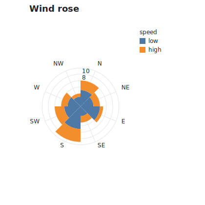

A **circular histogram** is just `Histogram` in a polar space — it desugars to
`Rect`, which honors polar for free:

```algraf
Chart(data: "circular_hours.csv", width: 420, height: 420, title: "Events by hour") {
  Space(hour, coords: "polar", theta: "x") {
    Histogram(bins: 12, fill: "#4E79A7")
  }
}
```

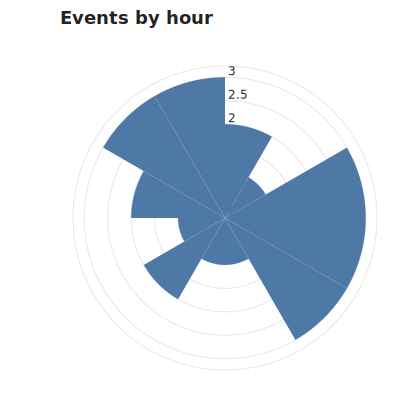

A **polar line/scatter** is good for seasonal or periodic data; `Line` and
`Area` close their polygons around the circle:

```algraf
Chart(data: "seasonal_temps.csv", width: 420, height: 420, title: "Seasonal temperature") {
  Space(month * temp, coords: "polar", theta: "x") {
    Area(fill: "#bcd")
    Line(stroke: "#4E79A7")
    Point(fill: "#4E79A7")
  }
}
```

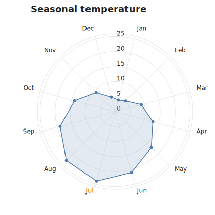

An **annular heatmap** uses `Tile` with band axes on both the angle and the
radius, plus an `innerRadius` hole:

```algraf
Chart(data: "activity.csv", width: 420, height: 420, title: "Sessions by day and period") {
  Scale(fill: sessions, gradient: [Stop(value: 0, color: "#ffffff"), Stop(value: 9, color: "#994422")])
  Space(day * period, coords: "polar", theta: "x", innerRadius: 0.25) {
    Tile(fill: sessions)
  }
}
```

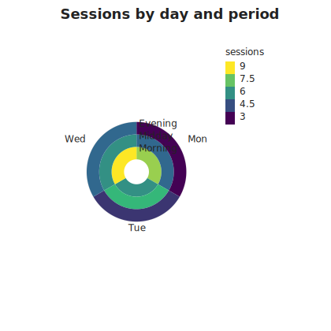

A **radar** chart layers a closed `Area`, `Line`, and `Point` over a categorical
angle, with a straight-edged polygon grid via `Guide(gridShape: "polygon")`:

```algraf
Chart(data: "radar_skills.csv", width: 420, height: 420, title: "Player profile") {
  Space(axis * score, coords: "polar", theta: "x") {
    Guide(gridShape: "polygon")
    Area(fill: "#9ec6e0")
    Line(stroke: "#2b6ca3")
    Point(fill: "#2b6ca3")
  }
}
```

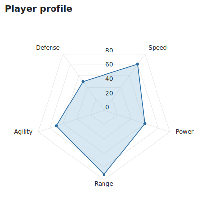

A **radial bar chart** puts each category on its own concentric ring with a
categorical `radius:` mapping, while the value drives each bar's angular sweep.
Constrain the value axis to start at zero so the bars share a baseline:

```algraf
Chart(data: "sales_by_rep.csv", width: 460, height: 460, title: "Sales by rep (radial bar)") {
  Space(amount, coords: "polar", theta: "y", startAngle: 0) {
    Scale(axis: x, domain: [0, null])
    Bar(fill: rep, radius: rep)
  }
}
```

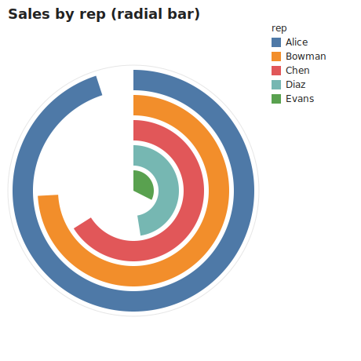

A **rotated coxcomb** shows `startAngle` and `direction` at work — here the wedges
begin 30° round from the top and sweep counterclockwise:

```algraf
Chart(data: "coxcomb_deaths.csv", width: 440, height: 440, title: "Deaths by month (rotated, counterclockwise)") {
  Space(month * deaths, coords: "polar", theta: "x", startAngle: 30, direction: "counterclockwise") {
    Bar(fill: month)
  }
}
```

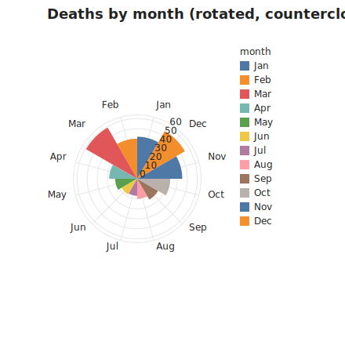

## Nested glyph marks

Glyph marks can nest: a glyph's child space can itself invoke another glyph.
The nested example below draws one composition pie per host node, then places
tiny trend lines inside the slices by correlating the outer glyph's host `id`
(`outer.id`) with the trend table's `id`, plus the current slice `category`.

```algraf
Chart(data: "inset_nodes.csv", width: 560, height: 380,
      title: "Nested glyph marks") {
    Table mix = "inset_node_mix.csv"
    Table trends = "inset_node_trends.csv"

    Glyph trendline(data: trends, key: [id => outer.id, category => category], scales: "local") {
        Space(t * value) {
            Line(stroke: "#111827", strokeWidth: 0.7)
        }
    }

    Glyph nodepie(data: mix, key: [id], scales: "shared") {
        Space(value, coords: "polar", theta: "y") {
            Scale(fill: category,
                  range: ["hardware" => "#4E79A7", "software" => "#F28E2B", "services" => "#59A14F"],
                  label: "Category")
            Bar(fill: category, layout: "fill")
            trendline(width: 18, height: 8, at: "mark-center", clip: "rect", padding: 1)
        }
    }

    Scale(size: size, range: [38, 62])

    Space(x * y) {
        nodepie(size: size, clip: "circle", padding: 1)
        Text(label: id, dy: -38, size: 10, anchor: "middle")
    }
}
```

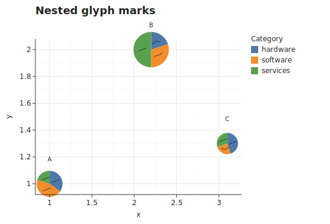

---

## Declarative tooltips

Interactions in Algraf are **data attached to marks, never code**. A geometry
declares *what* data participates; there is no event-handler syntax and no
scripting language. The `tooltip:` property names a column — or an array of
columns — whose per-row values describe each mark. In static SVG the renderer
attaches them as accessible `<title>` elements (which browsers show as native
hover tooltips), so the output stays completely script-free.

```ag
Chart(data: "penguins.csv", width: 760, height: 500) {
    Theme(name: "minimal")

    Space(flipper_length * body_mass) {
        Point(
            fill: species,
            alpha: 0.82,
            size: 4,
            tooltip: [species, flipper_length, body_mass]
        )
    }
}
```


## Highlight-on-hover

The `highlight:` property names a grouping column whose value marks which points
emphasize together. In static SVG each mark gains a stable
`data-algraf-highlight="<group>"` attribute (still no script). Pass
`--interactive` to embed Algraf's fixed, audited runtime, which reads that inert
metadata and dims the other groups while you hover — the chart body is otherwise
byte-for-byte identical to the static render, and chart source can never supply
its own script.

```ag
Chart(data: "penguins.csv", width: 760, height: 500) {
    Theme(name: "minimal")

    Space(flipper_length * body_mass) {
        Point(
            fill: species,
            alpha: 0.82,
            size: 4,
            tooltip: [species, flipper_length, body_mass],
            highlight: species
        )
    }
}
```

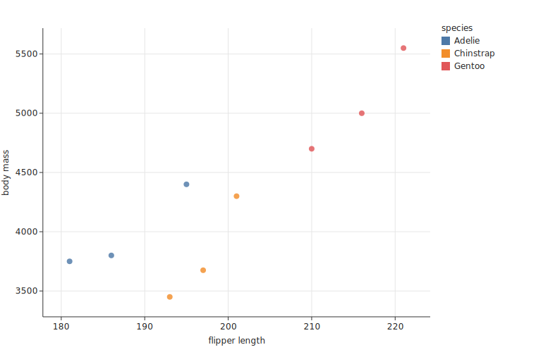

```bash
# Static (script-free) SVG with <title> tooltips and highlight groups.
cargo run -p algraf-cli -- render examples/highlight.ag --output chart.svg

# Opt-in interactive SVG: adds the single audited runtime for hover highlighting.
cargo run -p algraf-cli -- render examples/highlight.ag --interactive --output chart.svg
```

Interaction metadata is accepted on the per-datum filled marks `Point`, `Bar`,
`Rect`, and `Tile`, and rides through to the draw-list backend as inert data too.

---

## Multiple charts in one document

A document may hold more than one top-level `Chart`. Each chart is fully
independent — its own data source, scales, guides, theme, and layout — and
renders to its own file. With multiple charts, `render` requires `--output` and
writes one file per chart, inserting a 1-based suffix before the extension
(`out.svg` → `out-1.svg`, `out-2.svg`):

```algraf
// A single document with two independent charts. Each renders to its own file:
// `render --output multi_chart.svg` writes multi_chart-1.svg and multi_chart-2.svg.

Chart(data: "penguins.csv", width: 640, height: 400, title: "Observations") {
    Space(flipper_length * body_mass) {
        Point(fill: species, alpha: 0.8)
    }
}

Chart(data: "penguins.csv", width: 640, height: 400, title: "Linear fit") {
    Space(flipper_length * body_mass) {
        Point(alpha: 0.25)
        Smooth(method: "lm")
    }
}
```

```bash
cargo run -p algraf-cli -- render examples/multi_chart.ag --output multi_chart.svg
# writes multi_chart-1.svg and multi_chart-2.svg
```


---

## Running the examples yourself

From the repository root:

```bash
# Render a single example
cargo run -p algraf-cli -- render examples/scatter.ag --output /tmp/scatter.svg

# Regenerate every committed SVG and PNG
./examples/generate.sh

# Validate without rendering
cargo run -p algraf-cli -- check examples/scatter.ag

# Inspect inferred schema and IR
cargo run -p algraf-cli -- schema examples/scatter.ag --json
cargo run -p algraf-cli -- ir examples/scatter.ag --json
```

Render with debug layout metadata:

```bash
cargo run -p algraf-cli -- render examples/grouped_bar.ag --debug-layout --emit-metadata --output /tmp/grouped-bar.svg
```

## Notes

The examples avoid unsupported renderer paths and should pass `algraf check` without diagnostics. They are intentionally small enough to inspect by hand and broad enough to exercise scale training, legends, axes, derived data, statistics, coordinates, maps, and interaction metadata.
